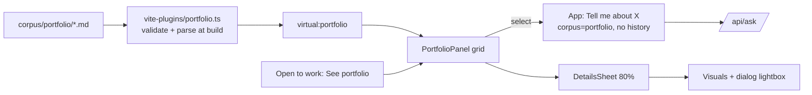

# Portfolio topic (frontend) (2026-10-02 11:40 PT)

**Status:** Merged and live on build-110 ([#150](https://github.com/hacka-tron/basel.engineering/pull/150), PR 3b of the portfolio feature, merge commit 7c889f2; review round 1 changes needed, fixed, round 2 approved; Release and post-deploy Stream check passed). Built on #148 (build-109) and #149 (build-107). The Portfolio topic stays hidden until the first published project.

## TL;DR

The site gets a third chat topic, **Portfolio**. On desktop the right pane follows the topic: Portfolio shows a card grid of the projects in `corpus/portfolio/*.md`, the other topics show the diagram. On phones the switch above the ask box becomes **Chat | Diagram | Portfolio**. Picking a project opens the shared 80% details sheet (visuals gallery with a full-screen lightbox, stack and links, the write-up) and asks the chatbot "Tell me about <title>". The footer "Open to work" popover gains "See portfolio →". **Hidden until there is content (owner, 2026-10-02):** today the corpus holds only the draft example, so visitors see no change at all: no Portfolio topic, no Portfolio segment (the toggle stays Chat | Diagram), no "See portfolio →". Everything appears by itself on the first release with a published project.

## What changed for a visitor

- Once there is a published project:
- **Desktop:** header nav "About Basel | About This System | Portfolio". Portfolio swaps the diagram for "Portfolio · N projects" (2 columns, 3 from 1280px). A card opens the sheet over 80% of the pane, the card stays in the strip above it with a cyan outline, and the question and streamed answer appear in the chat column.
- **Phones:** three chips ("Basel", "System", "Portfolio"; all fit at 280px) and a three-way view toggle (text from 360px, 44px icons below). The Portfolio view shows the grid (2 columns from 390px, single-column rows below); the sheet adds "Ask about this" with the streamed answer and "Continue in chat →".
- **Sheet and lightbox:** visuals in a row at one height with each image's declared shape, dots and "1 / N" when there are two or more, prev/next on desktop; tapping one opens a modal lightbox (✕, arrows, Escape closes only it, focus returns to the thumbnail). On phones any tap in the strip above the sheet closes it; on desktop another card switches it. The chevron or Escape closes it (focus to the locked bar); opening from the keyboard moves focus to the chevron; Back closes it with the view.
- **Footer:** "Open to work" → "See portfolio →" selects Portfolio (and the Portfolio view on phones) and focuses the first card or the empty-state text.

## How it works

- `lib/portfolio.ts` (pure): the schema, validation, a tiny Markdown subset (paragraphs, lists, https links; raw HTML stays text) and sorting.
- `vite-plugins/portfolio.ts` (Node, build time): reads the files, parses the YAML, validates every file, drops drafts, and serves the sorted list as `virtual:portfolio`. Any problem fails the build with every file and problem listed; the dev server reloads on edits.
- `lib/topics.ts`: the three topics, their API corpus and labels. `lib/selection.ts`: what a selected component or project shows, and which questions are sent and retried without history.
- `lib/diagramNav.ts` `createViewNav`: Diagram and Portfolio are one history entry above Chat (push from Chat, replace between them).

## Key design decisions and trade-offs

- **Build-time data, not a runtime fetch.** Nothing to serve or cache, invalid content can't ship, no YAML parser in the bundle. Cost: bodies are in the JS bundle (fine for a handful of projects) and a content change needs a release (it already does: the chatbot indexes the same files at release).
- **The Dockerfile copies `corpus/portfolio/` into the frontend build stage**, and the loader fails if the directory is missing. Before this, the frontend stage copied only `frontend/`, so a naive loader would have shipped an empty portfolio while CI (full checkout) passed. Not verified with `docker build` locally (Docker Desktop is down); the release workflow's build is the first real check.
- **Same rules as the backend.** The loader reads files the way `services/glassbox/portfolio.py` does: YAML 1.1 like PyYAML, only the literal `true`/`false` are booleans (`draft: yes` or `draft: True` is an error, not a draft), a repeated field is an error, floats are never whole numbers, drafts are validated (images unchecked) then dropped, files in subfolders and symlinks are errors, an image must be a real file with no symlink on its path. A 25-case parity run against `portfolio.py` agreed on every case. Stricter on purpose: a visual must be an image file with no hidden path segment, and body links must be https. The personal-data check stays in CI only.
- **Unknown frontmatter fields are errors** (typo protection), as in the backend.
- **Strip taps (owner, 2026-10-02):** on phones any tap in the strip closes the sheet (cards inert), as for the diagram (#148), so an accidental tap never asks a new, rate-limited question; on desktop another card switches the sheet.
- **Native `<dialog>` for the lightbox** (`showModal()`): the page is inert and Tab can't reach it; the dialog is closed when its panel unmounts (Back, topic change), so the page never stays inert.
- **Back closes the sheet by leaving the view** (no history entry for the sheet), as in PR 3a.
- **No URL switches** (`?topic`, `?sel`, `?lightbox`...); screenshots are driven through the UI.
- **Hidden until content (owner).** `HAS_PORTFOLIO` (`projects.length > 0`) gates the topic (`visibleTopics`), the phone segment (`views` in `createViewNav` and `PipelineStrip`) and the footer link; a history entry saved on the Portfolio view reads as Chat. The empty state stays in code but is unreachable. Corpus choice isn't persisted, so no saved topic can point at Portfolio.

## What review caught

Round 1 (Opus reviewer), changes needed, all fixed:
- **Important:** choosing a card from the keyboard dropped focus to `<body>` (the card went inert), and Escape left it there. Now opening moves focus to the sheet's chevron, and Escape or the chevron always lands on the locked bar when focus was in the sheet, the cards or lost. "See portfolio →" with a desktop sheet open now closes the sheet first, so the first card takes focus.
- Gallery "Next" in the wide desktop sheet jumped 1 / 3 → 3 / 3 when the last visuals fit; prev/next now hold the index they chose while the row scrolls.
- Duplicate stack tags or visual paths gave duplicate React keys; keys are index-qualified.
- A leading UTF-8 byte-order mark is now ignored on both sides (frontend loader and `portfolio.py`, with tests); the remaining fail-loud parity edge cases are documented in the loader.
- Owner decisions: hidden until content; strip taps close on phones only.
- Deferred to BACKLOG: selection surviving Portfolio → Diagram → Portfolio, the empty-state locked bar, bundle size.

## Operational notes and risks

- The warm-up already asks the three Portfolio questions (PR 2). With no content they abstain before reserving an LLM budget slot, so they cost no LLM call, and aren't cached, so they re-run each warm-up until content lands. The warm-up asks 10 questions, exactly the per-IP limit of 10 per 10 minutes: no headroom for another suggestion.
- An invalid portfolio file now fails the frontend build in CI and the release, not only the backend check. `python -m services.glassbox.portfolio` and the build agree on what is valid.
- Bundle: 501 kB JS (156 kB gzip) vs 485 kB before; project bodies add to it as content lands.

## How to see it / verify it

Local, with the live API unreachable (`GLASSBOX_API_PROXY=http://127.0.0.1:9`), `/api` faked in headless Chrome (CDP `Fetch`), throwaway fixtures `zz-verify-alpha|beta|gamma` (three visuals of different shapes, a 40-character unbroken title and tag, no visuals; removed afterwards, never committed). The backend check accepted the fixtures (`4 portfolio files OK`).

- Static: `npm run lint`, `npx tsc -b`, `npm test` (193 pass), `npm run build`; a broken file (`draft: yes`, missing fields) and a missing `corpus/portfolio/` both fail the build; backend `pytest services/tests -q`: 1061 passed, 33 skipped.
- Widths 280x653, 320x568, 360x780, 375x667, 393x852 (phone) and 768x1024, 1024x768, 1280x800: horizontal overflow 0 in every state; no missing selectors.
- Grid columns: 1 at 280–375, 2 at 393, 2 in the 768/1024 pane, 3 at 1280. Toggle: 222px with text at 360–393, 138px icons at 280/320. Chips' right edge 250px at 280, 292px at 320.
- Strip heights (sheet top minus region top), portfolio and diagram sheets alike: 68px at 320x568, 85 at 280x653, 110 at 360x780, 88 at 375x667, 125 at 393x852; portfolio pane 179 at 768x1024, 128 at 1024x768, 134 at 1280x800 (spec §5.5: about 68, 88, 125, 134).
- Focus: closing the sheet with Escape → "Select a project for details"; Escape again → Chat with focus on "Portfolio"; Back from the diagram sheet → "Diagram"; a reload inside Portfolio, then Chat → "Portfolio"; lightbox Escape → back on the thumbnail with the sheet still open; "See portfolio →" → the first card (empty: the empty-state text), popover closed.
- Lightbox: Back with it open → Chat, no `dialog[open]`, the ask box takes focus. Tab inside it cycles ✕ / prev / next and once per cycle the browser's own UI; it never reaches the page.
- A strip tap closes the sheet without selecting another card or asking (1 request in the run). Requests sent: "Tell me about <title>", corpus `portfolio`, history 0. Desktop: one `.react-flow` after switching back to About This System.
- Body HTML (`<b>raw HTML…</b>`) shows as text. Reduced motion and transparency: sheet animation `none`, scrim hidden. Rotate: `/?phone` at 667x375 shows the rotate screen; back at 375x667 the project sheet is still open.
- Empty corpus (only `_example.md`, the repo state) at 280, 320, 375 and 1280: topics About Basel and About This System only, toggle Chat | Diagram (text), no "See portfolio →", overflow 0; a reload on a history entry saved as Portfolio shows Chat.
- Round 1 fixes (fixtures in a scratch copy of the tree, not the worktree): keyboard Enter on a card → focus "Close <title> details and deselect it"; Escape → "Select a project for details", also after focus was blurred to `<body>` (375 and 1280). Desktop: a click on another card while a sheet is open switches to it; gallery Next 1 / 3 → 2 / 3 → 3 / 3, Next disabled at the end, Prev → 2 / 3; "See portfolio →" with a sheet open closes it and focuses the first card. Phones: a strip tap closes without switching. No React key warnings with a duplicate stack tag. Full regression at all eight widths again: overflow 0, no missing selectors, same strips and focus targets.

## Open items

- Owner: add real projects (the topic appears on that release).
- ~~First release build is the Dockerfile's real test~~ Passed: build-110 is the first release built with `corpus/portfolio` copied into the frontend stage.
- Follow-ups in `project/BACKLOG.md` "Portfolio frontend follow-ups".
