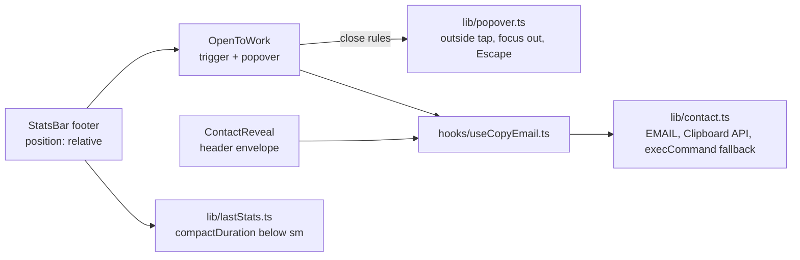

# Footer "Open to work" callout

**Status:** PR open, [#147](https://github.com/hacka-tron/basel.engineering/pull/147). Not merged.

## TL;DR

The footer now says Basel is open to work. A green dot with "Open to work" sits left of New chat on phones and left of Stress test on desktop. A tap opens a small popover, "Open to full-time work and freelancing", with one Copy email button. On phones the latency readout is shorter (`12.3s` instead of `total 12345ms`), so the footer never scrolls sideways, even on a Fold cover screen. This is PR 1 of 3 in the portfolio spec; the "See portfolio →" link comes with PR 3.

## What changed for a visitor

- Footer, right group: a green dot plus "Open to work" (dot only from 300 to 359px; left out below 300px, where the header envelope still copies the email).
- Tap or click: a popover above the footer with the headline, "Talking to teams about full-time roles and taking on freelance projects. Copy my email and say hi." and **Copy email**. Feedback matches the header envelope: "Email copied", or the address itself if copying is blocked.
- It closes on Escape (focus back to the button), a tap outside, a second tap on the button, or focus moving elsewhere.
- Phones: the latency shows at most 5 characters (`312ms`, `1.8s`, `12.3s`). The tooltip and screen readers still say "Total request time" when no answer text was generated. Desktop readings are unchanged.

## How it works



The address and copy logic moved out of the header envelope into `lib/contact.ts`, so both copy buttons share one path and one set of tests. The popover is positioned against the footer, not its button, so it can use the full screen width at 280px.

## Key design decisions and trade-offs

- **Footer item, not a banner or header pill.** The owner compared five live mocks. The footer item costs no chat height, and it slides away with the footer while typing.
- **Phones drop the word "total".** The spec allowed shortening; 5 characters is what fits at 280px beside the new item. The meaning stays in the tooltip and accessible name.
- **No component test framework.** The frontend tests run on Node's built-in runner with no DOM. The popover's rules are pure functions with unit tests; the DOM behaviour is checked in headless Chrome (below).
- **Focus leaving closes the popover.** Otherwise it could stay open inside the footer while focus mode hides it.

## What review caught

Round 1 (Opus): changes needed. The execCommand copy fallback focused a temporary textarea outside the item, which closed the popover before the result showed (address never visible on double failure). Fixed: the textarea is marked `data-copy-fallback` and the focus-out rule ignores it (`lib/popover.ts`, unit-tested). The e2e fallback check was vacuous (hidden popover); rewritten. Minor: `aria-haspopup`, unmount guard in `useCopyEmail`.

## Measurements

Headless Chrome against the phone preview server, footer numbers set to realistic and worst-case values: typical `1.8s` / `1840ms` with 128 queries, worst `999s+` / `total 12345ms` with 128 queries.

```
┌─────────┬────────────┬─────────────┬──────────┬──────────────┬────────────────┬───────────┬────────────────┬──────────────┬────────────────────┬──────────┬────────┬─────────┬───────────┬────────────────────┬────────────────────┐
│ (index) │ viewport   │ reading     │ state    │ pageOverflow │ footerOverflow │ rightmost │ smallestTarget │ triggerShown │ popover            │ problems │ escape │ outside │ secondTap │ fallbackDoubleOpen │ fallbackLegacyOpen │
├─────────┼────────────┼─────────────┼──────────┼──────────────┼────────────────┼───────────┼────────────────┼──────────────┼────────────────────┼──────────┼────────┼─────────┼───────────┼────────────────────┼────────────────────┤
│ 0       │ '280x653'  │ 'typical'   │ 'closed' │ 0            │ 0              │ 274       │ 44             │ false        │ ''                 │ ''       │        │         │           │                    │                    │
│ 1       │ '280x653'  │ 'typical'   │ 'open'   │ 0            │ 0              │ 274       │ 44             │ false        │ ''                 │ ''       │        │         │           │                    │                    │
│ 2       │ '280x653'  │ 'worst'     │ 'closed' │ 0            │ 0              │ 274       │ 44             │ false        │ ''                 │ ''       │        │         │           │                    │                    │
│ 3       │ '280x653'  │ 'worst'     │ 'open'   │ 0            │ 0              │ 274       │ 44             │ false        │ ''                 │ ''       │        │         │           │                    │                    │
│ 4       │ '320x568'  │ 'typical'   │ 'closed' │ 0            │ 0              │ 314       │ 44             │ true         │ ''                 │ ''       │        │         │           │                    │                    │
│ 5       │ '320x568'  │ 'typical'   │ 'open'   │ 0            │ 0              │ 314       │ 44             │ true         │ '16-304 top 333'   │ ''       │        │         │           │                    │                    │
│ 6       │ '320x568'  │ 'worst'     │ 'closed' │ 0            │ 0              │ 314       │ 44             │ true         │ ''                 │ ''       │        │         │           │                    │                    │
│ 7       │ '320x568'  │ 'worst'     │ 'open'   │ 0            │ 0              │ 314       │ 44             │ true         │ '16-304 top 333'   │ ''       │        │         │           │                    │                    │
│ 8       │ '320x568'  │ 'behaviour' │ ''       │              │                │           │                │              │                    │ ''       │ true   │ true    │ true      │ true               │ true               │
│ 9       │ '360x780'  │ 'typical'   │ 'closed' │ 0            │ 0              │ 354       │ 44             │ true         │ ''                 │ ''       │        │         │           │                    │                    │
│ 10      │ '360x780'  │ 'typical'   │ 'open'   │ 0            │ 0              │ 354       │ 44             │ true         │ '56-344 top 545'   │ ''       │        │         │           │                    │                    │
│ 11      │ '360x780'  │ 'worst'     │ 'closed' │ 0            │ 0              │ 354       │ 44             │ true         │ ''                 │ ''       │        │         │           │                    │                    │
│ 12      │ '360x780'  │ 'worst'     │ 'open'   │ 0            │ 0              │ 354       │ 44             │ true         │ '56-344 top 545'   │ ''       │        │         │           │                    │                    │
│ 13      │ '360x780'  │ 'behaviour' │ ''       │              │                │           │                │              │                    │ ''       │ true   │ true    │ true      │ true               │ true               │
│ 14      │ '375x667'  │ 'typical'   │ 'closed' │ 0            │ 0              │ 369       │ 44             │ true         │ ''                 │ ''       │        │         │           │                    │                    │
│ 15      │ '375x667'  │ 'typical'   │ 'open'   │ 0            │ 0              │ 369       │ 44             │ true         │ '71-359 top 432'   │ ''       │        │         │           │                    │                    │
│ 16      │ '375x667'  │ 'worst'     │ 'closed' │ 0            │ 0              │ 369       │ 44             │ true         │ ''                 │ ''       │        │         │           │                    │                    │
│ 17      │ '375x667'  │ 'worst'     │ 'open'   │ 0            │ 0              │ 369       │ 44             │ true         │ '71-359 top 432'   │ ''       │        │         │           │                    │                    │
│ 18      │ '375x667'  │ 'behaviour' │ ''       │              │                │           │                │              │                    │ ''       │ true   │ true    │ true      │ true               │ true               │
│ 19      │ '393x852'  │ 'typical'   │ 'closed' │ 0            │ 0              │ 387       │ 44             │ true         │ ''                 │ ''       │        │         │           │                    │                    │
│ 20      │ '393x852'  │ 'typical'   │ 'open'   │ 0            │ 0              │ 387       │ 44             │ true         │ '89-377 top 617'   │ ''       │        │         │           │                    │                    │
│ 21      │ '393x852'  │ 'worst'     │ 'closed' │ 0            │ 0              │ 387       │ 44             │ true         │ ''                 │ ''       │        │         │           │                    │                    │
│ 22      │ '393x852'  │ 'worst'     │ 'open'   │ 0            │ 0              │ 387       │ 44             │ true         │ '89-377 top 617'   │ ''       │        │         │           │                    │                    │
│ 23      │ '393x852'  │ 'behaviour' │ ''       │              │                │           │                │              │                    │ ''       │ true   │ true    │ true      │ true               │ true               │
│ 24      │ '640x900'  │ 'typical'   │ 'closed' │ 0            │ 0              │ 624       │ 44             │ true         │ ''                 │ ''       │        │         │           │                    │                    │
│ 25      │ '640x900'  │ 'typical'   │ 'open'   │ 0            │ 0              │ 624       │ 44             │ true         │ '336-624 top 665'  │ ''       │        │         │           │                    │                    │
│ 26      │ '640x900'  │ 'worst'     │ 'closed' │ 0            │ 0              │ 624       │ 44             │ true         │ ''                 │ ''       │        │         │           │                    │                    │
│ 27      │ '640x900'  │ 'worst'     │ 'open'   │ 0            │ 0              │ 624       │ 44             │ true         │ '336-624 top 665'  │ ''       │        │         │           │                    │                    │
│ 28      │ '640x900'  │ 'behaviour' │ ''       │              │                │           │                │              │                    │ ''       │ true   │ true    │ true      │ true               │ true               │
│ 29      │ '1024x768' │ 'typical'   │ 'closed' │ 0            │ 0              │ 992       │ 16             │ true         │ ''                 │ ''       │        │         │           │                    │                    │
│ 30      │ '1024x768' │ 'typical'   │ 'open'   │ 0            │ 0              │ 992       │ 16             │ true         │ '704-992 top 547'  │ ''       │        │         │           │                    │                    │
│ 31      │ '1024x768' │ 'worst'     │ 'closed' │ 0            │ 0              │ 992       │ 16             │ true         │ ''                 │ ''       │        │         │           │                    │                    │
│ 32      │ '1024x768' │ 'worst'     │ 'open'   │ 0            │ 0              │ 992       │ 16             │ true         │ '704-992 top 547'  │ ''       │        │         │           │                    │                    │
│ 33      │ '1024x768' │ 'behaviour' │ ''       │              │                │           │                │              │                    │ ''       │ true   │ true    │ true      │ true               │ true               │
│ 34      │ '1280x800' │ 'typical'   │ 'closed' │ 0            │ 0              │ 1248      │ 16             │ true         │ ''                 │ ''       │        │         │           │                    │                    │
│ 35      │ '1280x800' │ 'typical'   │ 'open'   │ 0            │ 0              │ 1248      │ 16             │ true         │ '960-1248 top 579' │ ''       │        │         │           │                    │                    │
│ 36      │ '1280x800' │ 'worst'     │ 'closed' │ 0            │ 0              │ 1248      │ 16             │ true         │ ''                 │ ''       │        │         │           │                    │                    │
│ 37      │ '1280x800' │ 'worst'     │ 'open'   │ 0            │ 0              │ 1248      │ 16             │ true         │ '960-1248 top 579' │ ''       │        │         │           │                    │                    │
│ 38      │ '1280x800' │ 'behaviour' │ ''       │              │                │           │                │              │                    │ ''       │ true   │ true    │ true      │ true               │ true               │
└─────────┴────────────┴─────────────┴──────────┴──────────────┴────────────────┴───────────┴────────────────┴──────────────┴────────────────────┴──────────┴────────┴─────────┴───────────┴────────────────────┴────────────────────┘
```

Every `problems` cell is empty; the script exits 0. The copy-failure checks run in two modes (Clipboard API missing plus execCommand failing, which must show the address; Clipboard API rejecting plus execCommand working, which must say "Email copied") and assert the popover stays open with a non-zero on-screen rectangle and focus inside the item. Round-1 review found the earlier version of this check was vacuous (it measured a hidden popover); with focus emulation on and the fix removed, the new check fails at every width from 320px. The 1024 and 1280 "smallestTarget 16" is a desktop (md+) control, where the 44px rule does not apply.

## Operational notes and risks

- Frontend only; no API, infra or data change. Ships with the next release.
- The footer has little room left at 300–360px. Any new footer content must be checked there.

## How to see it / verify it

- `cd frontend && npm run phone`, then open http://localhost:5230/phone-preview.html: dot and label at 393/375/360, dot only at 320, nothing at 280.
- `npm test` covers the copy paths, the phone reading and the popover rules.

## Open items

- "See portfolio →" in the popover (portfolio PR 3, spec §5.7).
