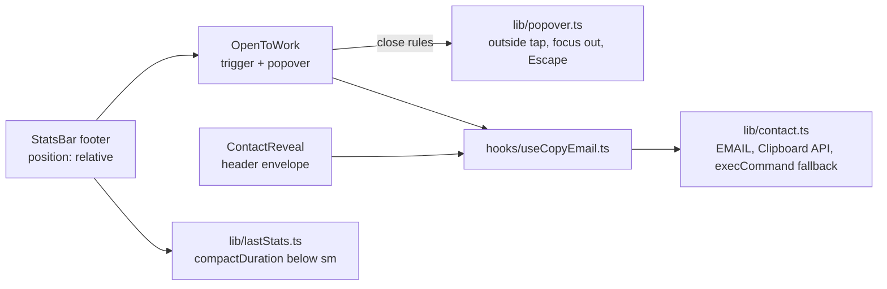

# Footer "Open to work" callout

**Status:** PR open, [#<n>](https://github.com/hacka-tron/basel.engineering/pull/<n>). Not merged.

## TL;DR

The footer now says Basel is open to work. A green dot with "Open to work" sits left of New chat on phones and left of Stress test on desktop. A tap opens a small popover, "Open to full-time work and freelancing", with one Copy email button. On phones the latency readout is shorter (`12.3s` instead of `total 12345ms`), so the footer never scrolls sideways, even on a Fold cover screen. This is PR 1 of 3 in the portfolio spec; the "See portfolio →" link comes with PR 3.

## What changed for a visitor

- Footer, right group: a green dot plus "Open to work" (dot only from 300 to 359px; left out below 300px, where the header envelope still copies the email).
- Tap or click: a popover above the footer with the headline, "Talking to teams about full-time roles and taking on freelance projects. Copy my email and say hi." and **Copy email**. Feedback matches the header envelope: "Email copied", or the address itself if copying is blocked.
- It closes on Escape (focus back to the button), a tap outside, a second tap on the button, or focus moving elsewhere.
- Phones: the latency shows at most 5 characters (`312ms`, `1.8s`, `12.3s`). The tooltip and screen readers still say "Total request time" when no answer text was generated. Desktop readings are unchanged.

## How it works

The address and copy logic moved out of the header envelope into `lib/contact.ts`, so both copy buttons share one path and one set of tests. The popover is positioned against the footer, not its button, so it can use the full screen width at 280px.

## Key design decisions and trade-offs

- **Footer item, not a banner or header pill.** The owner compared five live mocks. The footer item costs no chat height, and it slides away with the footer while typing.
- **Phones drop the word "total".** The spec allowed shortening; 5 characters is what fits at 280px beside the new item. The meaning stays in the tooltip and accessible name.
- **No component test framework.** The frontend tests run on Node's built-in runner with no DOM. The popover's rules are pure functions with unit tests; the DOM behaviour is checked in headless Chrome (below).
- **Focus leaving closes the popover.** Otherwise it could stay open inside the footer while focus mode hides it.

## What review caught

(Filled in after each review round: reviewer, round, verdict, findings and fixes.)

## Measurements

Headless Chrome against the phone preview server, footer numbers set to realistic and worst-case values: typical `1.8s` / `1840ms` with 128 queries, worst `999s+` / `total 12345ms` with 128 queries.

MEASUREMENTS_PLACEHOLDER

## Operational notes and risks

- Frontend only; no API, infra or data change. Ships with the next release.
- The footer has little room left at 300–360px. Any new footer content must be checked there.

## How to see it / verify it

- `cd frontend && npm run phone`, then open http://localhost:5230/phone-preview.html: dot and label at 393/375/360, dot only at 320, nothing at 280.
- `npm test` covers the copy paths, the phone reading and the popover rules.

## Open items

- "See portfolio →" in the popover (portfolio PR 3, spec §5.7).
