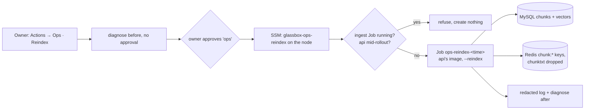

# Ops · Reindex runbook, old answer index dropped, chunk text cache fix

**Status:** Merged 2026-10-02 with the owner's go-ahead (PR [#136](https://github.com/hacka-tron/basel.engineering/pull/136), Opus review round 2 APPROVED). Terraform apply approved by the owner and succeeded (1 added: SSM document `glassbox-ops-reindex`); live on build-105. **Actions → Ops · Reindex** is usable; not run yet (not needed).

## TL;DR

- **"Ops · Reindex"** is a new push-button runbook. It runs `python -m services.glassbox.ingest.run --reindex` once as a Kubernetes Job, using the image the site runs right now. Before this, the only way to run a forced reindex in production was `kubectl exec` into a pod.
- **The unused answer index `idx:answers` is dropped automatically.** Every ingest run (one per release) now runs `FT.DROPINDEX idx:answers` without `DD` if the index exists. The next release drops it; nobody has to click anything.
- **Chunk text cache fix.** When ingest writes a chunk key, it now also deletes that chunk id's cached text (`chunktxt:{id}`). After a MySQL wipe that restarts ids, a reused id could otherwise show the old chunk's text for up to a day.
- **No IAM or RBAC change.** The ops role can already send any `glassbox-ops-*` document, and on-node scripts use the node's own kubectl.

## What changed for a visitor

Nothing visible. These are operations and cache-hygiene changes.

## How it works

- **Runbook** (`.github/workflows/ops-reindex.yml` → `ops.yml` action `reindex` → `.github/scripts/ops-run.sh` → SSM document `glassbox-ops-reindex` = `infra/modules/ops/scripts/reindex.sh`). It works like every other mutating runbook: a read-only diagnose first, then the owner's approval in the `ops` environment, then the action, then diagnose again.
- **The Job:** named `ops-reindex-<UTC timestamp>`. It uses the image of the `api` Deployment and the ingest Job's ConfigMap, MySQL password reference, pull secret and `app: ingest` label (the data NetworkPolicies only let listed apps reach MySQL and Redis). It never retries, Kubernetes stops it after 15 minutes, and it is deleted a day after it finishes. The script prints the Job's last 100 log lines (passed through the redaction filter).
- **Guards:** the runbook creates nothing while the release `ingest` Job or an earlier reindex Job is running, while `api` is mid-rollout, or until this release's `ingest` Job has completed with the api's image. It also refuses if the image is not the project's ECR `glassbox` image. A second guard is the Redis lock `ingest:lock`: if another run holds it, `--reindex` now exits 75 instead of 0, so the runbook fails visibly instead of reporting success after doing nothing. The ingest Job's own locked-out run still exits 0, so a release isn't failed by this.
- **Index drop:** `drop_legacy_index` (`services/glassbox/cache/answer.py`) runs at the start of `prepare_index`, which every ingest and reindex calls. "Unknown index" means already dropped and is a no-op; any other Redis error fails the run, just as an `idx:chunks` error would.

## Key decisions and trade-offs

- **SSM document, not a new IAM permission or a CronJob template.** This follows the existing pattern: only reviewed, Terraform-applied scripts run on the node, and the owner approves each run. The `glassbox-ops-*` wildcard already covers the document, so Bootstrap does not need to run.
- **The Job's manifest lives in the script, not a copy of the live ingest Job.** Copying the live Job would need JSON editing on the node (there may be no `jq`), and the Job might not exist mid-release. To catch drift, the offline test fails if the ConfigMap, Secret reference, pull secret or label names stop matching `k8s/overlays/prod/ingest/ingest-job.yaml`.
- **The image comes from the `api` Deployment.** That is exactly what serves the site, and the runbook refuses mid-rollout, so the image can't be half-updated.
- **No separate `chunktxt:*` flush in the runbook.** A forced reindex rewrites every chunk key in scope, and each rewrite already deletes that id's `chunktxt` in the same transaction (the reconcile did this before this PR). The remaining gap was ordinary ingest after a MySQL wipe: it wrote new keys without clearing their cached text. That is now fixed at the write path, which covers every wipe or restore scenario without anyone having to remember a flush.
- **`FT.DROPINDEX` without `DD`.** `DD` would delete every `ans:*` hash in one blocking call. Without it only the index goes, and any leftover keys expire on their 24-hour TTL. #117 (which stopped writing `ans:` keys) has been live for more than 24 hours, so every such key has already expired.

## What review caught

Round 1 (Opus): approved, no Critical or Important findings. The four minor findings were fixed:
- **Race with the release ingest.** A reindex could start after the api rollout but before Flux recreated `job/ingest`. That ingest would then be locked out (exit 0), and the release's corpus changes skipped until the next release. The runbook now also requires `job/ingest` to have completed with the api's image. A release that starts during a reindex is still possible, in a much smaller window.
- **Wrong exit status in the lock banner.** It always said "exits 0"; it now states each mode's real status (ingest 0, reindex 75).
- **Time budget.** Worst-case kubectl timeouts plus the poll could outrun the 1200 s on-node limit and lose the log. The limit is now 1800 s, and the workflow waits 1860 s.
- **Lock held after a deadline kill.** At its deadline Kubernetes sends SIGTERM. `--reindex` now cancels itself on SIGTERM and releases `ingest:lock` (exit 143), so a killed reindex no longer blocks the next release's ingest for 30 minutes. Only a hard kill (SIGKILL after the 30 s grace period, or a node crash) still leaves the lock held until its TTL.

## Operational notes and risks

- **Memory:** the Job requests 128 MiB and is capped at 384 MiB, the same as the ingest Job. The runbook refuses while the ingest Job runs, so the two never overlap. On a node with about 300 MiB free, run it when the diagnose-before shows no memory pressure.
- **What a reindex does:** it rewrites every `chunk:{id}` key from MySQL (no Bedrock call, no cost), bumps the corpus version (retrieval cache cold for a moment), and deletes orphan keys past the 30% guard. It never deletes when MySQL has zero chunks for a corpus. Cached answers stay valid as long as their source text is unchanged.
- **When to use it:** after MySQL alone was wiped or restored while Redis kept its keys, or when an ingest log shows `REDIS RECONCILE REFUSED` for orphan keys you want gone. "Restore from snapshot" restores MySQL and Redis from the same disk, and every release's ingest already repairs Redis data loss, so neither of those needs it.
- **Until the Terraform apply:** the button fails at the SSM step ("document not found"), and nothing runs.

## How to verify

- Offline: `bash infra/modules/ops/tests/reindex-test.sh` (25 checks: happy path, every refusal (including the release-ingest check), failed and unfinished Jobs, no Secret reads, name parity with the ingest Job). Python: `services/tests/test_answer_cache.py` (drop keeps keys and is idempotent, other errors raise, new chunk keys drop cached text), `test_ingest_reconcile.py` (`prepare_index` drops the old index; a locked-out `--reindex` exits 75; SIGTERM releases the lock and exits 143).
- Live, after the next release: the ingest Job log has one `Dropped the unused answer index idx:answers` warning, and later releases don't. Diagnose doesn't list Redis indexes, so this log line is the check.
- Live, after the Terraform apply: run **Actions → Ops · Reindex**, approve, and check that the summary shows `reconcile about_me: ... rewritten=N` and `about_system` lines and that the after-diagnose looks healthy.

## Open items

- The Terraform apply that creates `glassbox-ops-reindex` (owner approval in `terraform-prod`, any time after merge).
- The stale sweep's delete path (`--clear`, sweep `apply`) deletes chunk keys but not their `chunktxt`. That is harmless, because a deleted id is never retrieved and a reused one is now cleared on write, so it is left as is.
