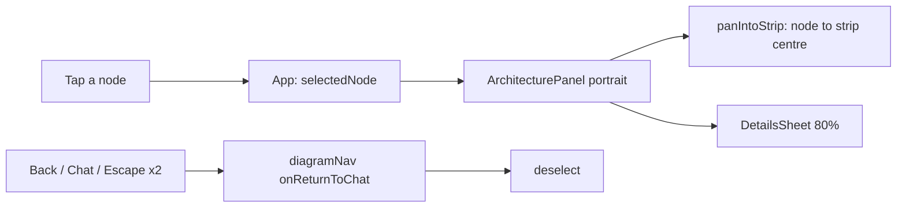

# Phone diagram details in a pull-up sheet

**Status:** Merged and live on build-109 ([#148](https://github.com/hacka-tron/basel.engineering/pull/148), PR 3a of the portfolio feature). Review: round 1 APPROVED; round 2 changes needed (React Flow handles swallowed taps in the strip), fixed and checked by the orchestrator at the review-round cap. Owner decision: any tap in the strip closes the open phone sheet. Release and post-deploy Stream check passed.

## TL;DR

On phones, tapping a diagram component now slides a details sheet up over the bottom 80% of the diagram instead of showing a panel capped at 40%. The tapped node is panned into the dimmed strip left above the sheet. This is the first half of the portfolio plan: the same `DetailsSheet` will carry project details in PR 3b. Desktop is unchanged.

## What changed for a visitor

- Tap a component: a sheet slides up in 260ms (no slide with reduced motion; no dimming with reduced transparency) with the name, what runs it, what it does, the About This System answer ("Continue in chat →") and the retrieved chunks, in 15px text.
- The diagram keeps the tapped node visible in the strip above the sheet; any tap in the strip (a node or empty space), the chevron or Escape closes it; nodes in the strip are not selectable while the sheet is open, so switching component means closing, then tapping a node.
- Back, the Chat segment, Escape with nothing selected, or "Continue in chat" return to Chat and close the sheet.

## How it works

`lib/detailsSheet.ts` holds the pure geometry (cover fraction, strip centre, panning). `diagramNav` gained an `onReturnToChat` hook called once on every route to Chat; App uses it to clear the selection.

## Key design decisions and trade-offs

- Back closes the sheet by leaving the view; the sheet has no history entry of its own.
- The locked bar keeps its place under the sheet (inert), so opening the sheet never resizes the region.
- The sheet is not keyed by the selection, so switching components in the strip does not re-slide it.
- Body text is deliberately larger than chat text (owner decision, spec §2).

## What review caught

Round 1 (Opus reviewer): APPROVED, no Critical or Important findings. Fixed in this PR: nodes now leave the Tab order while the sheet covers them, and, with the sheet open, node and edge wrappers are not focusable either (`nodesFocusable`/`edgesFocusable` false), so Tab and Shift+Tab from the chevron never reach the diagram; doc leftovers ("panel" wording, duplicated Escape). After review the owner chose "any tap closes" for the empty-strip tap problem (Chrome's touch adjustment snapped taps to nearby nodes and fired new questions): nodes ignore pointers while the sheet is open (`.sheet-open`),  Round 2: CHANGES NEEDED, one Important. React Flow's 1x1 connection handles kept pointer events, so 15-22% of strip taps landed on a handle and the sheet stayed open (19/126, 22/100, 28/168 at 280/320/375). Fixed by making handles ignore pointers too (`.sheet-open .react-flow__handle`), and nodes and edges are no longer focusable while the sheet is open (`nodesFocusable`/`edgesFocusable`), so Shift+Tab from the chevron cannot reach hidden diagram elements. A stale comment in `DetailsSheet.tsx` was reworded and two report claims corrected. Backlogged (see BACKLOG Bugs): desktop Back clearing the selection after a narrow-to-wide resize, and the cosmetic zoom dip during the animated pan.

## Operational notes and risks

Frontend only; no backend, infra or CSP change. Changes visitor behaviour on its own, independent of PR 2.

## How to see it / verify it

`cd frontend && npm run phone`, open `/phone-preview.html`, Diagram, tap a component. Headless-Chrome run (live API unreachable, `/api` faked) at 280x653, 320x568, 360x780, 375x667, 393x852 and desktop 768x1024, 1024x768, 1280x800: no horizontal overflow in any state. Strip heights (sheet top minus region top): 68px at 320x568, 88px at 375x667, 125px at 393x852 (85px at 280x653, 110px at 360x780). Dense grid of real touch taps over the whole visible strip (node tiles, edges, handles, gaps, 16x10px spacing), reopening after each close: 144/144 taps closed at 280x653, 140/140 at 320x568, 216/216 at 375x667; 0 selections and 0 `/api/ask` requests. Tapping a node with the sheet closed opens it normally; the chevron and Escape also close it (focus on the locked bar), Back closes it with focus on the Diagram toggle, and a second Escape returns to Chat. Keyboard with the sheet open: Tab from the chevron goes to Continue in chat, Chat, Diagram and the ask box, and Shift+Tab goes back through the footer controls; no diagram node or edge is focusable. With the sheet closed all 11 nodes are tabbable. Desktop 1280x800: a node click selects it and the inspector is unchanged.

## Open items

Reduced motion/transparency and rotation with a sheet open were verified by the reviewer. Not exercised: real-device iOS.
