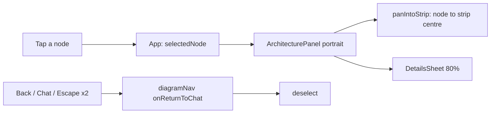

# Phone diagram details in a pull-up sheet

**Status:** In review, [#148](https://github.com/hacka-tron/basel.engineering/pull/148) (PR 3a of the portfolio feature, stacked on #147). Not merged.

## TL;DR

On phones, tapping a diagram component now slides a details sheet up over the bottom 80% of the diagram instead of showing a panel capped at 40%. The tapped node is panned into the dimmed strip left above the sheet. This is the first half of the portfolio plan: the same `DetailsSheet` will carry project details in PR 3b. Desktop is unchanged.

## What changed for a visitor

- Tap a component: a sheet slides up in 260ms (no slide with reduced motion; no dimming with reduced transparency) with the name, what runs it, what it does, the About This System answer ("Continue in chat →") and the retrieved chunks, in 15px text.
- The diagram keeps the tapped node visible in the strip above the sheet; tapping another node in the strip switches the sheet; empty space, the chevron or Escape closes it.
- Back, the Chat segment, Escape with nothing selected, or "Continue in chat" return to Chat and close the sheet.

## How it works

`lib/detailsSheet.ts` holds the pure geometry (cover fraction, strip centre, panning). `diagramNav` gained an `onReturnToChat` hook called once on every route to Chat; App uses it to clear the selection.

## Key design decisions and trade-offs

- Back closes the sheet by leaving the view; the sheet has no history entry of its own.
- The locked bar keeps its place under the sheet (inert), so opening the sheet never resizes the region.
- The sheet is not keyed by the selection, so switching components in the strip does not re-slide it.
- Body text is deliberately larger than chat text (owner decision, spec §2).

## What review caught

Round 1 (Opus reviewer): APPROVED, no Critical or Important findings. Fixed in this PR: nodes now leave the Tab order while the sheet covers them, so keyboard focus goes straight to the sheet; doc leftovers ("panel" wording, duplicated Escape). Backlogged (see BACKLOG Bugs): empty-strip taps snapping to nearby nodes (awaiting owner decision), desktop Back clearing the selection after a narrow-to-wide resize, and the cosmetic zoom dip during the animated pan.

## Operational notes and risks

Frontend only; no backend, infra or CSP change. Changes visitor behaviour on its own, independent of PR 2.

## How to see it / verify it

`cd frontend && npm run phone`, open `/phone-preview.html`, Diagram, tap a component. Headless-Chrome run (live API unreachable, `/api` faked) at 280x653, 320x568, 360x780, 375x667, 393x852 and desktop 768x1024, 1024x768, 1280x800: no horizontal overflow in any state. Strip heights (sheet top minus region top): 68px at 320x568, 88px at 375x667, 125px at 393x852 (85px at 280x653, 110px at 360x780). Tapping another node in the strip switches the sheet; an empty-space tap, the chevron and Escape close it with focus on the locked bar where applicable; Back closes it with focus on the Diagram toggle; a second Escape returns to Chat. Desktop 1280x800 inspector is unchanged.

## Open items

Reduced motion/transparency and rotation with a sheet open were verified by the reviewer. Not exercised: real-device iOS.
