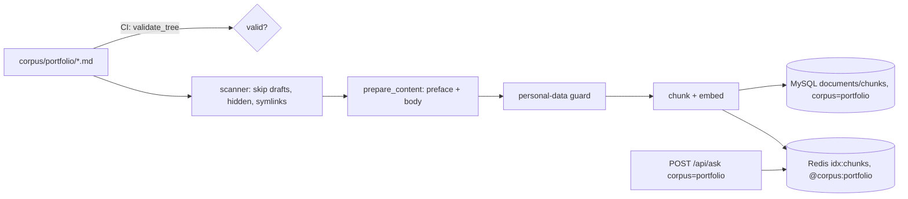

# Portfolio corpus in the backend (portfolio spec PR 2)

**Status:** PR open (PR [#149](https://github.com/hacka-tron/basel.engineering/pull/149)); review round 1 APPROVED, minors fixed. Spec: `docs/superpowers/specs/2026-10-02-portfolio-design.md` §6. Plan: `docs/superpowers/plans/2026-10-02-portfolio-corpus-backend.md`.

## TL;DR
`portfolio` is now a third corpus end to end in the backend: a content format with a CI check, the ingest scanner, the stale sweep, retrieval, `POST /api/ask`, MySQL (Alembic `0007`) and the answer warm-up all know it. The repo ships one draft example project, so nothing is indexed yet. Visitors see no change until the frontend PR (spec PR 3) adds the Portfolio topic.

## What changed for a visitor
Nothing. The only file under `frontend/` that changed is `suggested-questions.json` (a `portfolio` key the chat does not read yet).

## How it works

- **Content:** one public file per project, `corpus/portfolio/<slug>.md`. YAML front matter holds the card fields (`title`, `one_liner`, `kind`, `year`, `stack` required; `order`, `links`, `visuals`, `draft` optional); the Markdown body is the write-up. Screenshots go in `frontend/public/portfolio/<slug>/`. `corpus/portfolio/_example.md` (`draft: true`) explains every field.
- **One format definition:** `services/glassbox/portfolio.py` parses and validates files, builds the text the chatbot indexes, and validates the whole folder. CI runs it as an ordinary pytest test in `backend-tests`; locally `python -m services.glassbox.portfolio`.
- **Ingest:** non-draft files are `portfolio` documents. Each is indexed as a short preface (title, one-liner, kind, year, stack, links) followed by the body, then passes the personal-data guard like About Basel. An invalid file is skipped and listed in the Job log; its last good version keeps serving and the Job still succeeds.
- **One corpus list:** `services/glassbox/corpora.py` holds `Corpus`/`CORPORA`; the API, retrieval, sweep, reconcile, warm-up and both MySQL ENUM columns read it.

## Key design decisions and trade-offs
- **Validator in Python, run as a pytest test:** the ingest Job needs it inside the image, and `backend-tests` already runs on any `corpus/` or `frontend/` change, so no new workflow. PR 3's frontend parses the same files in TypeScript; the rules are written in the module docstring and DD3 §1.3 to keep them in step.
- **Strict schema:** unknown fields, `year: "2026"`, `stack: React`, `aspect: 16:10` (YAML reads it as 970) and `draft: "false"` are each a named error, never a silent coercion.
- **Preface for retrieval:** "which projects use React?" matches the stack line even if the body never says React.
- **Guard plus a CI personal-data check:** the ingest guard redacts what the chatbot sees, but the site will render these files as written, so CI also fails a file the guard would redact (it reports the category and line, never the value).
- **Drafts:** fully validated, but screenshot files are only required for published projects.
- **PyYAML is now a runtime dependency** (the image installs only `services/requirements.txt`); a test pins it.
- **No prompt, model or eval change** (`_PROMPT_VERSION` stays `v14`). The golden-set coverage test skips `portfolio` (no golden additions until real projects exist).

## What review caught
Round 1 (Opus reviewer): **APPROVED**, no Critical or Important findings. The reviewer re-ran the suite, read the CI log (migration round trip and the MySQL/Redis portfolio tests ran), and reproduced the YAML gotchas, invalid files, symlinks and the personal-data guard end to end. Minors fixed in this PR:
- **YAML 1.1 laxness:** PyYAML read `draft: yes`/`on`/`On` as true and let a repeated field silently win, so CI and PR 3's YAML 1.2 TypeScript parser could disagree on whether a project is published. The parser now accepts only literal `true`/`false` as booleans and rejects a repeated field with a clear message.
- **Rate-limit headroom:** a test keeps the number of warm-up questions at or below the per-IP bucket (`RATE_CAPACITY`, 10).
- **`aspect: 16:10`:** the error ("got 970") now says to put it in quotes.
- **Symlinked screenshots:** an image (or its folder) under `frontend/public/portfolio/` that is a symlink now fails the check, matching "symlinks are never read".

To BACKLOG: the old-worker skew during a rollout (one CronJob run can exit 1) and the downgrade's delete path being executed only on empty tables in CI.

## Operational notes and risks
- **Migration `0007`** appends `portfolio` to `documents.corpus` and `queries.corpus`. Appending an ENUM member at the end is metadata-only in MySQL 8.0 and both tables are small. The migrate Job applies it on deploy; the owner does nothing. CI now also runs a round trip (newest revision down, then up) before the tests.
- **Backing out:** revert the code but keep `0007_portfolio_corpus.py` (and the ENUM in `models.py`); an image whose migrations stop at `0006` would fail `alembic upgrade head` and its pods would wait in `Init`. The downgrade is lossy (deletes portfolio rows) and documented in the migration.
- **Deleting or drafting a project:** it becomes stale for the sweep, which runs in report mode in production, so it stays searchable until the sweep is applied or `--clear --corpus portfolio` runs. Drafting the last project is refused by the zero-file guard.
- **Warm-up now asks 10 questions** (3 About Basel, 4 About This System, 3 Portfolio), at the per-IP limit of 10 per 10 minutes. The 3 Portfolio asks find no sources while the corpus is empty, so they cost no LLM call. During a rollout the CronJob's new image may meet the old api, which rejects `portfolio` with HTTP 422: those 3 asks are logged as failed and spend no budget (tested).

## How to see it / verify it
- CI green on the PR, including "Migration round trip" and the MySQL/Redis tests `test_portfolio_migration.py` and `test_portfolio_projects_are_ingested_with_their_preface` passing (they skip locally without Docker).
- After deploy: `GET /api/version` shows the new build; the ingest Job log shows a `portfolio` sweep line with nothing to delete and no portfolio errors. Optionally, `curl -sN -X POST https://basel.engineering/api/ask -H 'Content-Type: application/json' -d '{"question":"What can Basel build for me?","corpus":"portfolio"}'` streams an "I don't know" answer with no sources (no LLM call).

## Open items
- Portfolio write-ups pass through the planned marker in `api/ask.py`, so a write-up mentioning "SQS", "ASG", "deferred" or "planned" would be labelled as not built. Exempt `corpus/portfolio/` before real projects land (a prompt change: owner go-ahead).
- Ops · Diagnose prints corpus versions for two corpora only; add `portfolio` with the next `ops` Terraform apply.
- Portfolio eval and golden cases once the owner adds real projects.
- Decide at PR 3 whether to hide the Portfolio topic until there is content.
