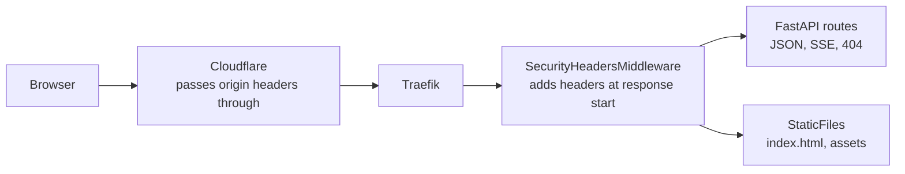

# Security pass leftovers: response headers, short-salt test, ops-read trust

**PR:** _(link added when opened)_ · **Branch:** `security/headers-and-leftovers` · **Docs:** `docs/DESIGN.md` §11, `docs/architecture/deep-dive.md` ("Web security headers", a new section, so the ingest test now expects 33 chunks), `infra/CI.md` "Roles"
**Status:** PR open, not reviewed yet. No production access was used (no AWS, SSM, kubectl, Terraform plan or apply, workflow runs, or GitHub settings changes). One live check: a HEAD request to the public site, which today sends none of these headers.

## TL;DR

- **Security headers on every response.** The API now sets HSTS (180 days, apex only, no preload), `X-Content-Type-Options: nosniff`, `Referrer-Policy: strict-origin-when-cross-origin`, `X-Frame-Options: DENY` plus CSP `frame-ancestors 'none'`, and a `Permissions-Policy` that turns off unused browser features. They apply to the page, static assets, API JSON, 404s and both SSE streams, and streaming still works. **Live on the release that follows the merge.** Security pass finding 12.
- **App-level short-salt test.** A salt that is too short now has a test proving the app itself refuses to start, not just the helper function (review minor on #96). Test only, no behavior change.
- **`glassbox-ops-read` trusts only the `ops-read` environment.** The plain `main` subject it also trusted had no user. Removing it means a future `main` job can't run diagnose without going through the environment. **Live only after the owner runs the Bootstrap workflow.** Security pass finding 3.
- Not in this PR: a CSP that restricts scripts and styles. It needs a Vite build audit and a Report-Only phase first (plan below).

## What changed for a visitor

Nothing visible. Browsers now always use HTTPS for basel.engineering (for 180 days after a visit). The page can't be framed by another site. Links out send only the origin. Unused features such as camera, microphone and geolocation are blocked.

## How it works

- `services/glassbox/api/security_headers.py` is a plain ASGI middleware. It edits only the `http.response.start` message and forwards every body chunk unchanged, so SSE frames and heartbeats go out as before, `X-Accel-Buffering: no` stays, and nothing is compressed or buffered. A header that a route sets itself keeps its own value.
- `services/glassbox/api/main.py` adds it with `app.add_middleware`. That wraps the routers and the `frontend/dist` mount.

| Header | Value |
|---|---|
| `Strict-Transport-Security` | `max-age=15552000` |
| `X-Content-Type-Options` | `nosniff` |
| `Referrer-Policy` | `strict-origin-when-cross-origin` |
| `X-Frame-Options` | `DENY` |
| `Content-Security-Policy` | `frame-ancestors 'none'` |
| `Permissions-Policy` | `accelerometer, autoplay, camera, display-capture, encrypted-media, fullscreen, geolocation, gyroscope, magnetometer, microphone, midi, payment, picture-in-picture, publickey-credentials-get, screen-wake-lock, usb, xr-spatial-tracking` all `=()` |

## Key design decisions & trade-offs

- **Middleware rather than a Cloudflare response-header rule.** The middleware is unit-tested, reviewed with the code, ships with a normal release (no Terraform apply), and applies in local dev too. A Cloudflare rule would need a new `http_response_headers_transform` ruleset in `infra/modules/edge` plus Transform Rules permissions on both Cloudflare tokens (the plan token is read-only for zone, DNS and cache rules). Cloudflare only adds value for responses that never reach the app (522s, edge errors), and those carry no app content to protect.
- **Pure ASGI, not `BaseHTTPMiddleware`.** The latter wraps streaming bodies and has a history of disconnect and background-task problems. The pure version can't change streaming behavior.
- **No `includeSubDomains`.** Only the apex record is in Terraform. `www` and any record added by hand aren't managed here, and `www` currently returns a Cloudflare 522. Committing every subdomain to HTTPS for 180 days would be a promise this repo can't check. No `preload` either, since removal takes months.
- **180-day max-age.** Long enough to matter. Short enough that a mistake ages out.
- **Clipboard is not in `Permissions-Policy`.** The Contact control copies the email address. Only widely recognized feature names are listed, so browsers don't log "unrecognized feature" warnings.
- **Known gap:** Starlette's outermost `ServerErrorMiddleware` sends the bare 500 page for an unhandled exception without these headers. That body is plain text with no script, so this is accepted.
- **ops-read:** `ops.yml`'s `diagnose` job is the only place that assumes `glassbox-ops-read`. It declares `environment: ops-read`, so its OIDC `sub` is `…:environment:ops-read`, and the eight "Ops · …" wrappers call it with `workflow_call`, which doesn't change that. No other workflow references the role. Every other `id-token: write` job uses its own role. The plain-ref subject was therefore unused and only widened who could run diagnose.

## Tests

- `services/tests/test_security_headers.py` (9 tests): the HTML page plus JS and CSS assets (the MIME types stay correct, which matters under `nosniff`), a static 404, API JSON, an API 404 and a 422, `/api/ask` SSE (keeps `X-Accel-Buffering` and `Cache-Control`, no `Content-Encoding`), `/api/cluster/stream` SSE, a raw-ASGI test where the second SSE frame is only produced after the first has reached the server (so the middleware doesn't buffer), and a route overriding a header. With the middleware line removed, 6 of them fail.
- `services/tests/test_limits.py`: the app-level salt test is parametrized over a missing salt, one character short, and short after whitespace stripping, plus a positive test that the app starts with a salt of exactly the minimum length.
- Full suite: 377 passed, 21 skipped (Redis/MySQL-backed). `ruff check services eval` is clean. `terraform fmt` passes, and `terraform validate` passes on a scratch copy of `infra/bootstrap` with `init -backend=false`.
- Manual check: ran uvicorn against a real `npm run build`. Every file type (HTML, JS, CSS, SVG, WOFF2), a 404 and the cluster SSE stream had all six headers. The SSE response used chunked transfer with no compression.

## What review caught

_Pending._

## Operational notes & risks

- **Headers:** on the next release after merge. Cloudflare passes origin headers through; Cloudflare's own HSTS setting is off today (no header live), so there is no duplicate. HSTS can't be withdrawn quickly: after a visit, a browser insists on HTTPS for 180 days. The apex is HTTPS-only already, so this is safe.
- **IAM:** merging changes nothing live. The owner runs **Actions → Bootstrap → Run workflow** on `main`, checks that the plan shows an in-place update to `aws_iam_role.runbook["glassbox-ops-read"]` (its `assume_role_policy`), plus the known no-op `aws_s3_bucket_policy.state` diff, then approves. Rollback is reverting the commit and running Bootstrap again.
- If a future workflow needs diagnose, it must use the `ops-read` environment, which is the point of the change.

## How to see it / verify it

1. After the release: `curl -sI https://basel.engineering/` lists the six headers. Also check `/api/cluster/stream` in the browser devtools Network tab: same headers, and events still arrive live.
2. Chat still streams token by token, the diagram still lights up, and Contact still copies the email address.
3. After the Bootstrap apply: run **Actions → Ops · Diagnose** once. It should pass as before. That is the only runbook that uses `glassbox-ops-read`, and the change-type runbooks also run diagnose first, so one Diagnose run covers the change.

## Open items

- **Script/style CSP, Report-Only first.** Move the inline iOS zoom `<script>` in `frontend/index.html` to a file in `public/` (or hash it at build time). Check React Flow and Tailwind for `<style>` injection or `style` attributes set from markup (React's `style` prop uses CSSOM and isn't affected). Then send `Content-Security-Policy-Report-Only: default-src 'self'; script-src 'self'; style-src 'self'; img-src 'self' data:; font-src 'self'; connect-src 'self'; object-src 'none'; base-uri 'self'; form-action 'self'; frame-ancestors 'none'`. Collect violations, either from a small rate-limited report endpoint or by watching consoles in the phone preview and desktop browsers for a few days. Then enforce.
- `includeSubDomains` and a longer max-age once every name in the zone is known to be HTTPS.
