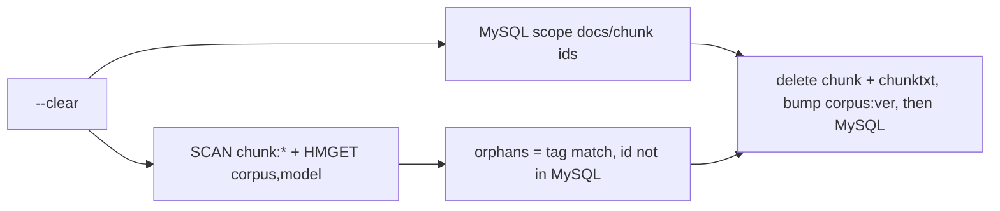

# Stale sweep follow-ups: orphan Redis keys and run notes

## TL;DR
Two small gaps in the stale sweep (PR #101) are closed. `--clear` now also finds and removes orphan `chunk:*` hashes (no MySQL row) for the chosen corpus and model, and every ingest run records its sweep outcome in a new `ingestion_runs.notes` JSON column. Stacked on PR #141 (merge after it).

## What changed
- `--clear` runs a batched `SCAN chunk:*` (COUNT 500, non-transactional HMGET pipelines) and matches hashes whose `corpus` field equals the corpus and `model` field equals the model tag, excluding ids MySQL still holds. Matches are deleted with their `chunktxt:{id}` text caches, then `corpus:ver` is bumped. Every removed chunk id (not just orphans) now also drops its `chunktxt:{id}`.
- `--dry-run` with `--clear` reports the orphan count and deletes nothing; the confirmation prompt mentions it. The confirmed orphan list is the one deleted.
- Alembic `0006_ingestion_run_notes`: one nullable JSON column, no default (MySQL 8 INSTANT add; old rows NULL). Written on success and on failure: `{"sweep": {"mode", "corpora": [{corpus, model, known, planned, deleted, refused}]}}`. The stdout banner is unchanged.

## Decisions
- Orphans are matched on the hash's own `corpus`/`model` fields, so other corpora and models are never touched. Hashes missing those fields are left alone (the reconcile handles those).
- `clear` now opens Redis even for a dry run (read-only), to count orphans.
- Notes are only written by ingest runs; `--clear` leaves no run row.

## Risks
- The migration must run before the new ingest image (it does: migrate Job first); purely additive.
- The SCAN is O(keyspace) but only on an operator-run command.

## How to verify
`python -m services.glassbox.ingest.run --clear --corpus about_me --dry-run` shows documents and orphan count; after an ingest, `SELECT notes FROM ingestion_runs ORDER BY id DESC LIMIT 1`. Integration tests (MySQL/Redis) run in CI only.

## Open items
None.
