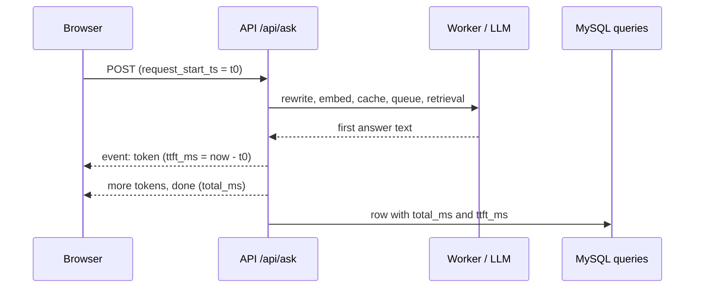

# Time to first token in the query log (`queries.ttft_ms`)

**Status:** Merged 2026-10-02 (PR [#137](https://github.com/hacka-tron/basel.engineering/pull/137)); Opus review round 1 APPROVED, test gaps fixed. Live (migration 0005 applied by the release).

## TL;DR

Every `/api/ask` request now records its server-side time to first token (TTFT) in a new nullable `queries.ttft_ms` column (Alembic `0005_query_ttft_ms`). It is the milliseconds from the API receiving the request to the API sending the first piece of answer text. This closes the "TTFT logging" item of M3 (DD2 §7.5, §9.3). Nothing changes for visitors and the SSE contract is unchanged.

## What changed for a visitor

Nothing visible. The footer already shows the browser's own TTFT; this adds the server's view to the query log so latency can be analysed over time.

## How it works

- `services/glassbox/api/ask.py`: every `token` event goes through one helper, `token_frame()`, which records `elapsed_ms(request_start_ts)` the first time it sends non-empty text. The value is passed to `_save_query`, including on the Stop path.
- `services/glassbox/db/models.py` and `migrations/versions/0005_query_ttft_ms.py`: one `INT NULL` column, no default.

## Key decisions

- **Same clock origin as `total_ms`.** Both start at `request_start_ts`, so the two are directly comparable, and `ttft_ms <= total_ms` in practice. Both read the wall clock (`time.time()` in `trace.py`), so a clock step during a request could break that ordering in rare cases.
- **Answer-cache hits are measured.** The cached answer is sent as one `token` event; that is when the visitor first sees text, so it matches what the browser measures. Hits are much faster, so analysis splits by `cache_status`. The no-sources abstention reply is also a streamed answer and is measured (flagged by `stage_timings_ms.abstained`).
- **NULL when no answer text was sent:** `retrieval_only` (kill switch or budget), Stop before the first token, and errors (which write no row). A Stop after the first token keeps its TTFT.
- **Server-side only.** It excludes network time to the visitor and Cloudflare. The production-vs-local comparison through Cloudflare (DD2 §7.5's scripted `curl -N` check) is still not built.
- **No structured log line.** The API has no per-request structured log (logs are plain text), so the query log row is the only record. Adding one would be a separate change.

## Operational notes and risks

- **Migration is safe during a release:** a nullable column with no default, appended at the end, is an in-place (instant) `ADD COLUMN` on MySQL 8. Old API pods never name the column and keep writing rows while `migrate` runs; new pods wait for the migration (`wait-for-migrations`).
- Query-log writes stay best-effort, as before.
- An eval golden snippet that quoted the old token line (`eval/golden.yaml`, `system-sse`) now quotes the helper. No evaluation was run.

## How to verify

- Tests: `services/tests/test_stream_resilience.py` (TTFT cases with a fake clock: first non-empty token, Stop after the first token, Stop before it, `retrieval_only`, cache hit, row write; the MySQL row test now also stores `ttft_ms` after `alembic upgrade head` in CI) and `services/tests/test_db_models.py` (column, DDL, migration chain).
- After deploy, with read access to MySQL: `SELECT cache_status, COUNT(*), MIN(ttft_ms), MAX(ttft_ms) FROM queries WHERE created_at >= NOW() - INTERVAL 1 DAY AND ttft_ms IS NOT NULL GROUP BY cache_status;`

## Open items

- **p50/p95 TTFT in Ops · Diagnose:** not added. `diagnose.sh` is embedded in an SSM document, so it needs a Terraform apply and owner approval. Logged in BACKLOG with a suggested query.
- §7.5 scripted `curl -N` streaming check through Cloudflare after each deploy (still not built).
