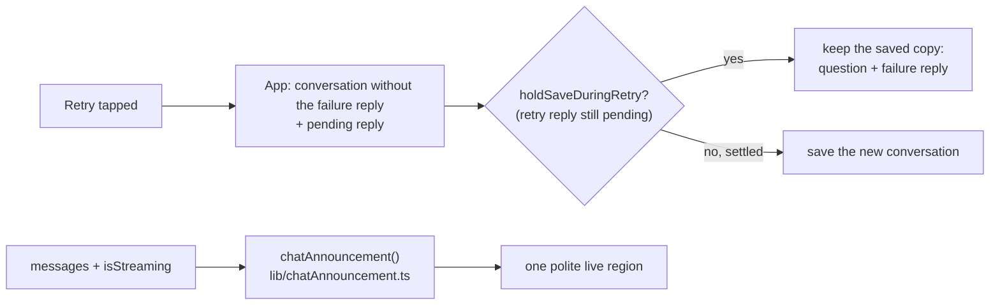

# UI review follow-ups: retry reload, announcements, phone focus, landscape fit

**Status:** In review, PR [#113](https://github.com/hacka-tron/basel.engineering/pull/113). Not merged.

## TL;DR

Five small follow-ups from the #93 (chat), #90 and #100 (landscape) reviews. A reload during a Retry no longer loses the failure reply and its Retry button. Screen readers now hear "Answer stopped." after Stop, nothing stray during stop-and-send, and "Retry is available now." when a rate-limit countdown ends. On phones, focus after Retry goes to the retried question instead of the page body. The Chat | Diagram segments' tap area now covers the whole control (it was already 48px tall). At 568x320 with the details open, the landscape diagram now shows all 11 nodes instead of clipping six. Desktop and portrait phones look exactly the same as before.

## What changed for a visitor

- **Reload during Retry:** you see the failed question, its failure reply and a working Retry, as before you pressed it. Before, the failure reply and Retry were gone and the question sat there unanswered.
- **Screen readers:** Stop says "Answer stopped." Sending a new question while an answer streams no longer briefly announces the interrupted answer. After "try again in N seconds", the end of the countdown is announced once ("Retry is available now.").
- **Phones, after Retry:** focus lands on the retried question (no on-screen keyboard), so keyboard and screen-reader users keep their place. Desktop still focuses the ask box.
- **Chat | Diagram switch:** a tap anywhere on the bordered control, including its 3px outer edge, hits a segment. Visually unchanged.
- **Smallest landscape phone (568x320), Diagram view with details open:** the whole three-row graph is visible (zoom 0.54, 4px margin) instead of being cut off on both sides. Wider phones fit as before (667x375 goes from 0.65 to 0.64 for the margin; 740x360 and 896x414 are unchanged).

## How it works

- **Reload mid-retry.** The save effect in `App.tsx` skips writing a conversation while the reply to an in-flight retry is still pending (`holdSaveDuringRetry` in `lib/chatRetry.ts`). The stored copy keeps the failure reply until the retried answer settles (done, stopped, or failed again), then the normal save runs.
- **Announcements.** `Chat.tsx` derives its live-region text from `chatAnnouncement()`: empty while streaming, the settled reply otherwise, "Answer stopped." for a stopped reply, nothing for the reply a stop-and-send interrupted (Chat remembers its id when you send), and "Retry is available now." once the Retry countdown calls back.
- **Focus.** User messages carry `data-message-id` and `tabIndex=-1`; after Retry on a phone, Chat focuses the retried question with `preventScroll`.
- **Landscape fit.** While the details are open beside the landscape diagram, the refit uses `squeezedMinZoom` (`lib/diagramFit.ts`): the 0.65 floor gives way only as far as needed for the graph to fit with a 4px margin, never below 0.5.

## Key design decisions

- **A reload mid-retry restores the last settled state, like a normal mid-answer reload.** A normal reload during an answer shows the question without its unfinished reply (the pending reply is never saved). For a retry, the last settled state includes the failure reply, so the visitor gets Retry back. No in-flight state is saved as an error that never happened.
- **"Answer stopped." instead of reading the partial answer.** The partial text was on screen while it streamed. Re-reading it would be long, and the region should say what just happened.
- **The existing live region, not a new one.** One polite region, one short text per settled event.
- **Focus on the question, not the message list.** Screen readers then read the question being retried, and the new answer appears right below it.
- **Segments: pseudo-element, not `h-11`.** The tap area was already 48px tall (measured with `elementFromPoint`: 49 rows). Making the segments 44px would grow the strip by 4px and take it from the messages, and the visible height would change. Now the pseudo-element also covers the group's outer edges (tap width 56px and 78px).
- **Landscape: lower the zoom floor, not a narrower panel.** At 568px the graph needs about 400px of width at 0.65, which would leave the details panel under 170px, too narrow for its text and the collapse button. A floor that gives way only while the details are open draws labels at about 6.5px instead of 7.8px, the diagram can still be pinched, and every other size is untouched.
- **No hook extraction.** The frontend has no React test renderer (`npm test` runs Node's runner over `lib/`), so a hook could not be unit tested without a new component-test setup. The new logic is in pure, tested helpers instead; the App wiring tests stay in the backlog.
- **Not touched (owner's call):** a visual cue for stop-and-send, and an "answer ready" cue in Diagram view.

## What review caught

Not reviewed yet.

## Operational notes and risks

Frontend only; no API or infra change. Low risk. Edge: if the browser is closed mid-retry, the stored conversation keeps the old failure reply, which is the intended state. Since the retried question is focused after Retry on a phone, a hardware-keyboard user sees a focus ring around it (`focus-visible` only, so not after a tap).

## How to verify

- `cd frontend && npm ci && npm test && npm run lint && npm run build` (new tests: `lib/chatAnnouncement.test.ts`, plus cases in `chatRetry.test.ts` and `diagramFit.test.ts`; 100 tests).
- Phone preview (`npx vite --config vite.phone.config.ts --port 5240`) driven by headless Chrome over CDP, with `/api/ask` faked in the page (0 live questions):
  - Reload mid-retry at 393x852, 320x568, 667x375, 568x320 and 1280x800: storage kept the failure reply while the retry streamed; after the reload the failure reply and an enabled Retry were back; retrying again saved the answer and sent the same history as the first attempt. A normal mid-answer reload still shows the question without a reply.
  - Live region: Stop gave `"Answer stopped."`; stop-and-send never contained the interrupted text; a 3s rate limit gave the failure reply, then `"Retry is available now."`, and the Retry label changed to "Retry question".
  - Focus after Retry: the retried question on every phone size, the ask box on desktop.
  - Segments: 49px tall tap area in portrait and landscape; visible 40px; strip height unchanged (47px).
  - 568x320 details open: 0 of 11 nodes clipped (was 6), zoom 0.54; 667x375, 740x360, 896x414 also 0 clipped.
  - Against `main` (separate worktree, same fixture): desktop 1280x800 Chat and Diagram screenshots byte-identical, and all portrait screenshots byte-identical; element rectangles identical at every size except the worker's live pod dots.
- Screenshots in the session scratchpad, `ui-followups/`.

## Open items

- Stop-and-send looks the same as Send to sighted users (owner design call).
- An "answer ready" cue in Diagram view (owner design call).
- Component questions are still recognised by wording (`COMPONENT_QUESTIONS`), and the App wiring (queued ask, `isCurrent` guard, retry wiring, the save hold) has no tests; it needs a component-test setup.
