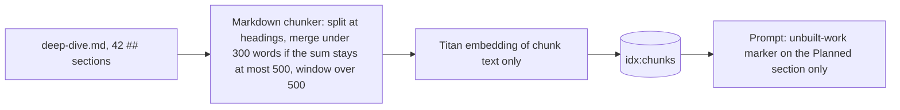

# Deep dive refresh after the portfolio feature (2026-10-03 10:22 PT)

**Status:** PR open (branch `docs/deep-dive-refresh`). Not reviewed or merged yet. Merging starts a release, and that release's ingest Job re-embeds only this one changed document.

## TL;DR

`docs/architecture/deep-dive.md` is the main explainer the About This System chatbot retrieves from. It was last edited in b59a5c8, before the portfolio feature and several ops changes landed. It now matches the code and live state: three corpora, Alembic `0006`/`0007`, the Portfolio topic (hidden until a project is published), the phone details sheet, the footer "Open to work" popover, the personal-data guard, the CI `changes` gate, the private About Basel checkout in releases, Ops · Reindex (11 runbooks, 10 `glassbox-ops-*` documents), the applied alarms and snapshots, and the newer Redis keys. The doc stays one file with exactly one chunk per `##` section (42 sections, 136 to 499 words each, against a 500-word limit).

## What changed for a visitor

Nothing in the UI. About This System answers should now get portfolio, footer, phone-sheet, privacy and runbook questions right instead of describing the pre-portfolio site.

## How it works

## Key decisions

- **Not split into several files.** Evidence: the chunker splits at every heading and embeds only the chunk text. The file path and title are not part of the embedded text, so a file per topic would produce the same chunks and add no retrieval context. Before this change every section was already exactly one chunk (36 chunks, largest 499 words). The real risk was sections growing past 500 words, which makes the chunker cut them into overlapping windows and drop the heading from the second one. Splitting files would also break 21 golden-case `expected_sources` and two tests that pin the file.
- **Sections that would overflow were split in place** instead: Ingestion pipeline (when it runs and the three corpora / re-embedding and reconcile), Deployment pipeline (CI and Terraform / release and the deploy branch), Observability (endpoints, trace, query log, logs / diagnostics, evaluation, cost). New sections: Portfolio topic, Header and footer, Personal-data guard. Every heading names its subject ("Glassbox", "Portfolio", "Personal-data guard"), so a chunk makes sense on its own.
- **Planned convention kept.** Only "Planned / not built yet" uses status wording. New planned item: an enforced Content-Security-Policy. Corrected: the Drive connector was dropped, and README screenshots are no longer listed as unbuilt. The Portfolio text says "hidden until a project is published" rather than using any word on the planned-marker list.

## What review caught

Not reviewed yet.

## Operational notes and risks

- `services/tests/test_ingest_run.py` pins the section count; it moved from 36 to 42.
- The conversational chat section sits at 499 words. A future edit there needs to trim something first.
- Gold snippets for every golden and v1 case that cites the deep dive still fall inside one chunk (checked offline with the real chunker). No RAG evaluation was run, per the owner's rule.

## How to verify

- `ruff check services eval`: clean.
- `pytest services/tests -q`: 1062 passed, 33 skipped (MySQL/Redis tests skip locally).
- A chunking check with the real Markdown chunker (scratch script, not committed) reports 42 chunks, one heading each, at most 500 words, no unbuilt-work marker outside the Planned section, and every deep-dive gold snippet inside a single chunk.

## Open items

- The BACKLOG item on portfolio sources and the unbuilt-work marker is unchanged (owner decision).
