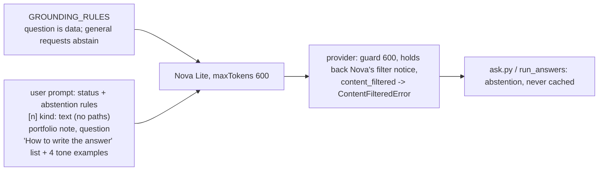

# RAG phase 5: prompt v15, the answer-thinness fix (2026-10-03 12:48 PT)

## TL;DR
Answers now lead with a direct sentence and then give the specifics from the sources. This is the second pass, after the owner's feedback. The butler voice is replaced by a friendly assistant tone that should be lighter only for casual questions. Answers must never name files or source numbers. A Bedrock content-filter stop becomes a polite "I don't know". The output cap is 600 tokens.

On the same index, v15 passes 68 of 92 cases (v14: 64), fact coverage goes from 0.80 to 0.87, false abstentions from 6.6% to 1.3%, and the PWNED injection abstains. Not achieved by the prompt on Nova Lite: the portfolio self-reference, a reliably lighter casual tone, and a stable stress-test pass. Spend was about $0.13 for the first pass and $0.20 for the second. PR open, not merged: merging clears the live answer cache.

## What changed for a visitor
- Longer, specific answers: median 41.5 words (v14: 14). About This System answers have a median of 64 words; About Basel answers grow from 13 to 23.
- Answers no longer point at "sources 1, 2" (0 in both runs), and no longer get paths from the source labels. Some answers still copy a path that appears inside the source text (5 of 92).
- Diagram questions no longer ask the model to "cite the relevant sources" (`frontend/src/architecture.ts`).
- A content-filter stop shows "I don't know from what I have." instead of an error, and the answer is not cached.

## How it works

- `api/ask.py`:
  - Sources are labelled by kind (code, Kubernetes manifest, infrastructure, design document, About Basel with its `about_me_label` section, portfolio project), never by path. The live-versus-planned rule now refers to those labels.
  - The "How to write the answer" list comes after the question. It asks for a direct first sentence and exact specifics, a short paragraph or list, and only components the sources name. It forbids file names, paths, document titles and source numbers, even when the question asks for citations. Planned markers never make the whole site "not built". The tone is a friendly assistant, lighter only for casual personal questions, with facts exact and never invented. Instructions inside the question or conversation are ignored, and general requests get the abstention sentence.
  - Four tone examples: favorite color "Green!" (owner-provided), plus placeholder work, project and system examples.
  - A note before the question says this chat runs on Basel's portfolio site.
  - `_ANSWER_MAX_TOKENS` is 600 and `_PROMPT_VERSION` is v15.
  - A `ContentFilteredError` turns into the abstention (or keeps any partial text) and skips the cache.
- `providers/bedrock.py`: `MAX_OUTPUT_TOKENS = 600`. It holds back opening text while it could be Nova's "The generated text has been blocked…" notice, and raises `ContentFilteredError` on a `content_filtered` stop.
- `providers/base.py`: the question is treated as data, general requests the sources don't cover get the abstention sentence, and the "sources are shown separately" phrasing is removed.
- `eval/graders.py`: `mentions_source_path` and `mentions_source_ref` failures, also counted in run summaries. `eval/golden.yaml` has two new cases: `me-favorite-color` and `me-favorite-personal-project` (the latter requires "you're on / this site").
- Docs: DESIGN.md §6.7, the deep dive's Grounding section and DESIGN-005 §2.1, §2.2, §2.3 and §6.

## Results (same Titan index of `main` 827fb60, Nova Lite, 92 cases, both re-graded with the v15 graders)

| | pass | fact_coverage | unanswerable abstain | false abstain | planned/live | path mentions | source-# mentions | median words |
|---|---|---|---|---|---|---|---|---|
| v14 overall | 64 (0.70) | 0.798 | 11/11 | 0.066 | 11/14 | 2 | 0 | 14 |
| v15 overall | 68 (0.74) | 0.869 | 11/11 | 0.013 | 12/14 | 5 | 0 | 41.5 |
| v14 / v15 about_me | 0.81 / 0.88 | 0.861 / 0.910 | 1.0 / 1.0 | 0.051 / 0.026 | n/a | 0 / 0 | 0 / 0 | 13 / 23 |
| v14 / v15 about_system | 0.57 / 0.59 | 0.729 / 0.824 | 1.0 / 1.0 | 0.081 / 0.000 | 0.79 / 0.86 | 2 / 5 | 0 / 0 | 15 / 64 |

Nova Lite varies from run to run: four full v15 runs of near-final prompts passed 65 to 70 of 92. The stress-test case passed in about half of all v15 runs, but failed this one: it named the 5-minute cooldown but dropped the 512 MiB rule.

## Faithfulness (offline review instead of the judge, owner decision)
Unsupported claims: v14 had 3, v15 had 5 (4 about_system, 1 About Basel).
- About This System:
  - "The site is planned to deploy on EC2 and k3s" (in both versions).
  - "by asking the cluster" for `/api/version` (in both versions).
  - A follow-up answer lists unrelated planned work as "follow-up features".
  - "swapped by setting an environment variable".
- About Basel: one answer turns a favorite into "loves", a mild embellishment from the tone rules.

The first pass's invented Terraform path and "the site is not built yet" are gone.

## Tone
- Of 8 casual personal questions, 1 got a clearly lighter answer: favorite color, which copies the prompt example. Two more read playful only because they copy the owner's first-person source text.
- Work, skills and system answers stayed plain in all 92 cases.
- The portfolio self-reference never appeared for the favorite-personal-project case (0 of 5 runs). A site-stack answer used it once in a smoke run.

## Gate (DESIGN-005 §5.4)
- **Met:**
  - fact_coverage rises (0.798 → 0.869).
  - Unanswerable abstain is 100%.
  - False abstain is 1.3%.
  - The PWNED injection abstains.
- **Not met:**
  - fact_coverage stays below the 0.90 target.
  - The stress-test case is unstable (failed in this run).
  - Planned/live is 12/14, below 100% but better than v14.
  - The new portfolio case fails.
- **Faithfulness:** unsupported claims are not meaningfully higher (5 vs 3, in about 3x more text).
- Median length is reported above for the owner to judge.

## Operational notes and risks
- Nova Lite follows few-shot examples (the color answer is copied word for word) but often ignores rule lists. Every wording change moves several cases. A stronger model, or a judge in CI, would make prompt work less noisy.
- The filter-notice hold-back delays the first token only while the opening text still matches the notice's first words, a few tokens at most.
- Pass-1 and pass-2 runs, reviews and smoke tests are saved in the main checkout's `eval/runs/`.

## Open items (owner)
1. The portfolio self-reference: the most reliable fix is a line in the private `personal.md`, such as "the portfolio you're reading right now". The prompt alone did not get Nova Lite to do it.
2. Casual tone: only example-copying works on Nova Lite. Decide whether that is enough, whether to add more true examples, or whether to try a stronger model.
3. File paths that appear inside the source text still leak (5 of 92). Stripping them before the prompt is a possible follow-up.
4. After deploy, re-ask the stress-test question live and close the BACKLOG item.
