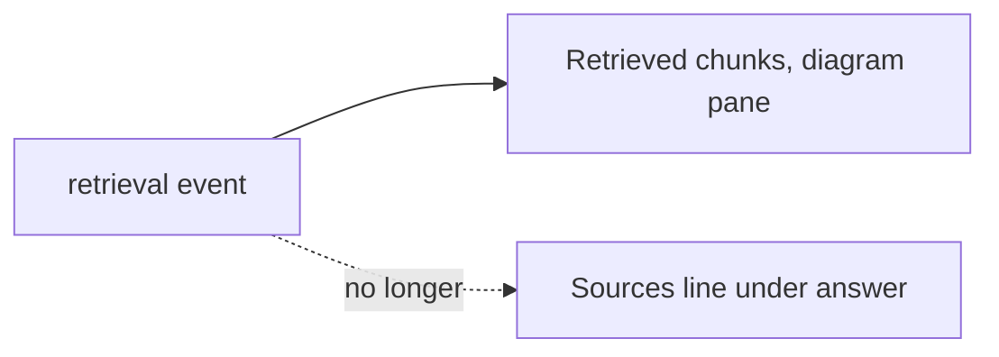

# Remove the sources list under chat answers (2026-10-03 13:15 PT)

## TL;DR
Chat answers no longer show a "Sources:" line in any topic. Owner (2026-10-03): the diagram pane's "Retrieved chunks" list already shows them, so the line was redundant. This began as "hide it for About Basel and Portfolio only" and widened the same day.

## What changed for a visitor
- No "Sources: ..." under answers in About Basel, About This System or Portfolio.
- When the daily budget or the kill switch means no answer text (`retrieval_only`): About This System says "I can't write an answer right now, but what I found is listed under Retrieved chunks in the diagram."; About Basel and Portfolio get a playful budget reply with no pointer. The 20 budget replies were reworded to drop "the sources below".
- The diagram pane's Retrieved chunks section is unchanged.

## How it works
Frontend only. `App.tsx` no longer builds `sources` from the SSE `retrieval` event, `Chat.tsx` no longer renders them, and `ChatMessage` has no `sources` field (`lib/conversation.ts`). Conversations saved earlier drop their `sources` on load and never write them back. `retrievalOnlyReply(topic)` in `lib/budgetReplies.ts` picks the retrieval_only text. The `budget_exhausted` error reply no longer carries sources either.

## Design decisions
- Frontend only; the backend, retrieval and caching are untouched, and the SSE still carries the chunks (the diagram needs them).
- Dead code removed instead of a flag.
- A fixed pointer message for About This System, since the chunk list is the one place its sources remain.

## What review caught
Not yet reviewed.

## Operational notes and risks
Retrieved chunks still lists `source_path` for every topic, so About Basel answers show `private/...` paths in the diagram pane and in the network tab. Not changed; needs an owner decision.

## How to verify
`cd frontend && npm test && npm run build` (198 tests pass). Ask any question: no Sources line. No live visual check was done (no backend in the worktree).

## Open items
Owner: hide the Retrieved chunks list (or its paths) for About Basel and Portfolio?
