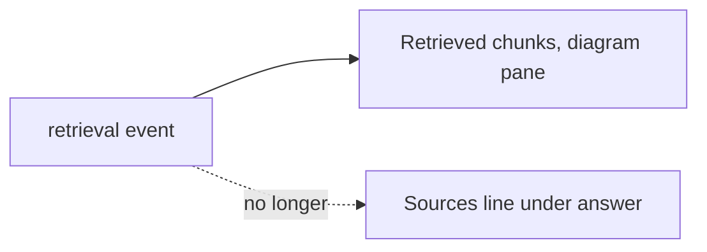

# Remove the sources list under chat answers (2026-10-03 13:15 PT)

## TL;DR
Chat answers no longer show a "Sources:" line in any topic. Owner (2026-10-03): the diagram pane's "Retrieved chunks" list already shows them, so the line was redundant. This began as "hide it for About Basel and Portfolio only" and widened the same day.

## What changed for a visitor
- No "Sources: ..." under answers in About Basel, About This System or Portfolio.
- When the daily budget or the kill switch means no answer text (`retrieval_only`): About This System says "I can't write an answer right now, but what I found is listed under Retrieved chunks in the diagram."; About Basel and Portfolio get a playful budget reply with no pointer. The 20 budget replies were reworded to drop "the sources below".
- The diagram pane's Retrieved chunks section stays, but for About Basel it shows each chunk's section heading (for example "Basel's education") instead of the `private/...` path.

## How it works
Mostly frontend, plus one API function (below). `App.tsx` no longer builds `sources` from the SSE `retrieval` event, `Chat.tsx` no longer renders them, and `ChatMessage` has no `sources` field (`lib/conversation.ts`). Conversations saved earlier drop their `sources` on load and never write them back. `retrievalOnlyReply(topic)` in `lib/budgetReplies.ts` picks the retrieval_only text. The `budget_exhausted` error reply no longer carries sources either.

## Design decisions
- The SSE still carries the chunks (the diagram needs them). Beyond `_public_chunk` (About Basel labels), the backend, retrieval, caching and the LLM prompt are untouched; the prompt still lists `private/...` paths and moves to PR #164 (prompt v15), which can reuse `about_me_label` from `services/glassbox/api/ask.py`.
- Dead code removed instead of a flag.
- A fixed pointer message for About This System, since the chunk list is the one place its sources remain.

## What review caught
Review r1: CHANGES NEEDED. (1) The LLM prompt still has `[n] private/....md` lines: moved to PR #164, which owns `_prompt`. (2) `docs/DESIGN-002-followups.md` and `docs/DESIGN.md` still described a sources line under answers: updated. (3) This report contradicted itself on scope and test results: fixed. (4) The title check for "private" was case-sensitive: now `.lower()`, with a test.

## Operational notes and risks
Owner chose (2026-10-03) to hide the private paths. `_public_chunk` in `services/glassbox/api/ask.py` maps `about_me` chunks to a label (first Markdown heading in the chunk text, else a title that is not a file name, else "About Basel"); it is the one place retrieval events are built, for live and answer-cache-hit replays, so the network tab shows no `private/` either. The cache keeps raw chunks (it validates their hashes) and is mapped on the way out, so no flush is needed. Logging, MySQL and the worker are unchanged. The label uses the chunk's own heading, not the nearest heading in the document, since the API has no document text; RAG phase 7's stored header field should replace it.

## How to verify
`cd frontend && npm test && npm run build` (198 tests pass) and `pytest services/tests` (on a clean DB the full suite passes: 1158 passed, 4 skipped; against my dirty shared stack 3 DB-dependent tests fail, unrelated). Ask any question: no Sources line. No live visual check was done (no backend in the worktree).

## Open items
Swap `about_me_label` for the stored header field once RAG phase 7 lands.
