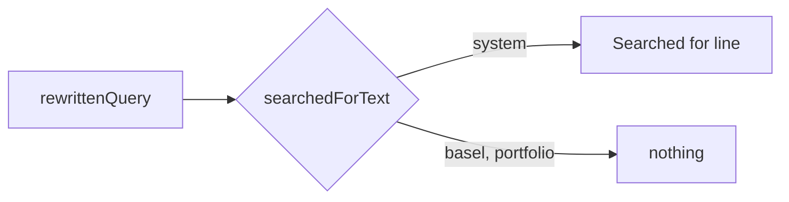

# "Searched for" only in About This System (2026-10-03 14:00 PT)

## TL;DR
The "Searched for: ..." line (the standalone query retrieval used for a follow-up) now shows only in About This System. Owner request 2026-10-03. Frontend only.

## What changed for a visitor
About Basel and Portfolio answers no longer show the line. About This System is unchanged.

## How it works
The line is client-rendered from `rewrittenQuery` in `components/Chat.tsx`; it is not server text. A pure helper `searchedForText(corpus, rewrittenQuery)` in `lib/searchedFor.ts` returns the text only for the `system` topic.

## Key design decisions
- A pure helper keyed on the topic, so the rule is testable and one place changes it.
- Rewriting and retrieval are untouched; the SSE still carries the field.

## What review caught
Pending.

## Operational notes and risks
None: no API, cache or infra change. Saved conversations keep the field; it is just not shown outside About This System.

## How to verify
`cd frontend && npm test && npm run build`; in the app, ask a follow-up in each topic.

## Open items
None.
