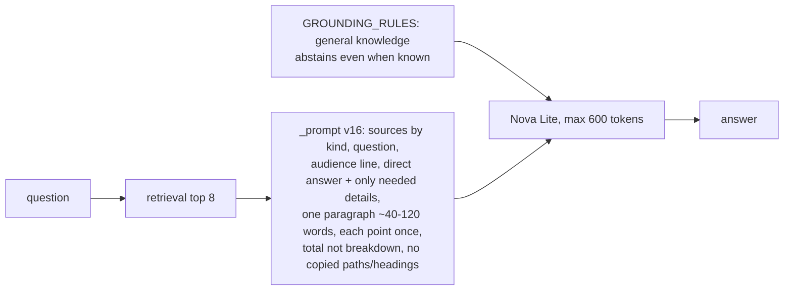

# Prompt v16: concise answers and a real cost section (2026-10-03 14:40 PT)

## TL;DR
The owner flagged a live v15 answer to "how much does this system cost to run?". It ran to about 220 words, said "about $100 a month" (wrong), invented a per-connection Redis bill, repeated the cost controls and ended by pointing at a deep-dive path and heading. v16 fixes both sides. The deep dive now has a short "What Glassbox costs to run" section with the real numbers. The prompt asks for short, direct answers written for hiring managers, recruiters and prospective clients. On the same index, v16 passes 71 and 74 of 95 cases (v15: 67). The median answer is 20 words (v15: 42), and file-path mentions drop to 1-3 (v15: 7). The cost answer is now 36 words and correct. Fact coverage is 0.833 and 0.849 (v15: 0.862), at the edge of run noise. PR open, not merged: merging clears the live answer cache.

## What changed for a visitor
- Cost question, v16 answer (both runs): "Glassbox costs about $5 to $6 a month to run while the AWS EC2 T4g free trial lasts (through December 31, 2026), and about $17 to $18 a month after it ends, plus Bedrock model usage."
- Answers lead with the direct answer and stop. About This System median 26-32 words (v15: 64), p90 about 88 (v15: 114).
- "What is the capital of Australia?" now gets "I don't know from what I have." (v15 said Canberra on this index).

## Where "$100" came from
No indexed document says $100 a month. The cost chunk the model saw (DESIGN.md §14 table) also holds "Credits: up to $200 ($100 at signup ...)", and the rate-limit chunk says the daily cap "defaults to 100 in code". The deep dive had no cost section. The Redis billing claim was invented.

## How it works

- `services/glassbox/api/ask.py`: `_PROMPT_VERSION = "v16"`, new rules in "How to write the answer", a cost-shaped placeholder example, and the specificity example changed to "a 24-hour TTL" (the rate limit is moving to 20).
- `services/glassbox/providers/base.py`: general knowledge (such as a country's capital) gets the abstention "even when you know the answer".
- `docs/architecture/deep-dive.md`: new section "What Glassbox costs to run: the monthly bill" (187 words). The Grounding section describes v16.
- `eval/`: `max_words` case field and `too_long` failure, `p90_answer_words` in summaries, 3 new cases (`system-cost`, `system-length-rds`, `system-length-cache-ttl`), 95 cases in total. Baseline `eval/baselines/answers-nova-lite-v16.json`.
- Docs: DESIGN.md §6.7 "Answer style", DESIGN-005 §2.1 and §2.2.

## Key design decisions & trade-offs
- **Bisected rules, not guesses.** On Nova Lite, a bare "aim for 40-120 words" bullet or a loosened v15 tone line made it copy whole sources (up to 460 words on `me-current-role`). v16 keeps the v15 tone line and puts the word range inside the paragraph rule. The capital-city rule moved to the system prompt, because adding it to the user prompt also triggered copying.
- `max_tokens` stays at 600 as a ceiling (owner).

## Results (same Titan index of origin/main 980d6eb plus the cost section, Nova Lite, 95 cases)
| | pass | fact_cov | abstain | false abstain | planned/live | paths | median words | p90 |
|---|---|---|---|---|---|---|---|---|
| v15 | 67 | 0.862 | 10/11 | 3.8% | 10/14 | 7 | 42 | 114 |
| v16 r1 | 71 | 0.833 | 11/11 | 3.8% | 11/14 | 1 | 20 | 88 |
| v16 r2 | 74 | 0.849 | 11/11 | 3.8% | 11/14 | 3 | 21 | 89 |

**Unsupported claims (offline review, v15 vs v16 r1): 4 vs 3.** In both versions: an invented provider-selection variable (v16: `AWS_REGION`), unrelated planned work listed as "follow-up features", and `/api/version` working "by asking the cluster". Only in v15: "the site is planned to deploy", and it answered "Canberra".

## Gate
- Met:
  - Unanswerable questions abstain in 11 of 11 cases.
  - False abstentions are 3.8%, within the ≤5% limit.
  - Path mentions fall from 7 to 1-3.
  - The about_system median is 26-32 words (limit about 60).
  - The cost answer is correct.
- Borderline: fact_coverage is 2.1 points below v15 on the two-run average (r1 is 2.9 points below, r2 is 1.3 points below), at the edge of the ~2-point noise allowance. Most of the missing facts are extra details that the shorter answers now leave out, for example the 10-per-10-minutes rule in `system-rate-limit`.

## Operational notes & risks
- `me-current-role` still copied a whole About Basel source once in two full runs (337 words). Nova Lite variance is high.
- Merging bumps the cache key, so every cached answer is regenerated. `warm-answers` refills the suggested questions.
- Spend was about $0.33 (Titan ingest, 2 v15/v16 baselines, 2 v16e runs, 2 final runs, variant and bisect smoke runs).
- Runs are saved in the main checkout's `eval/runs/v16/`.

## Open items
1. Owner: judge whether the shorter answers (fact_coverage −2 points) are the right trade-off.
2. Possible follow-up: strip paths from source text before building the prompt, to get path mentions to 0.
