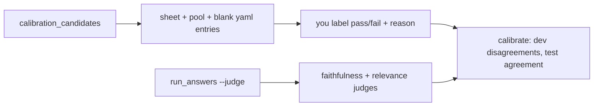

# RAG quality phase 4: LLM judges and calibration

PR: see the branch `feature/rag-p4-judge`. Status: PR open (code only; no paid run made).

## TL;DR
Two binary LLM judges (faithfulness, relevance) on Nova Pro, an optional `--judge` flag on `run_answers`, a pool builder for the labels you will write, and a calibration tool that measures judge-versus-you agreement on a held-out split. Nothing visitor-visible changes. Nothing gates on the judge until it scores at least 0.85 on both classes.

## Visitor-visible change
None (eval tooling only).

## How it works

## Design decisions
- Judge model `us.amazon.nova-pro-v1:0` (your choice), overridable with `GLASSBOX_JUDGE_MODEL_ID`; same `us.` profile style as Nova Lite in Terraform and the configmap.
- The judge sees question, numbered sources (with planned markers) and answer only; unusable replies are errors, counted as disagreements in calibration.
- Split by hash of item id and a fixed seed: deterministic, never overlapping, independent of labels. `calibrate` rejects edited splits and answers that changed after labelling.
- Test-split texts are never printed; reports under 10 test cases per class are refused; reusing the test split with a changed prompt warns.
- Addition to the plan: a `mismatched` candidate kind so the relevance judge has failing examples.
- `calibration.yaml` holds labels only, so private About Basel text never enters the repo.

## Operational notes and risks
Paid paths (`--judge` with a real provider, `--generate`, `calibrate`) stay behind `GLASSBOX_EVAL_ALLOW_PAID=1`. Cost is about $0.50 per full judged run (DESIGN-005 §5.3). Run rows now store raw retrieved chunk text (in gitignored `eval/runs/`). The pool file is the only copy of generated answers: keep it.

## Verify
`pytest services/tests/test_eval_judge.py -q`; `GLASSBOX_PROVIDER=fake python -m eval.run_answers --judge` against the local stack.

## Open items
Your ~50 labels; a fresh run with this code (to capture `sources`) before building the pool; confirm Nova Pro is enabled in the Bedrock account.
