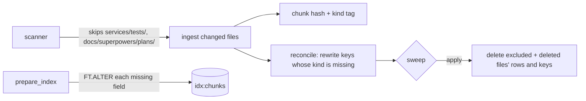

# Corpus scope, the `kind` tag and the stale sweep on (RAG plan phase 6, part 2)

**Status:** PR open, not merged. Branch `feature/rag-p6-scope`. Rebased onto main after PR #153 (deep-dive refresh) merged. Part 1 (the sweep and `--clear`) is [2026-10-01-rag-p6-stale-sweep.md](2026-10-01-rag-p6-stale-sweep.md).

## TL;DR

About This System no longer indexes the test suite (`services/tests/`) or the dated implementation plans (`docs/superpowers/plans/`). Before this change they were 342 of 761 chunks (tests 307, plans 35) and crowded real sources out of the top 8. Frontend source stays out. Each chunk hash in Redis also gets a `kind` tag (`doc`, `code`, `infra`, `manifest`, `test`), and retrieval can filter on it, though the worker doesn't use the filter yet (phase 8's hybrid ranking may). `ensure_index` now adds every missing field to an existing index, so phase 8's `text` field is a one-line change. A separate commit switches the stale sweep from `report` to `apply` in production. That commit needs confirmation first (see Open items).

## What changed for a visitor

After the release, About This System answers stop citing test files and plan documents. They come from the design docs and the real code instead. Nothing changes until the sweep runs in `apply` mode, because until then the old test and plan chunks stay in the index (report mode only logs them).

## How it works

- `ingest/scanner.py`: `EXCLUDED_SYSTEM_PREFIXES`. An excluded file is "unseen", so the stale sweep treats it like a deleted file.
- `ingest/redis_index.py`: `EXPECTED_FIELDS` (corpus, model, kind, vector), `chunk_kind(corpus, path)`, and `ensure_index`, which returns the set of fields it added.
- `ingest/reconcile.py`: `kind` is one of the compared fields. The first ingest after the deploy rewrites every existing key once (no embedding calls), the same way `content_sha` was backfilled.
- `retrieval/search.py`: `knn_query(..., kinds=None)` and `search_chunks(..., kinds=None)`.

## Key design decisions and trade-offs

- **Exclusion, not down-weighting:** this was the owner's decision. "How is X tested?" questions lose their sources. The `test` kind is kept, so any test file outside `services/tests/` is still tagged.
- **The reconcile backfills `kind`, not a new backfill pass.** It already compares every key against MySQL. Adding a field there needs no new marker key and repairs itself after a partial run. Cost: one rewrite of every key (about 1,000 for one model) in MULTI batches of 50, plus one corpus-version bump.
- **Kind rules:** About Basel and portfolio are `doc`; Markdown is `doc`; a file in a `tests` folder, `test_*.py`, `*_test.py` or `*.test.*` is `test`; `.tf` is `infra`; YAML is `manifest`; Python and TypeScript are `code`.

## Operational notes and risks

- **The 30% guard may refuse the sweep.** origin/main scans 55 files under the excluded prefixes (44 tests, 11 plans) out of 185 About This System files. A local fake ingest of origin/main produced 167 about_system documents (some test files are quarantined by the secret scanner and have no document). If stale documents are more than 30% of the documents in scope (and more than 2), the sweep refuses with a `STALE SWEEP REFUSED` banner. That fails safe, but the old chunks then stay. In that case, raise `GLASSBOX_INGEST_SWEEP_MAX_FRACTION` (for example `0.4`) for one release, or run `--force-sweep` once.
- On deploy: `FT.ALTER ... ADD kind TAG` (instant), a reconcile rewrite of every key, and a corpus-version bump. The retrieval cache empties and the answer cache is unaffected. No embedding calls.

## How to see it / verify it

- Tests: `services/tests/test_corpus_scope.py` (28 tests): scanner exclusions; the repo scan has no excluded or frontend paths; eval's `NOISE_PREFIXES` matches the exclusions; an excluded file is planned for the sweep; kind rules; reconcile rewrites a key without `kind`; `ensure_index` adds only `kind`, adds every missing field, adds a hypothetical `text` field, and creates with the full schema; a real Redis Stack test runs `FT.ALTER` on an old-schema index and checks the KNN kind filter. Full suite: 1120 passed, 3 skipped (against a private MySQL at Alembic head).
- After the deploy: the ingest log shows `reconcile about_system: ... rewritten=N` once and `sweep about_system: would delete|deleted N of M`.

## Open items

- **Before merging the `apply` commit:** the orchestrator confirms that one release's report-mode ingest log was checked.
- **Not done here:** the local dry-run list of what the sweep would delete, and the fake-provider retrieval eval (noise@8). Both were blocked by the agent's permission classifier. See the PR body.
- Paid retrieval eval (about $0.0001; plan acceptance): chunk recall@8 not lower than phase 3.
