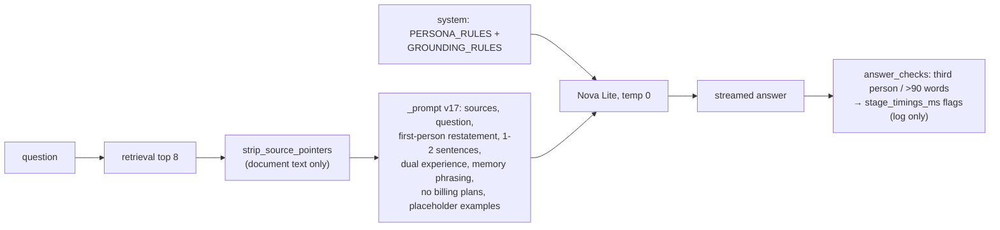

# Prompt v17: Basel answers in the first person, in one or two sentences (2026-10-04 19:36 PT)

## TL;DR
Prompt v17 makes the chat answer as you. The premise is that you uploaded your consciousness into the site. Answers are in the first person and run one or two sentences unless the visitor asks for detail. On identical sources, About Basel answers that refer to you in the third person drop from 30-32 of 38 (v16) to 0 of 38 in all three v17 runs. The p90 answer length falls from 76-89 words to 56-60, and the median from 18-21 to 15-17. Unsupported claims hold at 3 per run, the same as v16. Fact coverage drops about 2-3 points, because shorter answers leave out extra details. The answer temperature goes from 0.2 to 0. Two free checks after generation (third person, more than 90 words) are logged in the query log. The PR is open and not merged. Merging bumps the answer-cache key, so every cached answer is regenerated.

## What changed for a visitor
- A question such as "What does Basel work on at <employer>?" now gets "At <employer>, I built …" instead of "Basel is …" (real answers are in the PR's agent report, not here: this repo holds no About Basel text).
- Casual questions keep the light tone in the first person ("My favorite <thing> is …").
- About This System answers are sometimes in your voice too ("I split Markdown files into chunks by headings…"), and stay technical.
- Answers are shorter. One answer in 95 still copies a whole source paragraph (`me-fav-languages`, see Open items).

## How it works

- `services/glassbox/api/ask.py`: `PERSONA_RULES` is the persona section of the system prompt (`answer_system()`), shared by every answer prompt (the casual prompt in BACKLOG item 3 reuses it). The answer prompt restates the persona after the question, where Nova Lite follows it. Other changes: one or two sentences, dual experience, "I don't have that in my memory" for gaps, no billing plans, provisional placeholder examples, and `strip_source_pointers` for non-code sources. `_PROMPT_VERSION = "v17"`.
- `services/glassbox/answer_checks.py`: `third_person_hits` and `answer_check_failures`, used by the API (as logged flags) and by the eval graders.
- `services/glassbox/providers/bedrock.py`: `TEMPERATURE = 0.0` for every Bedrock text call (answers, rewrites, judges).
- `services/glassbox/providers/base.py`: a lone "I don't have that in my memory." counts as a refusal and is never cached. The same phrase followed by "but …" is a real answer.
- `eval/`: `run_answers --replay <run.jsonl>` reruns an earlier run's rewrites and chunks without any index. The graders add a `third_person` failure for About Basel and a default 90-word cap. `system-cost` rejects "trial", "credits" and "free plan/tier". `me-site-stack` no longer rejects RDS (BACKLOG Open item). The other `max_words` caps are lower.

## Key design decisions & trade-offs
- **Log, don't regenerate.** The answer streams token by token, so the visitor has read it before a check can run. At temperature 0 a plain retry also repeats the same answer. A regenerate would need one of two things. The first is buffering the opening sentence before the first `token` frame, which costs about a sentence of time to first token. The second is a non-streamed retry with a corrective instruction plus a `replace` SSE event, which the frontend does not have yet. v17 logs `answer_check_third_person` / `answer_check_too_long`, and the live rates show whether a regenerate is worth building. The eval showed 0 third-person answers and 2-3 over-long ones per 95.
- **Canonical abstention unchanged.** A question the sources don't cover at all still gets "I don't know from what I have." The frontend swaps that exact sentence for a playful line. The new memory phrasing is for gaps inside an answer ("…professional use of it isn't in my memory").
- **Examples are placeholders.** The repo is public and holds no About Basel text, so every example uses `<Company>`, `<Tech>`, `<Project>`. v16's one literal example answer is replaced too. The examples are provisional until you sign off the example set (BACKLOG item 2).
- **Measured by replay, not a fresh index.** The agent shell was not allowed to clone the private corpus. Every v17 run therefore replays the stored v16 run's retrieval, which also guarantees identical sources. That data is the v16 index of 2026-10-03, before today's corpus resync (Kafka, gRPC, new dates). So Kafka and gRPC dual-experience answers are untested.
- **Temperature 0 everywhere.** One constant for answers, rewrites and judges. The judge isn't calibrated yet, so nothing to invalidate. Bedrock at 0 is not fully deterministic: 11 of 95 answers differed between two runs.

## Results (replayed v16 retrieval, Nova Lite, 95 cases, re-graded with the v17 graders)
| | pass | pass w/o 3rd-person check | fact_cov | false abstain | 3rd person | median / p90 | unsupported |
|---|---|---|---|---|---|---|---|
| v16 live r1, r2 | 36, 40 | 60, 62 | 0.812, 0.828 | 3/79 | 32, 31 /38 | 20-21 / 88-89 | 3 |
| v16 replay r1, r2 | 40, 39 | 61, 63 | 0.809, 0.815 | 3/79 | 30, 31 /38 | 18-20 / 76-80 | 3 |
| v17 r1, r2, r3 | 62, 63, 62 | same | 0.789, 0.797, 0.778 | 4/79 | 0/38 | 15-17 / 56-60 | 3, 3, 3 |

Unsupported claims (offline review against the stored sources): `/api/version` works "by asking the cluster" (echoing the question) and the site is described as planned, in every run. Each run also has one more claim: either an invented provider variable (v17 r1: "the environment variable _mode") or unrelated planned work listed as follow-up features (v16 r1, v17 r2/r3). The `release.yml` mention from #170 is gone. The workflow is now "the release workflow".

## Operational notes & risks
- New false abstention: the suggested chip "Show me the Terraform for the database." (false premise) gets "I don't have that in my memory." in all three runs. v16 explained that MySQL runs in-cluster. Two prompt fixes failed in smoke runs: a false-premise example, and dropping "even when a source does" from the billing rule.
- The cost answer still says "while the AWS EC2 T4g free trial lasts". The no-billing rule did not stop Nova Lite copying it, even from the system prompt. `sugg-system-k3s` now mentions "the credits".
- Merging clears the answer cache (new prompt version). `warm-answers` refills the chips.
- Spend: about $0.25 (2 v16 + 3 v17 full replays at about $0.032 each, plus smoke runs).

## How to see it / verify it
- `pytest services/tests -q`: all pass except `test_eval_retrieval_e2e`, which also fails on `origin/main` against the shared compose data.
- Replay: `GLASSBOX_PROVIDER=bedrock GLASSBOX_EVAL_ALLOW_PAID=1 BEDROCK_LLM_MODEL_ID=us.amazon.nova-lite-v1:0 python -m eval.run_answers --paid --replay eval/runs/v16/same-v16-final-r1.jsonl`. The runs are in the main checkout's `eval/runs/v17/`.
- After deploy, query-log rows with `answer_check_*` keys in `stage_timings_ms` count the flagged answers.

## Open items
1. Owner: the example Q&A set (BACKLOG item 2) replaces the placeholder examples.
2. Owner: reword the deep dive's cost lead without the trial, or accept the trial mention.
3. Fix the `sugg-system-db-terraform` abstention (a false-premise rule or example that works on Nova Lite) before or with item 2.
4. `me-fav-languages` copies the skills list instead of "Python and TypeScript" in all three v17 runs.
5. Re-measure on a fresh index of the resynced corpus (Kafka, gRPC), and add dual-experience golden cases once the owner approves their facts.
6. Decide on a regenerate after a week of `answer_check_*` rates.
