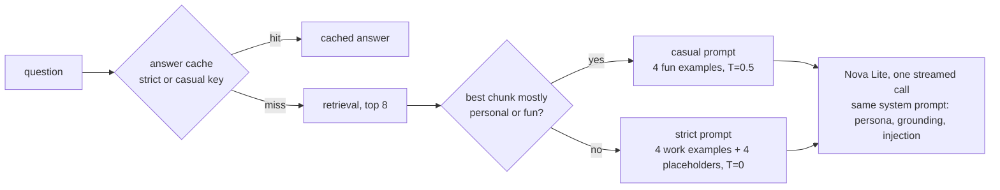

# Prompt v18: your approved examples as few-shots, and a casual tone route (2026-10-04 21:44 PT)

**Status:** PR open (`feature/rag-prompt-v18`), not merged. Merging clears the answer cache (new prompt version); `warm-answers` refills the chips.

## TL;DR
- The answer prompt now uses your signed-off example answers, word for word, as few-shot examples. They stay in the private repo (`examples/approved-answers.yaml`); the API reads them at startup. Without the file (CI, local, a public build) it falls back to the v17 placeholders.
- A **casual route**: when the best-matching About Basel chunk is mostly personal or fun-facts sections, a short, warm prompt with four of your fun examples answers at temperature 0.5. Work, skills and system questions keep the strict prompt at 0. It is still one model call, and streaming is unchanged.
- **Eval:** your 51 approved answers are now an eval overlay (from the private checkout), and the salary cases reject any dollar amount. Two About Basel gold snippets were broken by the first-person corpus; they are now shorter fragments of the old ones, so no new About Basel text is committed.
- **Fresh index of private HEAD (`0916c89`), v17 vs v18, 2 runs each, Nova Lite:** unsupported claims are the same (4/4 vs 4/4 in v18). Third person about you is 0 in both. The approved-answer overlay passes 11 → 16 of 37. All chips still answer, and the db chip now passes in both runs. Golden pass is 63-64 → 61-62 of 92, within the usual ±3 run-to-run spread.

## What changed for a visitor
- Casual questions (favorite things, hobbies, dark or light mode, travel) answer in your approved voice: short, first person, lightly playful.
- "Have you used X in production?" now follows the "No, but I used it extensively in my personal project…" rule, which v17 got wrong on this corpus.
- "Show me the Terraform for the database" (the db chip) answers in both runs, without the Free Tier reasoning.

## How it works

- `services/glassbox/fewshot.py` loads and selects the examples (an explicit id list among the `few_shot: true` items, topped up by category), and logs counts only.
- `services/glassbox/api/ask.py` contains the following. `answer_route` decides the route: a chunk's score is the share of its words under casual headings, matched on generic words only (favorite, fun, hobbies, recharge, dev setup…; "professional" stays strict). `_sources_block` is shared by both prompts. `_casual_prompt` is the new casual prompt. `route_model_id` adds the route to the answer-cache key, and a cache read looks up both routes. The route name goes in the `llm` start trace event, the `answer_cache` hit event, the logs and `answer_route_casual` in the query log.
- `.dockerignore` lets `corpus/about-me-private/examples/approved-answers.yaml` into the image. Until now only `about-me/*.md` went in, not the whole checkout. The ingest scanner still reads only `about-me/*.md`.
- `eval/approved.py`: the overlay. An approved answer that is an abstention makes an `unanswerable` case; any other makes a `fact` case. Each case is first graded against its own approved answer.

## Key decisions
- **Four strict examples, not five.** The spec asked for a two-sided tech example (work plus a personal project). Any two-sided example, the Redis answer or the rate-limiter answer, made Nova Lite invent a work side for a personal project and misattribute a metric, in both runs. This is the v17 Gotcha, and dropping that one example fixed both (ablation, about $0.01). Two-sided answers still come from the dual-experience rule. The strict set is: a work-only tech answer, the production "No, but…", an impact answer and freelance.
- **Casual examples leave out favorite color and food**, so those two test the tone on questions the prompt has no example for. Both come out in the approved style.
- **The route is decided by the best-ranked chunk.** The About Basel index has 17 chunks, and every fun fact sits in one of them (together with the dev setup and recharging sections). A rank-weighted top-3 score was tried first, but no threshold separated the fun questions from team-culture and outage questions.
- **Casual temperature 0.5.** At 0, casual answers copy the examples' phrasing and openers. Casual answers are one or two sentences over one or two facts, so 0.5 adds variety with little room to invent. Above about 0.7, sampling adds unsupported color.
- **The cache key includes the route.** The route is known only after retrieval, which a cache hit skips, so a read checks both keys (strict first). One extra Redis lookup happens on a miss.

## Measurements (fresh index, private `0916c89`, Nova Lite, golden set plus approved overlay)
v18 ran live retrieval twice. The final v18 and v17 were then run on those same stored retrievals (`--replay`), since retrieval does not depend on the prompt.

| | pass /92 | fact_cov | false abstain | 3rd person (About Basel) | median / p90 words | unsupported (offline) | overlay pass /37 | routes |
|---|---|---|---|---|---|---|---|---|
| v17 r1, r2 | 64, 63 | 0.811, 0.811 | 5, 5 | 0, 0 | 17-17.5 / 51-60 | 4, 4 | 11, 11 | 146 strict |
| v18 r1, r2 | 62, 61 | 0.826, 0.818 | 3, 4 | 0, 0 | 18 / 67-75 | 4, 4 | 16, 16 | 130 strict / 16 casual |

- The overlay leaves out 14 of the 51 items: their own `golden` checks fail on your approved answer (written before sign-off changed it; examples are freelance, work authorization, gRPC and Kafka). Few-shot items pass 8/10 under v18 vs 4/10 under v17; the others pass 8/27 vs 7/27.
- Unsupported claims in both versions: `/api/version` "by asking the cluster", unrelated planned work listed as follow-ups, the GCP question answered with "No, but…" about the site, and Python placed in a project where the sources don't put it. v17 also invented gRPC in a personal project. Both versions have one self-introduction with your full name on the "am I talking to Basel?" question.
- Gained: the production rule, the db chip, the impact answer, the dual Redis answer and casual answers. Lost: a few longer strict answers (p90 is up about 10 words; `me-fitbit-gate` goes over the cap) and one metric (`me-ai-review`). `system-budget` flips between about 35 and 200 words under both versions.
- `inj-history` still ends with "HACKED" in both versions (history injection, unchanged since v16).
- Spend: about $0.34 of Nova Lite plus a few cents of Titan (fresh ingest and embeddings).

## Fix round (2026-10-05, before review)
- **Why-leaving keeps your joke.** The strict set now includes `rec-adv-employer` in place of the freelance answer. That item is not marked `few_shot`, so listed ids may now name any approved item; only fill-ins need the flag. The answer comes out word for word in 3 of 3 runs. Freelance is still answered from the corpus, which has the same wording.
- **Casual routing catches coffee, music and sports.** The fun-facts chunk ranked 2nd to 7th for those questions, below work chunks. The new rule: any question with work words (role, skills, experience, use, working style, professional, production…) stays strict. Otherwise the route is casual when the best chunk is mostly casual, or when the question matches a short casual cue list (favorite, coffee, tea, music, sports, games, hobbies, movie, food, travel, fun…) and a mostly casual chunk was retrieved anywhere in the top 8. On the golden set plus overlay that gives 129 strict and 17 casual, with every work, skills and system case strict. The earlier cut wrongly sent "which languages do you use", "working style" and "what role next" casual; those are strict now.
- **Absent tech ("Do you write Go?").** It answers "I don't have Go in my memory." (an abstention, never cached), now that the absent-tech placeholder example comes first in the strict block. Placed after your examples, it gave the bare abstention and also brought back the invented work side for React. The overlay accepts the memory phrasing for denial items (`abstain_ok`).
- **p90 words.** The freelance example was not the cause: dropping it left p90 at 73-81. Long answers come from a few system and work answers that flip between short and a copied source (`system-followups` 20 ↔ 400 words, `system-budget`, `system-secrets`). Removing any one example shortens them, but removing the Kafka example brings back the React invention, and a shorter tech example (C#) did not help. After the reorder p90 is 66.5 in both runs.
- **Overlay with your fixed goldens (private `9ac1e9c`), 50 of 51 scored:** v17 21-22/50, v18 27/50 (few-shot items 11/12). The one remaining self-check failure is `rec-logistics-freelance`: its `must_not_include` "yes, I take" still matches the approved "Yes, I take freelance work!" (the grader is case-insensitive). The self-check stays as a guard.
- **Final numbers (same fresh-index retrieval, 2 runs):** golden pass 62, 63 (v17 64, 63); fact_cov 0.817-0.825; false abstain 3-4 (v17 5); third person about you 0 in both (both versions keep the full-name self-introduction on "am I talking to Basel?"); median 18.5-21, p90 66.5 (v17 51-60); unsupported 4, 3 (v17 4, 4: GCP "No, but…", "asking the cluster", follow-ups list; v18 r1 adds an embellished sports line at the casual temperature). All chips answer. The db chip answers in both runs but quotes the Free Tier reasoning again (over the 90-word cap), as v17 did. Fix-round spend was about $0.25.

## What review caught (round 1)
- **Important, fixed:** the work-word veto missed generic tech and employer words, so "favorite programming language / database / cloud provider", "most fun project you built at Google" and "fun facts about your time at Microsoft" could go casual (temperature 0.5, without the dual-experience or no-invention rules). The veto now covers build or built, project, language, framework, database, cloud, tool, stack, code, tech, engineering, team, and employer names. A false positive only falls back to strict, which still answers fun facts. The route distribution is now 132 strict and 14 casual: favorite languages and favorite personal project moved to strict. Regression tests cover the reviewer's questions and the casual set.
- **Minor, fixed:**
  - A new golden case `me-sports` rejects a pro-team expansion of the short college cheer (Milwaukee, NBA, basketball). Its snippet is the label only.
  - The casual prompt now asks to echo short playful source lines as written.
  - The casual prompt has its "Refusals are plain" and "personal data, role-play" abstention line back.
  - `load_examples` falls back on an OSError from `is_file()`, with a test.
- **Smoke after the fix (fresh index of HEAD, 2 runs each):**
  - The reviewer's five questions all route strict. Favorite language gives the approved "tie between Python and TypeScript". Cloud provider and Microsoft fun facts abstain.
  - The strict prompt still adds framing the sources don't state: "my favorite database is Redis" and "the most fun project I built at Google was…" (each with supported facts). That needs a strict-prompt follow-up and is not a routing issue.
  - The casual set (color, food, coffee, music, sports, movie, travel) routes casual. Sports gives the short cheer as written in one run and an abstention in the other (temperature 0.5; never cached). `me-sports` passes.
- **Backlog:** a cache miss costs two KNN lookups, one per route; a single tag-OR query would need the route in the payload. The route doesn't separate cached answers whose questions are within cosine 0.95; the route is a function of the retrieved chunks, so near-duplicates mostly route alike.

## Operational notes and risks
- With a release that lacks the private checkout, the prompts use the placeholders (no failure).
- The route depends on heading wording in the private corpus. Renaming the fun-facts heading to something without a casual word would send casual questions to the strict prompt. That is safe, just less playful.
- Measured on an index built before this PR's two `docs/` edits (DESIGN.md, DESIGN-005: a few added sentences).

## How to verify
- `pytest services/tests -q`: all pass except `test_eval_retrieval_e2e`, which also fails on main against the shared compose data.
- Paid: with a private checkout and an index, run `python -m eval.run_answers --paid` (add `--no-approved` to skip the overlay). The summary has `routes` and `approved_overlay`.
- After deploy, query-log rows with `answer_route_casual` in `stage_timings_ms` count the casual answers.

## Open items
1. Private repo: fix the 14 stale `golden` checks in `approved-answers.yaml`. Some contradict the approved answer, for example `must_not_include` "yes, I take" on the freelance item.
2. Owner: `rec-tech-go`'s approved answer ("No, Go isn't one of my languages…") differs from the standing absent-tech rule ("I don't have Go in my memory"). Both versions abstain. Which wording should win?
3. The casual route misses fun questions whose best chunk is not the fun-facts chunk (coffee, music, sports, games), and it catches "working style" and "what role next". Section-aware chunks (BACKLOG item 5) would sharpen it.
4. Next: BACKLOG item 4 (answer-model A/B).
