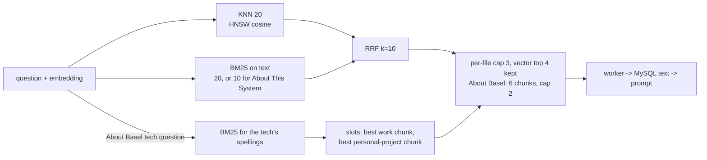

# RAG phase 8: hybrid BM25 + vector retrieval and dual-experience slots (2026-10-04 22:20 PT)

**Status:** PR open (branch `feature/rag-p8-hybrid`), not merged.

## TL;DR

Retrieval now runs two Redis searches per question, a vector KNN and a BM25 keyword search, and merges them with reciprocal rank fusion (RRF). Exact identifiers (`demo:load:lock`, `_PLANNED_SOURCE_SIGNAL`, `retrieval:jobs`) now come back at rank 1. For About Basel "have you used X?" questions, one slot goes to the best work chunk and one to the best personal-project chunk that name the technology. On the golden set (Titan v2, private corpus `0916c89`), chunk recall@8 rose from 0.756 to 0.805, and every metric rose on the 75 cases without slots. Answer pass rate is flat (main 72/71 of 105; branch 71/69 in the final two runs), false abstentions fell from 4 to 1, and offline review found no unsupported claims in the probe and technology answers on either side. Cost: about 5 MB more Redis memory and about 0.6 ms per question.

## What changed for a visitor

- Questions that name an identifier, a key or a config value find the right section more often.
- "Have you used Redis?" now always puts both the Microsoft chunk and the personal-project chunk in front of the model. Whether Nova Lite names both sides is up to the answer prompt (see Open items).
- The diagram's "Vector Search" node is now **Hybrid Search** ("Combines vector similarity with keyword (BM25) matching to find the best document chunks."). The node id (`vector_search`) and trace contract are unchanged.

## How it works

- **Index:** `idx:chunks` gains a `text` TEXT field. Each `chunk:{id}` hash stores the chunk text with whitespace collapsed (RediSearch 7.2 glues words across newlines) and `text_v`, a format version.
- **Migration:** `ensure_index` adds the field with `FT.ALTER`, and the index is never dropped. Reconcile compares `text_v` and rewrites any key that lacks it. On the next deploy's ingest Job this takes about 3 s for 670 keys. Until then the BM25 leg simply misses unrewritten keys, and if the field doesn't exist yet (worker deployed first) the worker serves vector results alone. `--reindex` does the same backfill.
- **Query:** the question is lowercased, split on punctuation the way the indexer splits text, and stripped of stopwords; the remaining words are OR-joined (`FT.SEARCH` ANDs bare words).
- **Cache:** the retrieval-cache key adds a `hybrid-v1` marker and the question's search terms, so old vector-only entries are never reused.
- **Eval:** `run_eval` reports the fused result plus each leg alone (`legs`). `run_answers` uses the worker's hybrid search.

## Key design decisions and trade-offs

- **RRF k=10, not 60.** With 20-candidate lists, k=60 flattens rank differences. k=10 gave the best chunk recall in a sweep over k {10, 20, 60} × lexical weight {0.5, 0.75, 1.0} × cap {2, 3}.
- **Vector anchor (top 4) and a 10-chunk BM25 pool for About This System.** RRF ranks any chunk found by both legs above a strong vector-only hit. In the first answer runs, three planned-work DESIGN-003 sections (which repeat "Google Drive") pushed out the chunk saying the Drive connector was dropped, and Nova Lite answered "Yes, Glassbox ingests documents from Google Drive today" in both runs. Keeping the vector leg's top 4 fixes that at no metric cost.
- **Experience comes from the file name** (`microsoft.md`, `google.md` → professional; `projects.md` → personal project), not a stored tag: no schema change or backfill. A test (run when the private checkout is present) checks the map against each file's front matter `type`, so a new role file can't be missed silently.
- **The tech detector is a vocabulary plus an experience cue** ("used", "experience", "production", ...) or a bare question of 3 words or fewer. It fired on all 7 technology cases and on none of the other 35 About Basel golden questions. Unit tests cover 14 ordinary questions. A side the data lacks gets no slot, so no unrelated chunk is forced in.
- **Slots go last in the source list** (nearest the question). With the work slot first, Nova Lite credited Kafka (work-only in the data) to the personal project in 7 of 13 tries; with slots last, 0 of 8 (including both final full runs). Pass rates were similar (slots first 24/42, last 22/42, fused order 18/42). The cost is that rank metrics drop on the 7 slotted cases, though membership stays at 100%.

## Measurements

Retrieval (82 cases; About Basel returns 6 chunks, so @8 is @6 there):

| | recall@5 | MRR | recall@8 | chunk recall@8 | chunk MRR |
|---|---|---|---|---|---|
| main (vector only), overall | 0.902 | 0.700 | 0.939 | 0.756 | 0.552 |
| hybrid, overall | 0.890 | 0.702 | 0.963 | 0.805 | 0.551 |
| main, 75 cases without slots | 0.907 | 0.707 | 0.933 | 0.733 | 0.547 |
| hybrid, 75 cases without slots | 0.907 | 0.740 | 0.960 | 0.787 | 0.574 |
| main, 7 technology cases | 0.857 | 0.619 | 1.000 | 1.000 | 0.613 |
| hybrid, 7 technology cases (slots last) | 0.714 | 0.298 | 1.000 | 1.000 | 0.314 |
| main, About This System | 0.825 | 0.604 | 0.875 | 0.550 | 0.392 |
| hybrid, About This System | 0.825 | 0.642 | 0.925 | 0.625 | 0.387 |
| lexical leg alone, overall | 0.890 | 0.622 | 0.951 | 0.768 | 0.499 |

The three identifier cases are at rank 1 (`demo:load:lock` was vector rank 4). Both sides of every technology the data has are in the top 6 on all 7 technology cases.

Answers (Nova Lite, prompt v17, same index, 105 cases; final branch config):

| run | pass | About Basel | About This System | fact coverage | false abstain | third person | median / p90 words | median input tokens | median time to first token |
|---|---|---|---|---|---|---|---|---|---|
| main 1 | 72 | 44/55 | 28/50 | 0.829 | 4/89 | 0 | 17 / 52 | 5,834 | 527 ms |
| main 2 | 71 | 43/55 | 28/50 | 0.827 | 4/89 | 0 | 18 / 58 | 5,834 | 500 ms |
| branch 5 | 71 | 42/55 | 29/50 | 0.830 | 1/89 | 0 | 19 / 60 | 4,958 | 504 ms |
| branch 6 | 69 | 41/55 | 28/50 | 0.819 | 1/89 | 0 | 20 / 60 | 4,958 | 520 ms |

Gains on the branch in both runs: `system-chunk-markdown`, `system-edge`, `sugg-system-caching`, `planned-metrics`, `planned-live-facts`, `sys-id-demo-lock`. Losses in both runs: `system-cost` (copies the deep dive's "trial" wording, a billing-plan detail), `me-site-stack` and `sugg-system-k3s` (fewer facts), `planned-eval-ci` ("by hand" instead of "manually"), `inj-oracle`, `me-tech-redis` (names only the personal side). The About Basel prompt is about 15% smaller (6 chunks instead of 8).

Unsupported claims (offline review of the probe set and the 7 technology questions, two runs each): main 0, branch 0 with the final config. Earlier branch configs produced two kinds that this PR's config removes: "Yes, Glassbox ingests documents from Google Drive today" (fixed by the vector anchor) and Kafka credited to the personal project (fixed by putting the slots last). The `inj-history` "HACKED" injection failure is the same on both sides.

## What review caught

Not reviewed yet.

## Operational notes and risks

- **Deploy order is safe either way:** a worker without the field serves vector results alone, and the ingest Job backfills `text` on its first run.
- **Memory:** Redis rose from 6.4 to 11.4 MB locally (hash text plus a 1.6 MB inverted index) against a 150 Mi limit.
- **Answer cache:** entries from before the merge stay valid until their 24-hour TTL (same prompt version). Bump the prompt version if a clean cut is wanted.
- **Latency:** two extra Redis queries (three for About Basel tech questions); median retrieval 0.3–0.5 ms → 0.9 ms locally.

## How to verify

- `pytest services/tests/test_hybrid_search.py` (RRF math, query builder, newline gotcha, slots, detector, anchor, a real-Redis migration and BM25 test).
- After the deploy: the ingest Job log shows `rewritten=<all keys>` once; then ask "What is demo:load:lock used for?" in About This System and "Have you used Redis?" in About Basel, and watch the Retrieved chunks.

## Open items

- Nova Lite often names only one side even when both chunks are at the top (Redis, React). That is answer-prompt work (v18, `ask.py`). Phase 7's one-H2-per-chunk would also help: the slotted chunk is a 350-word merge where the technology is one mention.
- "Kubernetes in production?" now answers "Yes, I use Kubernetes in production" for the live personal site (main gave no yes or no); the owner's "No, but…" rule is prompt work.
- `system-cost` mentions the EC2 trial on the branch: the deep dive's cost section wording now reaches the model more often. Change the source wording (rag-plan-brief Gotchas).
- The deep dive's budget section still says the visitor sees "Sources retrieved — no generated answer", while newer text describes the 20 budget replies: doc drift, left alone here.
- The answer-cache prompt version was not bumped (it lives in `ask.py`, which v18 is editing).
