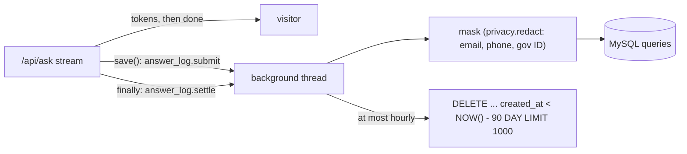

# RAG phase 10: answer log and the answer-cache hit rate (2026-10-04 23:16 PT)

**Status:** PR open (branch `feature/rag-p10-answer-log`), not merged.

## TL;DR

Every answered question now leaves one row in MySQL `queries` with the answer text, whether it was an abstention, the answer route (strict or casual), the LLM model ID, the prompt version and the cache status (`miss`, `answer_hit` or the new `coalesced`). The row stores no IP or client identity, masks emails, phone numbers and ID numbers the visitor typed, and is deleted after 90 days. The answer-cache hit rate per day is now one SQL query (`eval/README.md`). The write happens after the `done` event in a background thread, so it cannot fail or slow an answer.

## What changed for a visitor

Nothing visible. The `done` event now arrives before the log insert instead of after it (a few milliseconds sooner).

## How it works

- **Schema** (migration `0008_query_answer_log`, additive and metadata-only on MySQL 8): `answer TEXT`, `abstained BOOL`, `answer_route VARCHAR(16)`, `llm_model_id VARCHAR(128)`, `prompt_version VARCHAR(16)`, all nullable; `cache_status` gains `coalesced` (appended at the end of the ENUM). Downgrade folds `coalesced` into `answer_hit` and drops the columns; no row is deleted.
- **What each path stores:** generated answer (text, `abstained` = the `done` event's flag, route, model, prompt version); cache hit (the replayed answer, route of the cached entry); coalesced (same, status `coalesced`); no-sources abstention (canned text, `abstained` true, no route/model); stopped (partial text as sent, `abstained` empty); kill switch or budget (`retrieval_only`, no answer); rate limited (no row, unchanged).
- **Code:** new `services/glassbox/answer_log.py` (masking, row building, retention, error counters, `submit`/`settle`). `ask.py` `_save_query` now calls `answer_log.record`.

### `ask.py` touch list (for the PR #183 / #184 merge)

1. Import `answer_log`; drop the unused `Query` import.
2. `_save_query`: four new keyword arguments (`answer`, `abstained`, `route`, `llm_model_id`); the body is one `answer_log.record(...)` call.
3. `_stream` state: `route`, `llm_model_id`, `coalesced`, `log_tasks`.
4. `save()`: two new arguments; `answer_log.submit(...)` instead of `await asyncio.to_thread(...)`.
5. `llm_model_id = llm_provider.model_id` after the provider is created.
6. Answer-cache branch: `coalesced = True` when the lock is busy; on a hit `cache_status = "coalesced" if coalesced else "answer_hit"` and `route = hit_route`.
7. The four `save(...)` calls pass `answer`/`abstained` (hit, no sources, generated, stopped).
8. `finally`: `await answer_log.settle(log_tasks)` before the lock release.

No change to retrieval, routing decisions, prompts or the SSE contract.

## Key design decisions

- **Reuse `queries` and the personal-data guard** instead of a new table or detector: the plan named `queries`, the question was already stored there, and `privacy.redact` is the same detector the ingest guard and answer mask use. Addresses and dates of birth are not masked in visitor text (too noisy on free text).
- **No identity stored.** The salted HMAC is not needed to review answers, so the row has none (the owner's "or store none" option).
- **Retention by a cheap delete on write**, not a job: a new CronJob would need DB credentials and a manifest/Terraform change. The delete is batched (1,000), uses `idx_created` and runs at most once an hour per API process; no traffic means nothing new is stored. `GLASSBOX_QUERY_LOG_RETENTION_DAYS` overrides the 90-day default.
- **Never slow or fail an answer:** the insert runs in a thread after `done`; the stream waits for it only in `finally`, shielded, so a write finishes even when the client leaves. Failures are logged and counted in `answer_log.STATS` (in-process).
- **Hit rate:** first questions only (`turn_index = 0`) as the denominator, since follow-ups skip the cache; `coalesced` counts as a hit.

## Operational notes and risks

- The first write after deploy purges rows older than 90 days (the site's log starts 2026-09-29, so nothing yet).
- The kill-switch request still writes its existing `retrieval_only` stats row (without an answer), because Ops · Diagnose counts those. If "nothing written for a killed request" meant no row at all, that is a one-line follow-up.
- Rows from before `0008` have NULL answer columns; old coalesced requests were logged as `answer_hit`.
- `STATS` is per process and not exported; the warning log line carries the running failure count.

## How to verify

- Tests: `services/tests/test_answer_log.py` (masking, retention parsing, the purge SQL and hourly throttle, error counting, every stream path, `done` before the write, and MySQL integration: one row per answer, none when rate limited, purge deletes only expired rows, the hit-rate SQL runs); `test_db_models.py` (schema, migration); the stop test checks the partial answer.
- Migration up, down and up again on a throwaway MySQL 8 (coalesced row folded to `answer_hit`).
- After deploy, with read access: `SELECT cache_status, abstained, answer_route, prompt_version, LEFT(answer, 80) FROM queries ORDER BY id DESC LIMIT 5;` and the hit-rate query in `eval/README.md`.

## Cost

No paid runs: the change does not touch prompts or retrieval, so a `run_answers` smoke would show nothing new. $0.

## Open items

- Ops · Diagnose hit-rate line (`infra/modules/ops/scripts/diagnose.sh`; needs the ops module Terraform apply).
- `eval/sample_live.py` and the weekly online review (plan phase 10, not built).
- Owner: confirm 90 days, and whether a kill-switch request should write no row at all.
