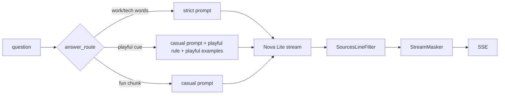

# Prompt v19: no "Sources:" line, first-person chips, playful replies, one topic per answer (2026-10-05 05:53 PT)

**Status:** branch `feat/prompt-v19` pushed, PR not opened yet (orchestrator). Pairs with private docs PR hacka-tron/basel.engineering-docs#12 (**do not merge until you sign off the lines it lists**). Merging clears the answer cache (new prompt version) and re-chunks About Basel once on the next ingest.

## TL;DR
- **"Sources: 1, 4, 5, 9" is gone.** The prompt says never to end with a "Sources:" line, and a deterministic filter (`services/glassbox/sources_line.py`) drops any line that starts with "Source:"/"Sources:" from the streamed answer, even when the label arrives split across tokens. It runs before the personal-data masker; dropped lines are logged as `sources_line_dropped`.
- **Chips and "I don't know" replies speak as you.** "What have you built…", "Are you available…"; the 20 playful abstention lines say "my memory", "the upload", "the real me", never "Basel" or "he".
- **Flirty or off-topic personal questions** ("Do you love me?", "Will you marry me?") route to the casual prompt, which swaps the abstention rule for a playful-reply rule (one warm, funny line about being an uploaded mind, no invented facts). Two draft replies wait for your sign-off in the docs PR.
- **One topic per answer.** About Basel sections are now single-topic (movie vs shows, why leaving vs why looking, location vs pay, etc.; list in the docs PR) and each section is its own chunk (no merging of short sections in `about_me`). A show question retrieves the shows section first; a movie question the movie section.

## What changed for a visitor
- A show question answers about shows only, and a movie question about the movie only. "Why are you looking for new roles?" gets your new <why-looking> answer; the <leaving joke> stays with "Why are you leaving Microsoft?".
- "Do you love me?" gets a joke instead of "I checked everything Basel gave me…".

## How it works

## Key decisions
- The filter is line-based and holds only a line start that could still become "Sources:" (one token of delay at most); inline "…, Sources: 1" mid-line is not touched.
- Playful routing is a narrow regex (`playful_question`), vetoed by any work word; "How are you?" matches only as the whole question.
- One-topic chunking is a corpus-level switch (`ONE_TOPIC_CORPORA`), folded into the content hash so the next ingest re-chunks About Basel once (85 chunks instead of 17).
- The casual few-shot "favorite movie or anime" is replaced by a show-only example, plus a placeholder example showing "answer only the part asked".

## Measurements (review round 1: fresh indexes, private docs `b8e70a3`, Nova Lite, 2 runs each)
v18 = `origin/main` code with main's chunking (19 About Basel chunks); v19 = this branch (85 one-topic chunks, retuned retrieval). Rows re-graded with the round-1 checks.

| | v18 r1 / r2 | v19 r1 / r2 |
|---|---|---|
| golden pass (110) | 81 / 79 | 87 / 86 |
| fact_coverage | 0.860 / 0.851 | 0.891 / 0.881 |
| false abstain | 1.1% | 2.1% |
| third person (about_me) | 1 | 0 |
| median / p90 words | 21 / 61–75 | 20 / 63 |
| approved overlay (54) | 27 / 28 | 39 / 39 |
| About Basel chunk recall@8 / MRR | 0.94 / 0.66 | 0.96 / 0.73 |
| About This System chunk recall@8 / MRR | 0.625 / 0.43 | 0.600 / 0.38 |
| source words per About Basel prompt | ~2,500 | ~570 |
| db chip | answers (old wording) | answers ("Is the database managed by Terraform?") |

About This System lost one chunk hit (`planned-metrics`): BM25 statistics are index-wide, and the 85 About Basel chunks shift them.

## Risks and open items
- Owner sign-off: the two playful drafts and the three re-worded answers in docs PR #12.
- Nova Lite still sometimes invents a work side for personal-only tech (React); unchanged by v19.
- The db chip is reworded (owner-visible): "Show me the Terraform for the database." made Nova Lite abstain whenever a CI runbook chunk was retrieved; the question form answers 3/3 and 2/2.
- Owner decision: about 20 failing cases omit a required fact because of the 1–2 sentence rule (list in the review notes).
