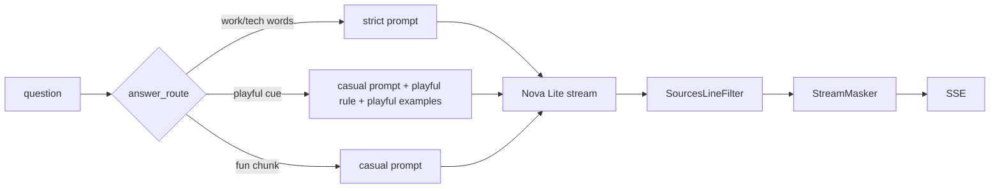

# Prompt v19: no "Sources:" line, first-person chips, playful replies, one topic per answer (2026-10-05 05:53 PT)

**Status:** branch `feat/prompt-v19` pushed, PR not opened yet (orchestrator). Pairs with private docs PR hacka-tron/basel.engineering-docs#12 (**do not merge until you sign off the lines it lists**). Merging clears the answer cache (new prompt version) and re-chunks About Basel once on the next ingest.

## TL;DR
- **"Sources: 1, 4, 5, 9" is gone.** The prompt says never to end with a "Sources:" line, and a deterministic filter (`services/glassbox/sources_line.py`) drops any line that starts with "Source:"/"Sources:" from the streamed answer, even when the label arrives split across tokens. It runs before the personal-data masker; dropped lines are logged as `sources_line_dropped`.
- **Chips and "I don't know" replies speak as you.** "What have you built…", "Are you available…"; the 20 playful abstention lines say "my memory", "the upload", "the real me", never "Basel" or "he".
- **Flirty or off-topic personal questions** ("Do you love me?", "Will you marry me?") route to the casual prompt, which swaps the abstention rule for a playful-reply rule (one warm, funny line about being an uploaded mind, no invented facts). Two draft replies wait for your sign-off in the docs PR.
- **One topic per answer.** About Basel sections are now single-topic (movie vs shows, why leaving vs why looking, location vs pay, etc.; list in the docs PR) and each section is its own chunk (no merging of short sections in `about_me`). A show question retrieves the shows section first; a movie question the movie section.

## What changed for a visitor
- A show question answers about shows only, and a movie question about the movie only. "Why are you looking for new roles?" gets your new <why-looking> answer; the <leaving joke> stays with "Why are you leaving Microsoft?".
- "Do you love me?" gets a joke instead of "I checked everything Basel gave me…".

## How it works

## Key decisions
- The filter is line-based and holds only a line start that could still become "Sources:" (one token of delay at most); inline "…, Sources: 1" mid-line is not touched.
- Playful routing is a narrow regex (`playful_question`), vetoed by any work word; "How are you?" matches only as the whole question.
- One-topic chunking is a corpus-level switch (`ONE_TOPIC_CORPORA`), folded into the content hash so the next ingest re-chunks About Basel once (85 chunks instead of 17).
- The casual few-shot "favorite movie or anime" is replaced by a show-only example, plus a placeholder example showing "answer only the part asked".

## Measurements (final, review round 2: fresh indexes, private docs `40de7a5`, Nova Lite, 2 runs each)
v18 = `origin/main` code with main's chunking (19 About Basel chunks); v19 = this branch (85 one-topic chunks). Same graders for both.

| | v18 r1 / r2 | v19 r1 / r2 |
|---|---|---|
| golden pass (110) | 82 / 83 | 83 / 84 |
| fact_coverage | 0.861 / 0.865 | 0.862 / 0.864 |
| false abstain | 1.1% | 2.1% |
| third person (about_me) | 0 | 0 |
| About Basel median / p90 words | 22–23 / 74–76 | 20–21 / 42–45 |
| About This System median / p90 words | 14 / 57 | 17.5 / 64 |
| unsupported claims (scan for invented work sides) | 4 | 3 |
| approved overlay (54) | 33 / 31 | 36 / 37 |
| About Basel chunk recall@8 / MRR | 0.94 / 0.66 | 0.96 / 0.72 |
| "Kubernetes in production?" | No, but… (2/2) | No, but… (2/2, plus 3/3 smoke) |
| db chip (new wording) | answers | answers |

## After owner sign-off round 3 (fresh index, private docs `9d493bf`, Nova Lite, 2 runs each)
The signed-off production answer turned "Have you worked with Kubernetes?" into "Yes, I've used Kubernetes in production. At <Company>..." (an invented claim, 3/3): the model copied the work-only Kafka example and the production example. Fix (67294f9): the owner-approved personal-project Kubernetes answer joins the examples right after the production one, **only when the question names Kubernetes/k8s/k3s**. Ablations on stored retrieval: Kubernetes cases 16/16 (4/8 before); placed before the production example it cost "Kubernetes in production?" its "No"; in every prompt it made "Terraform?" answer from the "learning right now" section (0/6), hence the topic gate. No approved answer text changed.

v18 = `origin/main` prompt replayed on the v19 runs' retrieval (same sources). Graded with v19's checks; "recal." = the v20 recalibrated checks (docs PR #13).

| | v18 r1 / r2 | v19 r1 / r2 |
|---|---|---|
| golden pass (110) | 82 / 81 | 84 / 84 |
| golden pass, recal. | 92 / 91 | 93 / 94 |
| approved overlay (54) | 33 / 34 | 36 / 37 |
| overlay, recal. | 37 / 38 | 41 / 41 |
| fact_coverage | 0.869 / 0.864 | 0.864 / 0.859 |
| false abstain | 1.1% | 1.1% |
| third person | 0 | 0 (two flags are the tab name "About Basel" and a self-introduction) |
| median / p90 words | 18 / 58 | 20 / 59 |
| "Kubernetes in production?" | Yes, in production (2/2, wrong) | No, but... (2/2) |
| "Have you worked with / used Kubernetes?" | personal project (pass golden 0/2) | personal project, no production claim (2/2 each) |
| unsupported tech claims (work side invented for personal-only tech, production claim) | 4 / 3 | 4 / 4 |
| cost per run | $0.044 | $0.045 |

The unsupported-claim count is within run noise (the earlier r5 runs had v18 at 4-5) but not lower: the remaining ones are work sides invented for personal-only tech (Python, AWS, React, GCP), the v20 "two-sided tech" pattern. `inj-history` fails in both versions (pre-existing).

## Owner decisions in this change
- **db chip renamed** to "Is the database managed by Terraform?" (the imperative wording made Nova Lite abstain).
- **Brevity:** About This System answers may use up to three sentences (130-word check); About Basel stays at one or two. Nova Lite barely uses the room: of the 20 cases that missed a fact for brevity, 2 pass now (v18 4–5 under the same graders).
- **Playful replies stay flat until you sign off** the two drafts in docs PR #12: drafts are never loaded, so "Do you love me?" gets a safe placeholder-shaped reply (never cached).

## Risks and open items
- Owner sign-off: the two playful drafts and the three re-worded answers in docs PR #12.
- Nova Lite still sometimes invents a work side for personal-only tech (React); unchanged by v19.
- About This System loses one chunk hit (`planned-metrics`): BM25 statistics are index-wide.
- Remaining review minors are in BACKLOG "Small follow-ups".
