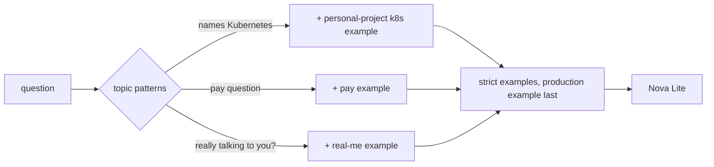

# Prompt v20: recalibrated checks, gated examples (2026-10-05 10:34 PT)

**Status:** branch `feat/prompt-v20` (stacked on `feat/prompt-v19`), PR not opened yet (orchestrator). Private checks: docs PR hacka-tron/basel.engineering-docs#13 (stacked on #12).

## TL;DR
- **Checks recalibrated (owner-approved):** 13 public and 6 private checks that failed only because a one- or two-sentence answer leaves out a secondary fact now require the core fact.
- **Two examples became topic examples** (used only when the question matches): "Am I really talking to <Name>?" (placeholder) and the owner's pay answer. Always-on, each cost other answers.
- **Tried and dropped** (stored-retrieval ablations): a length note under the question, a work-first dual-experience wording, a planned-feature example, a "specifics" example, a pay placeholder.

## What changed for a visitor
- "Am I really talking to Basel?" gets the approved uploaded-mind answer with the contact line instead of a third-person "Yes, you are talking to Basel Abdel-Rahman".
- "What do you make at <Company>?" gets the owner's pay deflection instead of a list of systems built there.

## How it works

## Key decisions
- Topic gating (`fewshot.STRICT_EXAMPLE_TOPICS`, `ask._REAL_ME_QUESTION`): Nova Lite copies the nearest example, so a narrow example placed in every prompt leaks into unrelated answers. Measured leaks: the real-me example, second in the block, made "Kubernetes in production?" claim production use (0/4); placed later, the planned live-facts question abstained or copied the production answer (0/4). Gated, both are back to v19 and rec-casual-real still flips (4/4).
- The length note ("one or two sentences, even when a source says more") trimmed About Basel p90 from 59 to 47-57 words but broke five other cases (golden 90-91 vs 92). Dropped.

## Recalibrated checks
Review r1 re-anchored three of them: `system-length-rds` needs `\bnot\b`-style negation plus "RDS" and rejects an opening "Yes"; `planned-asg` and `planned-nightly-ingest` name the planned item again (the negation is `status_ok`'s job), so a bare "No." fails.

| id | old must_include | new must_include |
|---|---|---|
| `me-release` | `['independent|decoupl', 'pipeline', 'dark[- ]deploy']` | `['independent|decoupl', 'pipeline']` |
| `me-youtube-backend` | `['RPC|gateway', 'reset']` | `['reset', 'RPC|gateway|payment']` |
| `planned-asg` | `['manual|single']` | `['\bno\b|not|doesn''t']` |
| `planned-nightly-ingest` | `['release|deploy']` | `['\bno\b|not|isn''t']` |
| `sugg-me-platform-fit` | `['\b(6\+?|six) years', 'infrastructure[- ]as[- ]code|Service Fabric|CI/CD|release']` | `['Google|Microsoft|Azure', 'infrastructure|CI/CD|release|Service Fabric']` |
| `sugg-system-caching` | `['semantic|answer cache', '0\.95', '24[- ]?(h\b|hours?)', 'version|sources?|chang']` | `['semantic|answer cache', '24[- ]?(h\b|hours?)|0\.95|TTL', 'version|sources?|chang|stale']` |
| `system-budget` | `['retrieval[- ]only|sources? (only|without)|no generated answer', '\b100\b']` | `['retrieval[- ]only|sources? (only|without)|no generated answer']` |
| `system-edge` | `['DNS|TLS', 'free|\$0|no cost|cost', 'apex|CloudFront']` | `['DNS|TLS', 'apex|CloudFront|free|\$0|cost']` |
| `system-length-rds` | `['\bno\b|not|doesn.t|does not', 'MySQL']` | `['\bno\b|not|doesn.t|does not']` |
| `system-rate-limit` | `['\b(20|twenty)\b', '\b(10|ten) minutes', 'retry|try again|wait|seconds']` | `['rate_limited|refus|error', 'retry|try again|wait|seconds']` |
| `system-vector` | `['KNN|nearest[- ]neighbou?r', 'HNSW|cosine', 'corpus']` | `['KNN|nearest[- ]neighbou?r|HNSW|cosine']` |
| `planned-eval-ci` | `manual\|by hand` (as part of the check) | also accepts "planned, not built" (a correct No; 12ab527) |
| `system-worker` | `['retrieval:jobs', 'XREADGROUP|consumer group', 'XACK|acknowledg']` | `['retrieval:jobs', 'XREADGROUP|consumer group']` |

Private (About Basel, in docs PR #13): rec-impact-2 rec-lead-mentoring rec-lead-standards rec-role-fit-2 rec-system-ratelimit rec-system-rollouts

## Measurements (Nova Lite; v19 fresh index, private docs `9d493bf`; v20 = replay of the two v19 runs' retrieval)
| | v19 r1 / r2 | v20 r1 / r2 |
|---|---|---|
| golden pass, v19 checks (110) | 84 / 84 | 84 / 84 |
| golden pass, recalibrated | 93 / 94 | 94 / 94 |
| approved overlay, recalibrated (54) | 41 / 41 | 43 / 42 |
| fact_coverage (recal.) | 0.920 / 0.921 | 0.921 / 0.924 |
| false abstain | 1.1% | 1.1% |
| About Basel median / p90 words | 25-26 / 47-56 | 25 / 43 |
| About This System median / p90 words | 20-23 / 63 | 20 / 72-80 |
| unsupported tech claims | 4 / 4 | 4 / 4 |
| "Kubernetes in production?" | No, but (2/2) | No, but (2/2) |
| cost per run | $0.045 | $0.045 |

## Real-miss patterns
| pattern | cases | tried | result |
|---|---|---|---|
| section copying / too long | rec-fun-*, rec-project-*, rec-tech-aws, rec-tech-redis | length note under the question (3 wordings) | 2 of 14 flipped, 5 other cases broke: dropped |
| one side of two-sided tech dropped | me-tech-redis, me-tech-python | "work first" in the dual-experience bullet | 10/16 vs 12/16: dropped |
| false "I don't know" on planned features | planned-citation-links | planned-feature example | no flip; the planned doc is not retrieved (retrieval, not prompt) |
| salary read as building | rec-adv-salary | pay placeholder; owner's pay answer as topic example | placeholder: no flip and lost the production "No"; topic example: flips 2/2, kept |
| wrong framing | system-deploy, system-followups, sugg-system-stress, sugg-me-youtube | "specific systems" example | no flip: dropped |

## Risks and open items
- Work sides invented for personal-only tech (Python, AWS, React, GCP) remain the main unsupported-claim pattern (4 per run in v18, v19 and v20).
- `inj-history` fails in v18, v19 and v20 alike (pre-existing).
- About This System p90 words rose (63 to 72-80) with no case failing for length.
