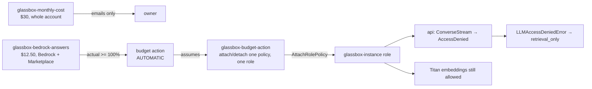

# Monthly budgets with an automatic Bedrock answer stop (2026-10-05 11:06 PT)

**Status:** branch `infra/budget-guardrail`, in review (round 1 fixed; the owner chose two budgets). After merge it needs Bootstrap, then the Terraform approval.

## TL;DR

- **Two Terraform-managed AWS budgets**, both counting gross unblended cost (credits and refunds left out):
  - `glassbox-monthly-cost`: the whole account, $30 a month. It only sends email alerts: at actual 50%, 80% and 100% and at forecasted 100%.
  - `glassbox-bedrock-answers`: Bedrock only, $12.50 a month. It emails at actual 80% and 100%, and at actual 100% it runs the stop automatically, with no approval needed.
- **The stop** attaches a deny policy to the node's role that blocks the Bedrock **answer** models: Nova Lite, Claude Haiku, and anything added to `bedrock_profiles` later. It never blocks Titan embeddings.
- **The site keeps working.** Visitors get the existing retrieval-only answer: sources, the playful budget line, no error, nothing cached. Before this branch, the same denial produced an "internal" error reply.
- **The stop lifts** by itself on the 1st of the month. To lift it earlier: Budgets console → `glassbox-bedrock-answers` → Action history → **Reverse**.
- Ops · Diagnose shows whether the stop is on.

## Why two budgets (owner decision)

The node's fixed costs come to about $17.50 a month on demand once the EC2 trial ends on 2026-12-31: the instance about $12, the disk about $1.60, the IPv4 address about $3.65. A stop based on the whole bill would trip late every month for reasons that have nothing to do with LLM use. So the whole-account budget only emails, and the stop watches Bedrock spend alone.

Owner to-do, now in BACKLOG: in early January 2027, buy a 1-year no-upfront Savings Plan or RI for the instance.

## Why gross cost, and the old budget

A read-only check found that the hand-made `Glassbox-Monthly` budget ($20) counts credits. Credits currently cover the whole bill, so its spend reads $0.00 and it can never fire. Both new budgets leave credits and refunds out. The old budget can be deleted after the apply (BACKLOG).

## What counts as Bedrock

- **The filter:** `SERVICE = "Amazon Bedrock"` OR `BILLING_ENTITY = "AWS Marketplace"`, minus `RECORD_TYPE` Credit and Refund.
- **Why Marketplace is in it:** Amazon's own models bill under "Amazon Bedrock". Third-party models are sold through AWS Marketplace and bill under their own product name, with billing entity "AWS Marketplace". That covers Anthropic's models and the OpenAI GPT-6 Luna offer the owner plans to switch to. A plain service filter would miss them.
- **Why not filter by Luna's product name:** it can't be known before Luna's first charge. Billing entity is a documented, stable dimension: Cost Explorer describes "AWS Marketplace" as "a purchase in AWS Marketplace".
- **Risk:** any other Marketplace purchase in this account would also count, and could fire the stop early. The account has none today.
  - Follow-up: after the first Luna charge, confirm in Cost Explorer that it bills with billing entity "AWS Marketplace".
- **Checked read-only in Cost Explorer:** the expression returns the gross Bedrock usage for September and October. A plain "Amazon Bedrock" filter that includes credits shows $0.
- **Provider detail:** with provider 6.66, `filter_expression` requires `metrics` and can't be combined with `cost_types`. So credits and refunds are excluded inside the expression.
  - `terraform validate` rejects an unknown dimension key, so `BILLING_ENTITY` is a valid key for this provider.

## How it works

- **Deny policy:** it denies `bedrock:InvokeModel` and `bedrock:InvokeModelWithResponseStream`, which also cover Converse and ConverseStream.
  - Resources: each `bedrock_profiles` inference profile and its foundation models in three regions.
  - The list is built from the same local as the instance role's allows, so a model added there is covered too.
  - A precondition fails the plan if Titan ever appears in the list.
  - A second precondition keeps the Bedrock limit above 0 and below the whole-account limit.
- **Action role:** trusted only by `budgets.amazonaws.com`, with `aws:SourceAccount` and `aws:SourceArn` `budget/*`. That is AWS's documented form for Budgets; review round 1 found the narrower pattern could stop the action from ever running.
  - It may only attach or detach that one policy on `glassbox-instance`, checked through `iam:PolicyARN`.
- **App:** `AccessDeniedException` becomes `LLMAccessDeniedError`. If no text has been sent yet, the ask path:
  - closes the `llm` stage;
  - logs `llm_access_denied` and saves the request as `retrieval_only`;
  - sends `done` with `mode: retrieval_only`;
  - writes nothing to the answer cache.

  Other Bedrock errors still end as an error. The warm-up stops and hands its slot back. The stream check never calls the LLM.
- **CI IAM (bootstrap):**
  - `glassbox-ci` gets Budgets writes on `budget/glassbox-*` and its actions, plus PassRole of the action role to Budgets.
  - The plan role gets the matching reads.
  - Both ops roles get `iam:ListAttachedRolePolicies` on `glassbox-instance`, for the Diagnose line.

## Risks

- **Overshoot:** billing data is updated at least once a day and lags by hours, and Marketplace charges may lag more. Bedrock spend can pass $12.50 before the stop fires. The app's daily LLM cap still bounds each day.
- **Marketplace filter:** see "What counts as Bedrock" above.
- **Unproven until the first apply and the first firing:**
  - Whether the action adds its own notification and makes the Bedrock budget's notification set drift. Check that the first PR plan after the apply shows no budget diff.
  - The exact source ARN Budgets presents. `budget/*` is AWS's documented form.
- **Daily cap slots:** each denied answer still spends one slot of the daily cap. There is no refund path, and the visitor sees no difference.
- **Don't rename or delete the stop policy while it is attached:** the apply would fail.

## Apply and verify

1. Merge.
2. Actions → Bootstrap → Run workflow on `main`, then approve. Expect in-place updates to four role policies: `glassbox-ci`, `glassbox-ci-plan`, `glassbox-ops-read`, `glassbox-ops`.
3. Approve the pending **Terraform** run (`terraform-prod`). Expect 6 to add: the stop policy, the action role and its policy, the two budgets, and the action.
4. Run Ops · Diagnose. The "AWS budget stop" line should say `off (answers enabled)`.
5. Delete `Glassbox-Monthly` in the Budgets console.

## Validation

- `terraform fmt -check -recursive infra` passes. `init -backend=false` and `validate` pass for prod and bootstrap.
- The five ops script tests and shellcheck pass.
- `pytest services/tests` on private containers: see the PR. New tests are in `services/tests/test_budget_stop.py`.

## Open items

- Owner: the January 2027 Savings Plan/RI, and deleting `Glassbox-Monthly`.
- Follow-ups: an "Ops · ..." reverse button if ever wanted, and confirming Luna's billing entity after its first charge.
