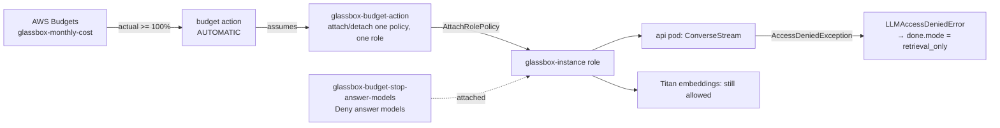

# $25 monthly budget with an automatic Bedrock answer stop (2026-10-05 11:06 PT)

**Status:** branch `infra/budget-guardrail`, in review. Needs Bootstrap, then the Terraform approval, after merge.

## TL;DR

- A Terraform-managed AWS budget, `glassbox-monthly-cost`: $25 a month of total account cost, unblended, **gross** (credits and refunds left out). It emails you at actual 50%, 80% and 100% and at forecasted 100%.
- At actual 100%, AWS Budgets itself attaches a deny policy to the node's role. The policy blocks the Bedrock **answer** models (Nova Lite, Claude Haiku, and anything added to `bedrock_profiles` later), but never Titan embeddings. No approval is needed.
- The site keeps working. Visitors get the existing retrieval-only answer: sources shown, the playful budget line, no error, nothing cached. Before this change the same denial would have produced an "internal" error reply.
- The stop lifts by itself on the 1st of the next month. To lift it earlier: Budgets console → the budget → Action history → **Reverse**.
- Ops · Diagnose now shows whether the stop is on.

## Why gross cost, and the old budget

A read-only check found the hand-made `Glassbox-Monthly` budget ($20) counts credits. Credits currently cover the whole bill, so its actual spend reads $0.00 and it can never fire. The new budget leaves credits and refunds out, so it measures what the site actually uses. You can delete the old budget after the apply. If you'd rather stop only on money actually billed, flip `include_credit` to true in `budget.tf`. While credits last, the stop would then never fire.

## What changes for a visitor

Nothing, until the month's gross spend passes $25. After that, every question gets the retrieval-only reply (sources plus a playful budget line), just like when the daily LLM cap is reached. Follow-up rewrites are skipped quietly, so retrieval uses the original question.

## How it works

- **Deny policy** (`infra/modules/compute/budget.tf`): denies `bedrock:InvokeModel` and `bedrock:InvokeModelWithResponseStream` on each `bedrock_profiles` inference profile and its foundation models in the three destination regions. Converse and ConverseStream have no IAM actions of their own. The resource list is built from the same local as the instance role's allows, so a model added there is stopped too. A Terraform precondition fails the plan if the list ever contains Titan.
- **Action role** `glassbox-budget-action`: trusted only by `budgets.amazonaws.com`, with `aws:SourceAccount` and `aws:SourceArn` (this budget or its actions). It is allowed only `iam:AttachRolePolicy` and `iam:DetachRolePolicy` on `glassbox-instance`, with `iam:PolicyARN` equal to the stop policy.
- **App** (`services/glassbox/providers/bedrock.py`, `api/ask.py`): a botocore `ClientError` with code `AccessDeniedException` becomes `LLMAccessDeniedError`. If no text was streamed yet, the ask path closes the `llm` stage, logs `llm_access_denied` in the query log's timings, saves `mode=retrieval_only` and sends `done` with `mode: retrieval_only`. It does not write the answer cache. Other Bedrock errors (throttling and so on) still end as an error, as before.
- **Warm-up**: it already stops at a `retrieval_only` answer, and the slot it reserved goes back (nothing was generated). Only the log message changed. The stream check never calls the LLM.
- **CI IAM** (`infra/bootstrap`): `glassbox-ci` gets Budgets writes on `budget/glassbox-*` and its actions, plus `iam:PassRole` of `glassbox-budget-action` to Budgets only. `glassbox-ci-plan` gets the Budgets reads. Both ops roles get `iam:ListAttachedRolePolicies` on `glassbox-instance`, for the Diagnose line.

## Key decisions

- **Email, not the SNS topic.** Budget notifications go straight to `alert_email`. Using `glassbox-alerts` would have needed a topic policy for Budgets, which replaces the default policy the CloudWatch alarms rely on. Budget emails need no confirmation click.
- **The 100% notification matches the action's threshold exactly.** The provider reads every notification on the budget back into state. If the action shares a notification that isn't in config, every plan would try to delete it.
- **No "Ops · Reverse budget stop" button.** It would need the ops role to run `budgets:ExecuteBudgetAction` and pass the action role. That is more access than one console click saves, so it's listed as a follow-up.
- **No budget-slot refund on a denied answer.** The daily cap slot reserved before the call stays spent: there is no refund path, at most one slot per question, and the call cost nothing.

## Lifting the stop

- **Automatically:** AWS resets IAM-policy budget actions at the start of each budget period, which detaches the policy (AWS blogs "Get started with AWS Budgets actions" and "Manage cost overruns, part 2"). No restart is needed; IAM propagates within about a minute.
- **By hand:** Billing and Cost Management → Budgets → `glassbox-monthly-cost` → Action history → select the completed action → **Reverse**. A reversed action does not run again that month; **Reset** re-arms it. To raise the limit, change `monthly_budget_usd` through a PR, not the console.

## Operational notes and risks

- **Overshoot:** billing data, which Budgets evaluates, is updated at least once a day and lags by hours. Spend can pass $25 before the stop fires.
- **Fixed costs keep running.** The stop only cuts Bedrock answers. The node, its disk and its IP still accrue cost and count toward the same $25.
- **Unproven until it fires:** the exact `aws:SourceArn` Budgets presents. The docs example uses `budget/*`; ours allows this budget and its `/action/*`. If Budgets sends something else, the action fails when it runs and the 100% email still arrives. Also unproven: whether the action creates its own notification and makes the budget's notification set drift. Check that the first PR plan after the apply shows no change to `module.compute.aws_budgets_budget.monthly`.
- Forecast alerts need about five weeks of usage history before they can fire.
- Don't rename or delete the stop policy while it is attached: IAM refuses to delete an attached policy, so the apply would fail. A normal Terraform apply leaves an attached stop in place.

## How to apply and verify

1. Merge.
2. Actions → Bootstrap → Run workflow on `main`, then approve. Expect in-place updates to the `glassbox-ci`, `glassbox-ci-plan`, `glassbox-ops-read` and `glassbox-ops` role policies.
3. Approve the pending **Terraform** run on `main` (`terraform-prod`). Expect 5 to add (the stop policy, `glassbox-budget-action` and its inline policy, the budget, the budget action) and nothing changed or destroyed.
4. Ops · Diagnose: the "AWS budget stop" line says `off (answers enabled)`.
5. Optional: delete `Glassbox-Monthly` in the Budgets console.

## Validation

- `terraform fmt -check -recursive infra` passes; `init -backend=false` plus `validate` pass for `infra/envs/prod` and `infra/bootstrap`.
- Ops script tests: `restore-snapshot-test.sh` gains the budget-stop line cases (off, on, unreadable); all ops tests and shellcheck pass.
- `pytest services/tests`: 1366 passed, 6 skipped (data or checkout dependent). New: `services/tests/test_budget_stop.py`. Three of its tests fail without the `ask.py` change.

## Open items

- Follow-up: an "Ops · ..." button to reverse the stop, if it's ever wanted.
- Owner: delete the old `Glassbox-Monthly` budget, and decide whether to keep gross cost or count credits.
