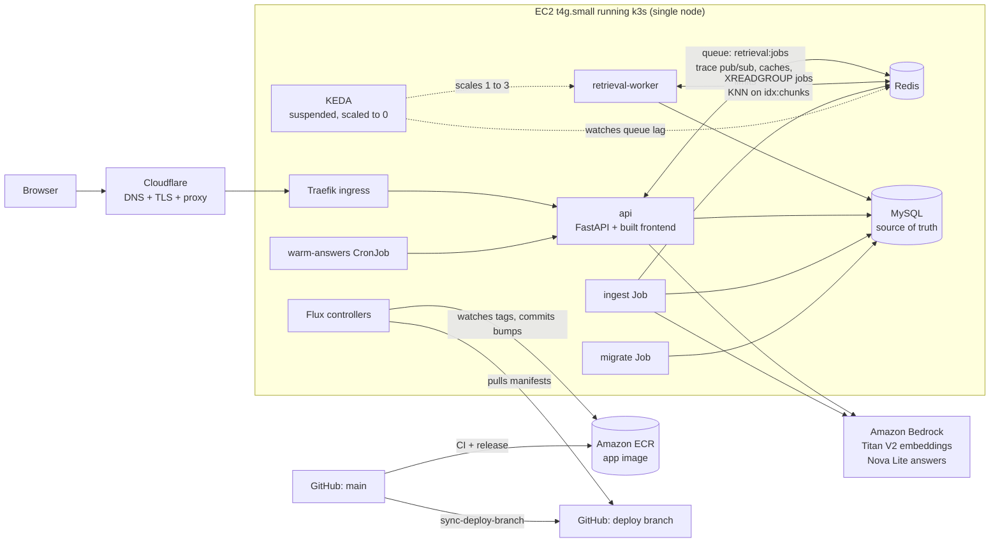

# Status reports

Briefings for the project owner. After each substantial feature or change, the agent that shipped it writes a short report here, like one you'd hand a technical manager: what changed, how it fits into the architecture, which decisions were made and why, what review caught, and what could go wrong in production. The goal is that reading these keeps you current on the whole system without reading diffs.

- **When:** a report is written when the PR opens, and updated when it merges and again when it's live (status, anything learned in deploy). Delegating the writing to a subagent is fine. The rule is in `project/CLAUDE.md` and `project/orchestration/README.md`.
- **Naming:** `YYYY-MM-DD-HHMM-<slug>.md`, the local Pacific time the report is first written, and the slug names the feature (e.g. `2026-09-30-1315-stress-test-keda.md`). The H1 carries the same date and time: `# <title> (YYYY-MM-DD HH:MM PT)`. One report per feature. Update it in place instead of writing a new one.
- **Shape:** TL;DR · What changed for a visitor · How it works (with a diagram) · Key design decisions & trade-offs · What review caught · Operational notes & risks · How to see it / verify it · Open items. About 1–2 pages.
- **Index:** add each report to the table below, newest first, and keep its status current.

## Index

| Date (PT) | Report | Summary | Status |
|---|---|---|---|
| 2026-10-05 11:06 | [$25 monthly budget with an automatic Bedrock answer stop](2026-10-05-1106-budget-guardrail.md) — branch `infra/budget-guardrail` | Terraform budget `glassbox-monthly-cost` ($25 gross unblended; emails at 50/80/100% actual and 100% forecast). At 100% an automatic budget action attaches a deny for the answer models (never Titan) to the node role; the app answers retrieval-only (sources, budget line, nothing cached) instead of erroring. Lifts on the 1st or by Reverse in the Budgets console; Diagnose shows it. The hand-made budget counts credits and never fires. | In review; needs Bootstrap, then Terraform approval |
| 2026-10-04 23:16 | [RAG phase 10: answer log and the answer-cache hit rate](2026-10-04-2316-rag-p10-answer-log.md) | `queries` stores the masked answer, abstained, route, model ID, prompt version and a new `coalesced` cache status (Alembic `0008`, additive); no IP or client hash; emails/phones/IDs masked; 90-day retention by an hourly batched delete; written in a background thread after `done`; daily hit-rate SQL in `eval/README.md`. Diagnose line and `sample_live.py` are follow-ups. | PR open |
| 2026-10-04 22:20 | [RAG phase 8: hybrid BM25 + vector retrieval](2026-10-04-2220-rag-p8-hybrid.md) | KNN + BM25 on a new `text` field, RRF k=10, per-file cap, About This System keeps the vector top 4; About Basel 8 chunks (max 2 per file) plus dual-experience slots (best work and personal-project chunk naming the technology, placed last). Chunk recall@8 0.756 → 0.805, identifiers at rank 1, every metric up on the 75 unslotted cases; answers flat (72/71 vs 71/69), false abstain 4 → 1, unsupported claims 0 vs 0. Diagram node now "Hybrid Search". | PR open |
| 2026-10-04 21:44 | [Prompt v18: approved few-shots and a casual tone route](2026-10-04-2144-rag-prompt-v18.md) | Owner-approved example answers (private repo, read at startup, placeholder fallback) as few-shots: 4 strict (two-sided example dropped: it invented a work side) and 4 casual; casual route when the best About Basel chunk is mostly personal/fun (T 0.5, route in trace, logs and cache key); approved-answer eval overlay; salary `$` check; first-person gold snippet fixes. Fresh index, v17 → v18: unsupported 4 → 4, third person 0 → 0, overlay 11 → 16/37, db chip passes 2/2, golden pass 63-64 → 61-62. | PR open |
| 2026-10-04 19:36 | [Prompt v17: Basel answers in the first person, in one or two sentences](2026-10-04-1936-rag-prompt-v17.md) | First-person persona (system prompt), 1-2 sentences, owner dual-experience rule, memory phrasing for gaps and absent tech, no billing plans, pointer stripping (facts kept), topic labels on About Basel sources, warm placeholder examples, temperature 0, third-person/length checks logged. Fresh index of the resynced corpus, v16 → v17: third person 32/40 → 0-1/40, pass 40 → 62-63, p90 72 → 58-60 words, unsupported 4 → 2, fact_cov 0.87 → 0.82. Open: db chip 1/2, injection on new corpus. Nova 2 Lite A/B: stay on Nova Lite. | PR open |
| 2026-10-03 14:40 | [Prompt v16: concise answers and a real cost section](2026-10-03-1440-rag-prompt-v16.md) | Owner complaint about a 220-word, wrong "$100 a month" cost answer: deep dive gains a cost section (~$5-6/month in the T4g trial, ~$17-18 after, plus Bedrock); prompt v16 is concise (audience line, direct answer, ~40-120 words, each point once, no copied paths). Same index v15 → v16: pass 67 → 71/74, median 42 → 20 words, paths 7 → 1-3, abstain 10/11 → 11/11, fact coverage 0.862 → 0.833/0.849. | PR open |
| 2026-10-03 14:00 | ["Searched for" only in About This System](2026-10-03-1400-searched-for-system-only.md) | The rewritten follow-up query line stays in About This System and is removed for About Basel and Portfolio; frontend only (`lib/searchedFor.ts`). | PR open |
| 2026-10-03 13:15 | [Remove the sources list under chat answers](2026-10-03-1315-hide-sources.md) | No "Sources:" line in any topic (owner: redundant with the diagram's Retrieved chunks); retrieval_only shows a short reply instead; frontend only. About Basel's Retrieved chunks show section labels, not `private/...` paths (API-side, live and cached). | PR open |
| 2026-10-03 12:48 | [RAG phase 5: prompt v15](2026-10-03-1248-rag-p5-prompt-v15.md) — PR [#164](https://github.com/hacka-tron/basel.engineering/pull/164) | Answer-thinness fix, second pass: specifics instead of brevity, tone lighter only for casual questions, no file names or source numbers (sources labelled by kind), content-filter stop becomes an abstention, 600-token cap. Same-index v14 → v15: pass 0.70 → 0.74, fact coverage 0.80 → 0.87, false abstain 6.6% → 1.3%, median 14 → 41.5 words. Portfolio self-reference and casual tone not reliably achieved on Nova Lite. | PR open |
| 2026-10-03 11:29 | [RAG phase 3: paid baseline of v14](2026-10-03-1129-rag-p3-baseline.md) | Titan v2 retrieval baseline refreshed (chunk recall@8 0.73, noise@8 0.127) and first paid answer run of prompt v14 on Nova Lite (pass 0.70, fact coverage 0.79, median 13.5 words); numbers in DESIGN-005 §2.2. | PR open |
| 2026-10-03 10:46 | [Corpus scope and `kind` tag](2026-10-03-1046-rag-p6-corpus-scope.md) — PR [#157](https://github.com/hacka-tron/basel.engineering/pull/157) (RAG plan phase 6, part 2) | About This System drops `services/tests/` and `docs/superpowers/plans/` (frontend stays out); chunk hashes get a `kind` TAG (doc/code/infra/manifest/test) with an optional retrieval filter; `ensure_index` adds every missing field via `FT.ALTER`; the stale sweep stays in report mode (the `apply` switch is a stacked follow-up PR). | PR open |
| 2026-10-03 10:34 | [RAG phase 4: LLM judges and calibration](2026-10-03-1034-rag-judge.md) — branch `feature/rag-p4-judge` | Faithfulness and relevance judges on Nova Pro, `run_answers --judge`, a label-pool builder, `calibration.yaml` labels and `calibrate` (test-split agreement, dev disagreements, refusal under 10 per class). No paid run yet. | PR open |
| 2026-10-03 10:31 | [Golden set refresh](2026-10-03-1031-golden-refresh.md) | RAG plan step 0: 12 stale gold snippets fixed against the resynced private About Basel files, 14 new About Basel cases and 2 unanswerable cases (91 total), `personal.md` registered; zero unreachable snippets. | PR open |
| 2026-10-03 10:22 | [Deep dive refresh after the portfolio feature](2026-10-03-1022-deep-dive-refresh.md) | `docs/architecture/deep-dive.md` brought up to date (three corpora, Alembic 0006/0007, Portfolio topic, phone details sheet, Open to work, personal-data guard, CI changes gate, Ops · Reindex, applied alarms, Redis keys); still one file, one chunk per section (42 sections, at most 499 words). | PR open |
| 2026-10-02 11:40 | [Portfolio topic (frontend)](2026-10-02-1140-portfolio-frontend.md) — PR [#150](https://github.com/hacka-tron/basel.engineering/pull/150) (3b) | Third chat topic **Portfolio**: desktop pane follows the topic (card grid from `corpus/portfolio/*.md`, built at build time with the backend's validation rules), phones get Chat \| Diagram \| Portfolio, the shared 80% sheet with a visuals gallery and modal lightbox, "See portfolio →" in the footer popover. Hidden until the first published project (owner); the Dockerfile copies `corpus/portfolio` into the frontend build. | Merged, live (build-110) |
| 2026-10-02 10:24 | [Portfolio corpus in the backend](2026-10-02-1024-portfolio-backend.md) — PR [#149](https://github.com/hacka-tron/basel.engineering/pull/149) | `portfolio` is a third corpus: `corpus/portfolio/<slug>.md` with validated YAML front matter (CI check, `python -m services.glassbox.portfolio`), scanned without drafts/symlinks, indexed as preface + body behind the personal-data guard; API, retrieval, sweep and warm-up accept it; Alembic `0007` appends it to both ENUM columns (in place, automatic on deploy). One draft example; visitors see no change until the frontend PR. | Merged, live (build-107) |
| 2026-10-02 10:22 | [Phone diagram details in a pull-up sheet](2026-10-02-1022-phone-details-sheet.md) — PR [#148](https://github.com/hacka-tron/basel.engineering/pull/148) | On phones, selecting a diagram component opens the shared `DetailsSheet` over the bottom 80% (was a panel capped at 40%); the node pans into the dimmed strip above; Back, Chat and Escape close it. Desktop unchanged. | Merged, live (build-109) |
| 2026-10-02 10:13 | [Footer "Open to work" callout](2026-10-02-1013-open-to-work-footer.md) — PR [#147](https://github.com/hacka-tron/basel.engineering/pull/147) | Green dot plus "Open to work" in the footer (dot only below 360px, left out below 300px) opens a popover, "Open to full-time work and freelancing", with one Copy email button; email copy logic shared with the header envelope (`lib/contact.ts`). Phone latency reads in at most 5 characters (`12.3s`) so the footer never scrolls sideways at 280–393px. | Merged, live (build-106) |
| 2026-10-01 23:07 | [Overnight session: what shipped and what waits on you](2026-10-01-2307-overnight-session.md) | 13 PRs merged (#130–#135, #137–#143); #136 Ops · Reindex reviewed and waiting for the owner's go-ahead; alarms apply done, SNS email pending. | Summary |
| 2026-10-01 22:39 | [Post-deploy streaming check through Cloudflare](2026-10-01-2239-stream-check.md) — PR [#143](https://github.com/hacka-tron/basel.engineering/pull/143) | After every release (once `GET /api/version` reports the new `build-N`) and daily, a free GitHub Actions check streams `/api/cluster/stream` through Cloudflare and fails if events arrive late or in a burst, heartbeats are missing, the stream is compressed or cached, HTTP doesn't 301 to HTTPS, or security headers are missing. Never calls `/api/ask`; never blocks a deploy. | Merged, live (check passing) |
| 2026-10-01 22:29 | [Stale sweep follow-ups: orphan Redis keys and run notes](2026-10-01-2229-sweep-followups.md) — PR [#142](https://github.com/hacka-tron/basel.engineering/pull/142) | `--clear` now also SCANs `chunk:*` and removes hashes for the corpus and model that have no MySQL row (and their `chunktxt:` caches); the stale sweep's mode, planned/deleted counts and refusal reasons are stored in a new nullable JSON `ingestion_runs.notes` column (Alembic `0006`, additive). | Merged, live |
| 2026-10-01 21:59 | [Time to first token in the query log](2026-10-01-2159-ttft-logging.md) — PR [#137](https://github.com/hacka-tron/basel.engineering/pull/137) | New nullable `queries.ttft_ms` (Alembic `0005`, additive, safe mid-release): server-side ms from request receipt to the first streamed answer text; cache hits measured, NULL for `retrieval_only` and a Stop before the first token. SSE contract unchanged. p50/p95 in Ops · Diagnose deferred (needs a Terraform apply). | Merged, live |
| 2026-10-01 21:57 | [Ingest write path: commit first, batch queries, honest failures](2026-10-01-2157-ingest-robustness.md) — PR [#138](https://github.com/hacka-tron/basel.engineering/pull/138) | Phase 1a review leftovers in `ingest/run.py`: a changed document's old Redis keys are deleted before its MySQL commit and new keys written after (no Redis I/O inside the transaction; a crash leaves only missing keys, which the reconcile repairs, proven by a test); one query per run for the hash check and a bulk chunk insert instead of ~200 SELECTs and a flush per chunk; marking a run `failed` can no longer mask the original error. | Merged, live |
| 2026-10-01 21:54 | [Ops · Reindex runbook, old answer index dropped, chunk text cache fix](2026-10-01-2154-ops-reindex.md) — PR [#136](https://github.com/hacka-tron/basel.engineering/pull/136) | Owner-approved "Ops · Reindex" runs `ingest.run --reindex` as a one-off Job with the api's image (no kubectl); every ingest drops the unused `idx:answers` (no `DD`); ingest clears `chunktxt` for ids it writes. No IAM/RBAC change; the runbook needs one Terraform apply. | Merged, applied, live (build-105) |
| 2026-10-01 21:05 | [Process docs match how we work now](2026-10-01-2105-process-docs.md) — PR [#127](https://github.com/hacka-tron/basel.engineering/pull/127) | Orchestration README, CLAUDE.md working style, reviewer brief and BACKLOG resume point brought to current practice (Opus subagent review default, Codex optional, Gemini legacy; merge sequence; owner content rules); AGENT_HANDOFF trimmed to a short current handoff with history in `project/archive/`. | Merged |
| 2026-10-01 20:47 | [About Basel from a private repo, with a personal-data guard](2026-10-01-2047-private-about-me.md) — PR [#126](https://github.com/hacka-tron/basel.engineering/pull/126) | Release builds check out the owner's private repo (`hacka-tron/basel.engineering-docs`, `about-me/*.md`) with a read-only deploy key and ingest it as About Basel; no Actions cache export or build record while it is present; private twins replace the public copies without duplicates; the sweep never deletes private docs from a release without the checkout. One detector redacts phones, personal emails, addresses, dates of birth and SSN-like IDs at ingest and masks phones/SSNs in streamed answers across token boundaries; masked answers are never cached. Existing corpus: zero findings. Google Drive dropped. Inactive until the owner adds the key. | PR open |
| 2026-10-01 19:38 | [Alarms, uptime probe, daily snapshots and a one-click restore](2026-10-01-1938-alarms-snapshots.md) — PR [#124](https://github.com/hacka-tron/basel.engineering/pull/124) | Owner's choice instead of the self-healing plan's phases 2–4: CloudWatch recover/reboot alarms on the node's status checks emailing `glassbox-alerts`, a free 15-minute `/readyz` probe in GitHub Actions, a DLM policy snapshotting the node's one disk (k3s, MySQL, Redis) daily with 7 kept, and "Ops · Restore from snapshot" (EC2 replace root volume, same instance and IP, fails closed) plus "Ops · List snapshots". About $0.40–0.80/month. | Merged (2026-10-02); needs Bootstrap, then Terraform apply, then the SNS email click |
| 2026-10-01 16:06 | [Redis chunk index rebuilt from MySQL on every ingest run](2026-10-01-1606-redis-reconcile.md) — PR [#122](https://github.com/hacka-tron/basel.engineering/pull/122) | Bug fix: after Redis data loss or a MySQL restore nothing rebuilt `idx:chunks`, so every answer abstained. Each ingest run now ends with a reconcile (repair missing keys from MySQL's stored vectors, rewrite mismatches by `content_sha`, remove orphans; zero-MySQL guard; version bump only on change), plus `--reindex`. No embedding calls. | Merged (2026-10-01) |
| 2026-10-01 16:03 | [Content-Security-Policy, Report-Only, with a report endpoint](2026-10-01-1603-csp-report-only.md) — PR [#121](https://github.com/hacka-tron/basel.engineering/pull/121) | Strict same-origin `Content-Security-Policy-Report-Only` (no `'unsafe-inline'`, no `data:`) on every response; the inline iOS zoom script moved to `public/ios-zoom.js`; headless Chrome audit of the build found 0 violations. `/api/csp-report` is rate-limited, capped at 8 KiB, logs only directive/origin/path, no DB writes; counted in Ops · Diagnose (after the `ops` Terraform apply). Enforcing is the next step. | Merged (2026-10-01) |
| 2026-10-01 15:55 | [Docs drift pass: planned markers and design docs up to date](2026-10-01-1555-docs-drift.md) — PR [#120](https://github.com/hacka-tron/basel.engineering/pull/120) | Every section of DESIGN.md, DESIGN-002 to 005 and the deep dive checked against SNAPSHOT and the code: drift fixed (KEDA suspended, zram, ops runbooks, bootstrap pipeline, ECR/`build-N`, Nova Lite, in-cluster MySQL, eval v2) and every unbuilt part marked so each real chunk carries the planned marker; the deep dive no longer lists shipped chat UX, landscape or the sweep as planned. Regression cases pinned. | Merged (2026-10-01) |
| 2026-10-01 15:53 | [Phones are portrait only: "turn your phone upright"](2026-10-01-1553-phone-portrait-only.md) — PR [#119](https://github.com/hacka-tron/basel.engineering/pull/119) | A phone held sideways shows a "Turn your phone upright to use basel.engineering" screen; the app stays mounted underneath (inert, hidden), so answers and the selection survive. Tablets and desktop unaffected. Replaces and removes the #100/#113 landscape layout. | Merged (2026-10-01) |
| 2026-10-01 15:48 | [Answer cache survives unrelated re-ingests](2026-10-01-1548-answer-cache-sources.md) — PR [#117](https://github.com/hacka-tron/basel.engineering/pull/117) | Cached answers are no longer keyed by the corpus version; each hit checks its own source chunks still hold the same `content_sha`, so a docs edit invalidates only answers built from that doc. Retrieval cache keeps the version key. One-time cold answer cache at deploy. | Merged (2026-10-01) |
| 2026-10-01 15:29 | [Answers stopped: budget audit and LLM budget in Ops · Diagnose](2026-10-01-1529-budget-diagnose.md) — PR [#116](https://github.com/hacka-tron/basel.engineering/pull/116) | Live answers went `retrieval_only`. Audit of today's PRs found no request loop and a warm-up hard-capped at 10/day; ~20 releases kept invalidating cached answers. Ops · Diagnose now prints budget counters vs the cap, kill switch, warm-up counters, corpus versions, busiest rate-limit buckets and today's query counts (read-only, counts only). | Merged (2026-10-01); needs Terraform apply |
| 2026-10-01 06:43 | [Diagram: deselect by empty space, the details chevron, or Escape](2026-10-01-0643-diagram-deselect.md) — PR [#114](https://github.com/hacka-tron/basel.engineering/pull/114) | A click/tap on empty diagram space deselects the component (desktop and phones; a pan does not). On phones the details chevron deselects instead of collapsing (replaces #90's collapse-while-selected). Escape deselects first, then returns to Chat. Streaming answers keep streaming; focus goes to the locked bar. | Merged (2026-10-01) |
| 2026-10-01 06:21 | [UI review follow-ups: retry reload, announcements, phone focus, landscape fit](2026-10-01-0621-ui-review-followups.md) — PR [#113](https://github.com/hacka-tron/basel.engineering/pull/113) | A reload mid-retry keeps the failure reply and Retry; screen readers hear "Answer stopped.", nothing stray on stop-and-send, and "Retry is available now."; phones focus the retried question after Retry; the Chat/Diagram tap area covers the whole control; 568x320 with details open shows all 11 nodes. Desktop and portrait byte-identical. | Merged (2026-10-01) |
| 2026-10-01 06:09 | [Security pass leftovers: headers, short-salt test, ops-read trust](2026-10-01-0609-security-leftovers.md) — PR [#112](https://github.com/hacka-tron/basel.engineering/pull/112) | The API sets HSTS (180 days, apex only), `nosniff`, `Referrer-Policy`, `X-Frame-Options: DENY` + CSP `frame-ancestors 'none'` and a `Permissions-Policy` on every response, SSE and static files included (live on the next release). App-level test for a too-short salt. `glassbox-ops-read` trusts only the `ops-read` environment (needs a Bootstrap apply). Script/style CSP planned as Report-Only first. | Merged (2026-10-01) |
| 2026-09-30 23:42 | [Stale-document sweep and `--clear`](2026-09-30-2342-rag-p6-stale-sweep.md) — PR [#101](https://github.com/hacka-tron/basel.engineering/pull/101) | RAG plan phase 6, part 1: after each complete scan, ingestion lists indexed documents whose files are gone (report only on this release; `GLASSBOX_INGEST_SWEEP=apply` deletes, with a zero-file guard and a 30% limit). `--dry-run` and `--clear --corpus X [--yes]` for operators. Closes "Ability to clear chunks". | Merged (2026-10-01) |
| 2026-09-30 23:30 | [Landscape phones keep a usable phone layout](2026-09-30-2330-landscape-phone.md) — PR [#100](https://github.com/hacka-tron/basel.engineering/pull/100) | Phones held sideways (896x414 included) keep the phone layout: compact header and footer, chips beside the ask box, header hidden in Diagram view, a three-row graph with all 11 nodes, details beside the diagram. Messages 55 → 120px at 568x320. Portrait and desktop byte-identical. | Merged (2026-10-01) |
| 2026-09-30 23:27 | [Cluster stream: shared watch, caps, bounded lifetime](2026-09-30-2327-cluster-stream-cap.md) — PR [#99](https://github.com/hacka-tron/basel.engineering/pull/99) | `/api/cluster/stream` now runs one shared pod watch and Redis poller per api process, fanned out to bounded per-client queues; 100 streams per process and 5 per IP (503/429 + `Retry-After`), 10-minute lifetime with `reconnect`, 15 s heartbeat; the browser backs off (first retry 2.5–5 s, up to 2 min) and keeps the last pods on screen. Security pass finding 11. | Merged (2026-10-01) |
| 2026-09-30 23:14 | [RAG quality phase 1: golden answer set and free answer checks](2026-09-30-2314-rag-p1-golden-set.md) — PR [#97](https://github.com/hacka-tron/basel.engineering/pull/97) | 75-case answer test set (facts, planned vs live, refusals, follow-ups, injection) with free deterministic checks and an in-process answer runner; the stress-test case fails on today's thin answer. About Basel facts await owner review. | Merged (2026-10-01) |
| 2026-09-30 23:06 | [Security pass](2026-09-30-2306-security-pass.md) — PR [#96](https://github.com/hacka-tron/basel.engineering/pull/96) | No live secret in history. Fixed: worker exception text in the SSE stream, a spoofable/shared rate-limit identity (now `CF-Connecting-IP`, then the rightmost untrusted XFF hop; IPv6 by /64), and a fail-open salt (API refuses to start without one in prod). Open: Terraform preview credentials are readable by any repo writer, unpinned actions, cluster-stream cap, security headers. | Merged (2026-10-01) |
| 2026-09-30 23:04 | [Retrieval eval v2: k=8, chunk-level, noise@8](2026-09-30-2304-rag-p2-retrieval-eval.md) — PR [#95](https://github.com/hacka-tron/basel.engineering/pull/95) | RAG quality plan phase 2: the retrieval eval searches at the worker's k=8 and adds chunk-level recall (gold snippets), noise@8 (share of tests/plans chunks), per-category output and matching regression gates; v1 baselines still parse. Offline tooling only. | Merged (2026-10-01) |
| 2026-09-30 22:56 | [Chat UX leftovers: type while streaming, Up-arrow recall, Retry](2026-09-30-2256-chat-ux-leftovers.md) — PR [#93](https://github.com/hacka-tron/basel.engineering/pull/93) | The ask box stays enabled while an answer streams (sending stops it first); Up arrow recalls the topic's last question; Retry under the latest failure reply replaces the failed attempt, re-sends the same history, and waits out rate limits. | Merged (2026-10-01) |
| 2026-09-30 22:55 | [Ops log redaction: multiline secrets](2026-09-30-2255-redact-multiline.md) — PR [#94](https://github.com/hacka-tron/basel.engineering/pull/94) | `redact()` now masks secrets whose value is on the following lines (YAML blocks, Secret `data:` maps, pretty JSON, PEM), keeps streaming, and withholds output if the filter fails. Runner pass live on merge; on-node pass after the Terraform apply. | Merged (2026-10-01) |
| 2026-09-30 22:54 | [RAG quality: research, design and plan](2026-09-30-2254-rag-research.md) — PR [#92](https://github.com/hacka-tron/basel.engineering/pull/92) | Thinness traced to the prompt's "two or three concise sentences" rule; tests are 40% of About This System chunks; nothing measures answers. DESIGN-005 plus an 11-phase plan: validation harness first, then prompt v14, corpus hygiene, breadcrumb chunks, hybrid BM25+vector. No paid reranker. | Merged (2026-10-01) |
| 2026-09-30 22:53 | [Release pipeline hardening](2026-09-30-2253-release-hardening.md) — PR [#91](https://github.com/hacka-tron/basel.engineering/pull/91) | Manual Release runs must build `main`'s current head (else refused), so an old commit can't get the highest `build-N` and be deployed; the main → deploy sync re-fetches, re-merges and retries a push rejected by a racing Flux commit (5 attempts, never forced). Offline bare-repo tests in CI. | Merged (2026-10-01) |
| 2026-09-30 22:53 | [Mobile diagram: details bar locked until a component is selected](2026-09-30-2253-details-gating.md) — PR [#90](https://github.com/hacka-tron/basel.engineering/pull/90) | The phone Diagram view's details bar reads "Select a component for details" and can't be opened until a component is tapped, so it no longer shows the latest chat answer. `aria-disabled`, still focusable. Desktop unchanged. | Merged (2026-10-01) |
| 2026-09-30 22:15 | [Desktop topic chips; latency readout lights up](2026-09-30-2215-desktop-topic-pills.md) — PR [#82](https://github.com/hacka-tron/basel.engineering/pull/82) | "Asking about (Basel) (System)" chips now sit above the desktop ask box too (always shown); the header nav is gone, so the header is name ... envelope, GitHub at every width. The footer latency brightens on hover, focus and press like the capacity icon. | Pills reverted (latency hover kept) |
| 2026-09-30 21:20 | [Session wrap-up: outage, ops, mobile](2026-09-30-2120-session-wrapup.md) | What shipped 2026-09-30/10-01 (#55, #59, #61–#79), the node memory incident and its fix, live state (zram on, KEDA suspended, warm-up running), docs brought up to date, and what's next. | In review |
| 2026-09-30 20:30 | [Mobile header: one row, topic chips in Chat view, envelope Contact](2026-09-30-2030-mobile-topic-dropdown.md) — PR [#78](https://github.com/hacka-tron/basel.engineering/pull/78) | Phone header is one 61px row; topic is "Asking about (● Basel) (○ System)" chips above the ask box in Chat view only; Contact is an envelope icon ("Copy email") at every width. Owner chose this after comparing a header dropdown, the chips and the old header live. Chat and Diagram heights equal main; desktop differs only in the Contact area. | Merged 2026-10-01 |
| 2026-09-30 19:07 | [UI tweaks: footer readout, Contact, diagram refit](2026-09-30-1907-ui-tweaks.md) — PR [#65](https://github.com/hacka-tron/basel.engineering/pull/65) | Latency shows just `312ms`, with a hover/long-press tooltip; Contact confirms "Email copied"; diagram refits on any container resize (fixes it staying small after widening); phone New chat is a long-press-aware "+" icon. Follow-ups: "+" on the right (#69), "1 query served" (#71). | Merged |
| 2026-09-30 18:17 | [Reviewer primer for the Codex gate](2026-09-30-1817-reviewer-primer.md) — PR [#63](https://github.com/hacka-tron/basel.engineering/pull/63) | One-file primer (system map, hard rules, known traps by area, per-area checklist) so reviews start warm; template gains prior-rounds and status-report slots and `< /dev/null`. | Merged |
| 2026-09-30 18:08 | [Push-button ops runbooks + bootstrap pipeline](2026-09-30-1808-ops-runbooks.md) — PR [#62](https://github.com/hacka-tron/basel.engineering/pull/62) | Eight "Ops · …" workflows over a reusable `ops.yml` (#68): diagnose (no approval) plus reboot, restarts, Flux suspend/resume/reconcile, KEDA on/off, CronJob suspend, zram, all through Terraform-managed SSM documents behind owner approval. `bootstrap.yml` applies bootstrap from CI after approval. | Merged; one-time owner setup done; bootstrap pipeline used live |
| 2026-09-30 17:58 | [Mobile layout A: diagram in place, focus mode](2026-09-30-1758-mobile-layout-a.md) — PR [#61](https://github.com/hacka-tron/basel.engineering/pull/61) | Below 768px the diagram replaces the chat in place (portrait graph, capped collapsible details, Back returns); header and footer hide while typing; New chat moves to the footer. Desktop pixel-identical. Follow-ups #67–#79 are in the session wrap-up. | Merged |
| 2026-09-30 17:28 | [Bootstrap state moves to S3](2026-09-30-1728-bootstrap-remote-state.md) — PR [#59](https://github.com/hacka-tron/basel.engineering/pull/59) | Bootstrap root's state goes from a laptop file to `bootstrap/terraform.tfstate` in the existing bucket; CI roles scoped to `envs/prod/*` and denied `bootstrap/*`; bucket gets prevent_destroy + policy. | Merged; owner migration done |
| 2026-09-30 17:03 | [Quirky "I don't know" replies](2026-09-30-1703-quirky-idk.md) — PR [#58](https://github.com/hacka-tron/basel.engineering/pull/58) | `done.abstained` flag; the chat swaps the flat refusal for one of 20 playful replies (some blame Basel). History keeps the canonical sentence. | Merged |
| 2026-09-30 16:48 | [Stress control: labelled button when there is room](2026-09-30-1648-stress-control-responsive.md) — PR [#56](https://github.com/hacka-tron/basel.engineering/pull/56) | Labelled "Stress test" button plus details-only icon from 640px; icon-only below; footer gutter 16px + safe-area. | Merged |
| 2026-09-30 16:24 | [Compressed zram swap on the node](2026-09-30-1624-zram-swap.md) — PR [#55](https://github.com/hacka-tron/basel.engineering/pull/55) | Swap moves to compressed RAM (`/dev/zram0`, prio 100) ahead of the EBS `/swapfile` to stop IO thrashing. Delivered by a Terraform-managed SSM association, not user data. IAM fixes in #64 and #66. | Merged and live (zram active) |
| 2026-09-30 16:21 | [Latency quick wins](2026-09-30-1621-latency-quick-wins.md) — PR [#54](https://github.com/hacka-tron/basel.engineering/pull/54) | Footer shows time to first token and `· cached`; suggested questions' answers kept warm (CronJob every 2h + after each deploy's ingest; at most 10 LLM calls/day across all runs, stops on limits); follow-up overlap measured as not worth doing. | Merged; warm-up CronJob running |
| 2026-09-30 16:01 | [Cached refusals + planned-design label](2026-09-30-1601-cached-refusals.md) — PR [#53](https://github.com/hacka-tron/basel.engineering/pull/53) | Refusals/empty answers are never cached (legacy ones read as a miss); live infra (KEDA, k3s, Terraform, Flux) no longer labeled "planned" in the prompt; prompt v13 invalidates old entries. | Merged |
| 2026-09-30 15:53 | [EC2 instance pinned against AMI replacement](2026-09-30-1553-ami-pin.md) — PR [#44](https://github.com/hacka-tron/basel.engineering/pull/44) | `ignore_changes = [ami]` so a new Amazon Linux release can't force-replace the node (and wipe k3s/MySQL/Redis data). Plan: no changes. | Merged and applied (no-op) 2026-09-30 |
| 2026-09-30 15:53 | [Deploy safety](2026-09-30-1553-deploy-safety.md) — PR [#47](https://github.com/hacka-tron/basel.engineering/pull/47) | Longer probe timeouts + startupProbe, stop-old-pod-first rollouts (owner chose seconds of downtime over memory overlap), graceful shutdown, API/worker wait for the DB migration. Ingest-after-app ordering is in #49. | Merged 2026-09-30 |
| 2026-09-30 15:53 | [KEDA capped at 3 workers](2026-09-30-1553-keda-max-3.md) — PR [#45](https://github.com/hacka-tron/basel.engineering/pull/45) | Sized for the 2 GiB node: real burst needs 512 MiB free (was 768); tooltip/animation/docs updated; §9.7 memory budget reconciled with live measurements. | Merged 2026-09-30; KEDA suspended since the 2026-09-30 incident |
| 2026-09-30 15:53 | [Ingest runs after the app is healthy](2026-09-30-1553-ingest-after-app.md) — PR [#49](https://github.com/hacka-tron/basel.engineering/pull/49) | Ingest Job moved to its own Flux Kustomization `ingest`, which waits on `app-ready` (health checks on api/worker, itself after the root `flux-system`). Nothing else moved. | Merged 2026-09-30 |
| 2026-09-30 15:49 | [Chat stream resilience](2026-09-30-1549-chat-stream-resilience.md) — PR [#48](https://github.com/hacka-tron/basel.engineering/pull/48) | 15s SSE heartbeat, generation stops server-side on Stop/disconnect, client stall watchdog, Stop button, smart auto-scroll, failures shown as friendly chat replies. | Merged |
| 2026-09-30 13:15 | [Stress test with KEDA + capacity gate](2026-09-30-1315-stress-test-keda.md) | A button bursts 300 synthetic jobs and KEDA scales workers (now 1→3, #45) live, but only if the node has the memory. Otherwise it plays a simulation. | Merged ([#40](https://github.com/hacka-tron/basel.engineering/pull/40), 2026-09-30); KEDA suspended since the 2026-09-30 incident, so the button simulates |
| 2026-09-30 13:15 | [Typography + mobile layout pass](2026-09-30-1315-typography-mobile.md) | Fixes a CSS bug that forced every button/input to 16px; dvh shell, 44px tap targets, readable mobile diagram zoom. | Merged ([#46](https://github.com/hacka-tron/basel.engineering/pull/46), 2026-09-30; Codex approved in round 3) |
| 2026-09-30 13:15 | [Orchestration: Codex review gate](2026-09-30-1315-orchestration-codex-gate.md) | Claude orchestrates and implements. Codex reviews and validates every change before check-in. Mobile design rules added. | [#39](https://github.com/hacka-tron/basel.engineering/pull/39) and follow-up [#42](https://github.com/hacka-tron/basel.engineering/pull/42) merged |
| 2026-09-30 13:15 | [Conversational chat](2026-09-30-1315-conversational-chat.md) | Follow-up questions with history, rewritten into standalone search queries; separate persisted chats per tab. | Merged ([#41](https://github.com/hacka-tron/basel.engineering/pull/41), 2026-09-30) |

## System at a glance

Glassbox is the chatbot on `basel.engineering`. It answers questions about Basel and about its own architecture using retrieval-augmented generation (RAG), and it shows each request moving through a live architecture diagram. All of it runs on one small EC2 instance using k3s. Sources: `project/SNAPSHOT.md`, `docs/DESIGN.md` §5 and §9. Feature reports refer back to these component names.

| Component | One line |
|---|---|
| **Cloudflare** | DNS, TLS termination and edge proxy in front of the single node. The origin only accepts Cloudflare traffic. |
| **Traefik** | k3s's built-in ingress. Routes `/api/*` and the static frontend to the `api` pod. |
| **api** | FastAPI. Serves the React frontend and `POST /api/ask` as a Server-Sent Events trace stream. Does rate limiting, the daily LLM budget, embedding the question, the semantic answer cache, prompt building, LLM streaming and query logging. |
| **Redis** (`redis-stack-server`) | Does several jobs on purpose: the vector index (`idx:chunks`), embedding/retrieval/chunk/answer caches, the job queue (Stream `retrieval:jobs`, group `workers`), trace fan-out (`trace:{request_id}` pub/sub), rate-limit and budget counters. None of it is precious: it can be rebuilt from MySQL. |
| **retrieval-worker** | Same image as the API, different entrypoint. Takes one job at a time from the Stream, runs KNN vector search in Redis, loads chunk text (chunk cache → MySQL), and publishes results and trace events. |
| **MySQL** | In-cluster StatefulSet. Source of truth for documents, chunks and embeddings, ingestion runs and the `queries` log. Schema is managed by Alembic via the `migrate` Job. |
| **ingest Job** | Chunks the two corpora (`about_me`, `about_system` = this repo), embeds via Bedrock, writes MySQL and the Redis index. Incremental by content hash and embedding model. |
| **Amazon Bedrock** | Titan Text Embeddings V2 (512-dim) and Nova Lite for generated answers. Auth is the EC2 instance role, so there are no API keys. Local dev uses a deterministic fake provider. |
| **GitHub Actions** | CI (tests, lint, build, Terraform plan), `release.yml` builds the arm64 image and pushes it to ECR, and `sync-deploy-branch.yml` mirrors `main` into `deploy`. |
| **Flux** | GitOps: pulls `k8s/overlays/prod` from the unprotected `deploy` branch and applies it. Image Update Automation watches ECR for new build tags and commits the tag bump to `deploy`. Merging to `main` deploys hands-off. |
| **KEDA** | Installed by Flux as a Helm release; scales `retrieval-worker` 1→3 on the Stream's consumer-group lag. *Suspended and scaled to 0 since the 2026-09-30 memory incident*, so the worker stays at one replica. |
| **warm-answers** | CronJob every 2 hours (and after each deploy's ingest) that asks the suggested questions through the API to keep their answers cached; at most 10 LLM answers a day. |
| **Ops runbooks** | "Ops · …" GitHub Actions workflows that run Terraform-managed SSM documents on the node (diagnose, reboot, restarts, Flux suspend/resume/reconcile, KEDA on/off, CronJob suspend, zram) behind owner approval. |
| **Terraform** | Everything AWS-side (network, EC2/k3s, zram, ops SSM documents, secrets, Cloudflare edge, CI roles). Applied from CI after owner approval (`terraform.yml`, `bootstrap.yml`), not via Flux and never by hand. |

**Request path, in one breath:** the browser POSTs a question → the API checks limits, embeds the question (cache first) and checks the semantic answer cache → on a miss it enqueues a job on `retrieval:jobs` and subscribes to `trace:{id}` → a worker searches, then publishes chunks → the API builds the prompt, streams Bedrock tokens back as SSE, caches the answer and logs the query to MySQL.
