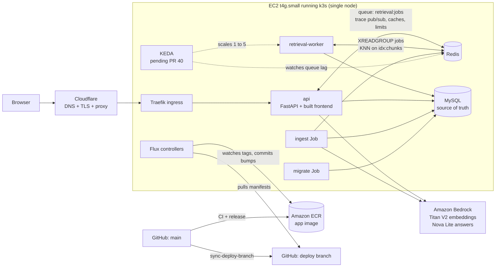

# Status reports

Briefings for the project owner. After each substantial feature or change, the agent that shipped it writes a short report here, like one you'd hand a technical manager: what changed, how it fits into the architecture, which decisions were made and why, what review caught, and what could go wrong in production. The goal is that reading these keeps you current on the whole system without reading diffs.

- **When:** a report is written when the PR opens, and updated when it merges and again when it's live (status, anything learned in deploy). Delegating the writing to a subagent is fine. The rule is in `project/CLAUDE.md` and `project/orchestration/README.md`.
- **Naming:** `YYYY-MM-DD-<slug>.md`. The date is when the work was first proposed, and the slug names the feature (e.g. `2026-09-30-stress-test-keda.md`). One report per feature. Update it in place instead of writing a new one.
- **Shape:** TL;DR · What changed for a visitor · How it works (with a diagram) · Key design decisions & trade-offs · What review caught · Operational notes & risks · How to see it / verify it · Open items. About 1–2 pages.
- **Index:** add each report to the table below, newest first, and keep its status current.

## Index

| Date | Report | Summary | Status |
|---|---|---|---|
| 2026-09-30 | [Push-button ops runbooks + bootstrap pipeline](2026-09-30-ops-runbooks.md) — PR [#62](https://github.com/hacka-tron/basel.engineering/pull/62) | `ops.yml`: diagnose (no approval) plus reboot, restarts, Flux suspend/resume/reconcile, KEDA scale, CronJob suspend, zram, all through Terraform-managed SSM documents behind owner approval. `bootstrap.yml` applies bootstrap from CI after approval. One last manual bootstrap apply creates the roles. | In review |
| 2026-09-30 | [Quirky "I don't know" replies](2026-09-30-quirky-idk.md) — PR [#58](https://github.com/hacka-tron/basel.engineering/pull/58) | `done.abstained` flag; the chat swaps the flat refusal for one of 20 playful replies (some blame Basel). History keeps the canonical sentence. | In review |
| 2026-09-30 | [Stress control: labelled button when there is room](2026-09-30-stress-control-responsive.md) — PR [#56](https://github.com/hacka-tron/basel.engineering/pull/56) | Labelled "Stress test" button plus details-only icon from 640px; icon-only below; footer gutter 16px + safe-area. | In review |
| 2026-09-30 | [Latency quick wins](2026-09-30-latency-quick-wins.md) — PR [#54](https://github.com/hacka-tron/basel.engineering/pull/54) | Footer shows time to first token and `· cached`; suggested questions' answers kept warm (CronJob every 2h + after each deploy's ingest; at most 10 LLM calls/day across all runs, stops on limits); follow-up overlap measured as not worth doing. | In review (Codex round 2 fixes done) |
| 2026-09-30 | [Chat stream resilience](2026-09-30-chat-stream-resilience.md) — PR [#48](https://github.com/hacka-tron/basel.engineering/pull/48) | 15s SSE heartbeat, generation stops server-side on Stop/disconnect, client stall watchdog, Stop button, smart auto-scroll, failures shown as friendly chat replies. | In review (Codex round 1 fixes done; awaiting re-review) |
| 2026-09-30 | [Reviewer primer for the Codex gate](2026-09-30-reviewer-primer.md) | One-file primer (system map, hard rules, known traps by area, per-area checklist) so Codex reviews start warm; template gains prior-rounds and status-report slots and `< /dev/null`. | Merged |
| 2026-09-30 | [Mobile layout A: diagram in place, focus mode](2026-09-30-mobile-layout-a.md) — PR [#61](https://github.com/hacka-tron/basel.engineering/pull/61) | Below 768px the diagram replaces the chat in place (portrait graph, capped collapsible details, Back returns); header and footer hide while typing; New chat moves to the footer (label or "+" by measured width). Desktop pixel-identical. | Merged |
| 2026-09-30 | [Quirky "I don't know" replies](2026-09-30-quirky-idk.md) — PR [#58](https://github.com/hacka-tron/basel.engineering/pull/58) | `done.abstained` flag; the chat swaps the flat refusal for one of 20 playful replies (some blame Basel). History keeps the canonical sentence. | Merged |
| 2026-09-30 | [Stress control: labelled button when there is room](2026-09-30-stress-control-responsive.md) — PR [#56](https://github.com/hacka-tron/basel.engineering/pull/56) | Labelled "Stress test" button plus details-only icon from 640px; icon-only below; footer gutter 16px + safe-area. | Merged |
| 2026-09-30 | [Latency quick wins](2026-09-30-latency-quick-wins.md) — PR [#54](https://github.com/hacka-tron/basel.engineering/pull/54) | Footer shows time to first token and `· cached`; suggested questions' answers kept warm (CronJob every 2h + after each deploy's ingest; at most 10 LLM calls/day across all runs, stops on limits); follow-up overlap measured as not worth doing. | Merged |
| 2026-09-30 | [Chat stream resilience](2026-09-30-chat-stream-resilience.md) — PR [#48](https://github.com/hacka-tron/basel.engineering/pull/48) | 15s SSE heartbeat, generation stops server-side on Stop/disconnect, client stall watchdog, Stop button, smart auto-scroll, failures shown as friendly chat replies. | Merged |
| 2026-09-30 | [Ingest runs after the app is healthy](2026-09-30-ingest-after-app.md) — PR [#49](https://github.com/hacka-tron/basel.engineering/pull/49) | Ingest Job moved to its own Flux Kustomization `ingest`, which waits on `app-ready` (health checks on api/worker, itself after the root `flux-system`). Nothing else moved. | Merged 2026-09-30 |
| 2026-09-30 | [Cached refusals + planned-design label](2026-09-30-cached-refusals.md) — PR [#53](https://github.com/hacka-tron/basel.engineering/pull/53) | Refusals/empty answers are never cached (legacy ones read as a miss); live infra (KEDA, k3s, Terraform, Flux) no longer labeled "planned" in the prompt; prompt v13 invalidates old entries. | Merged |
| 2026-09-30 | [Deploy safety](2026-09-30-deploy-safety.md) — PR [#47](https://github.com/hacka-tron/basel.engineering/pull/47) | Longer probe timeouts + startupProbe, stop-old-pod-first rollouts (owner chose seconds of downtime over memory overlap), graceful shutdown, API/worker wait for the DB migration. Ingest-after-app ordering is in #49. | Merged 2026-09-30 |
| 2026-09-30 | [KEDA capped at 3 workers](2026-09-30-keda-max-3.md) — PR [#45](https://github.com/hacka-tron/basel.engineering/pull/45) | Sized for the 2 GiB node: real burst needs 512 MiB free (was 768); tooltip/animation/docs updated; §9.7 memory budget reconciled with live measurements. | Merged 2026-09-30 |
| 2026-09-30 | [EC2 instance pinned against AMI replacement](2026-09-30-ami-pin.md) — PR [#44](https://github.com/hacka-tron/basel.engineering/pull/44) | `ignore_changes = [ami]` so a new Amazon Linux release can't force-replace the node (and wipe k3s/MySQL/Redis data). Plan: no changes. | Merged and applied (no-op) 2026-09-30 |
| 2026-09-30 | [Typography + mobile layout pass](2026-09-30-typography-mobile.md) | Fixes a CSS bug that forced every button/input to 16px; dvh shell, 44px tap targets, readable mobile diagram zoom. | Merged ([#46](https://github.com/hacka-tron/basel.engineering/pull/46), 2026-09-30; Codex approved in round 3) |
| 2026-09-30 | [Conversational chat](2026-09-30-conversational-chat.md) | Follow-up questions with history, rewritten into standalone search queries; separate persisted chats per tab. | Merged ([#41](https://github.com/hacka-tron/basel.engineering/pull/41), 2026-09-30); live rollout being verified |
| 2026-09-30 | [Stress test with KEDA + capacity gate](2026-09-30-stress-test-keda.md) | A button bursts 300 synthetic jobs and KEDA scales workers 1→5 live, but only if the node has the memory. Otherwise it plays a simulation. | Merged ([#40](https://github.com/hacka-tron/basel.engineering/pull/40), 2026-09-30, owner-approved); live rollout being verified |
| 2026-09-30 | [Orchestration: Codex review gate](2026-09-30-orchestration-codex-gate.md) | Claude orchestrates and implements. Codex reviews and validates every change before check-in. Mobile design rules added. | [#39](https://github.com/hacka-tron/basel.engineering/pull/39) and follow-up [#42](https://github.com/hacka-tron/basel.engineering/pull/42) merged |

## System at a glance

Glassbox is the chatbot on `basel.engineering`. It answers questions about Basel and about its own architecture using retrieval-augmented generation (RAG), and it shows each request moving through a live architecture diagram. All of it runs on one small EC2 instance using k3s. Sources: `project/SNAPSHOT.md`, `docs/DESIGN.md` §5 and §9. Feature reports refer back to these component names.

| Component | One line |
|---|---|
| **Cloudflare** | DNS, TLS termination and edge proxy in front of the single node. The origin only accepts Cloudflare traffic. |
| **Traefik** | k3s's built-in ingress. Routes `/api/*` and the static frontend to the `api` pod. |
| **api** | FastAPI. Serves the React frontend and `POST /api/ask` as a Server-Sent Events trace stream. Does rate limiting, the daily LLM budget, embedding the question, the semantic answer cache, prompt building, LLM streaming and query logging. |
| **Redis** (`redis-stack-server`) | Does several jobs on purpose: the vector index (`idx:chunks`), embedding/retrieval/chunk/answer caches, the job queue (Stream `retrieval:jobs`, group `workers`), trace fan-out (`trace:{request_id}` pub/sub), rate-limit and budget counters. None of it is precious: it can be rebuilt from MySQL. |
| **retrieval-worker** | Same image as the API, different entrypoint. Takes one job at a time from the Stream, runs KNN vector search in Redis, loads chunk text (chunk cache → MySQL), and publishes results and trace events. |
| **MySQL** | In-cluster StatefulSet. Source of truth for documents, chunks and embeddings, ingestion runs and the `queries` log. Schema is managed by Alembic via the `migrate` Job. |
| **ingest Job** | Chunks the two corpora (`about_me`, `about_system` = this repo), embeds via Bedrock, writes MySQL and the Redis index. Incremental by content hash and embedding model. |
| **Amazon Bedrock** | Titan Text Embeddings V2 (512-dim) and Nova Lite for generated answers. Auth is the EC2 instance role, so there are no API keys. Local dev uses a deterministic fake provider. |
| **GitHub Actions** | CI (tests, lint, build, Terraform plan), `release.yml` builds the arm64 image and pushes it to ECR, and `sync-deploy-branch.yml` mirrors `main` into `deploy`. |
| **Flux** | GitOps: pulls `k8s/overlays/prod` from the unprotected `deploy` branch and applies it. Image Update Automation watches ECR for new build tags and commits the tag bump to `deploy`. Merging to `main` deploys hands-off. |
| **KEDA** | *Not live yet (PR #40).* Scales `retrieval-worker` 1→5 on the Stream's consumer-group lag. It is installed by Flux as a Helm release. |
| **Terraform** | Everything AWS-side (network, EC2/k3s, secrets, Cloudflare edge, CI roles). It is applied separately, not via Flux. |

**Request path, in one breath:** the browser POSTs a question → the API checks limits, embeds the question (cache first) and checks the semantic answer cache → on a miss it enqueues a job on `retrieval:jobs` and subscribes to `trace:{id}` → a worker searches, then publishes chunks → the API builds the prompt, streams Bedrock tokens back as SSE, caches the answer and logs the query to MySQL.
